# 2024年秋季《交通仿真技术》期末考试

## 考试要求

### 上机考试内容

一. 以指定路口图为参照，使用Vissim进行路口建模仿真。（50分）
要求：

1. 加载背景图并设置比例                （2分）
2. 创建车辆构成（含非机动车、行人）    （5分）
3. 绘制路网并加载流量（以15分钟为时间间隔）（10分）
4. 完成路径设置和比例分配              （5分）
5. 创建信号控制器和信号灯（含行人灯）（8分）
6. 合理设置冲突区、减速区              （5分）
7. 设置公交线路                        （5分）
8. 仿真数据采集（包括检测点、旅行时间、延误、节点等方式，采样间隔300s）（10分）

二. 以指定路口图为参照，使用SUMO进行路口建模仿真。（50分）
要求：

1. 加载背景图                          （2分）
2. 绘制路网（包括斑马线、设置流向）      （8分）
3. 按数据配置辆路径                   （15分）
4. 配置信号配时方案                    （10分）
5. 设置sumocfg仿真参数                （5分）
6. 进行仿真数据采集（包括E1、E2、E3、Emission、Queue、Summary等类型数据采集方式。时间间隔：300s）（10分）

### 试卷提交要求

以文件夹提交。以“学号-姓名”命名文件夹，如“20210198746321-朱亿婉”；子目录包括“vissim”和“sumo”，相关的内容分别放入两个子目录中。

## A卷

### 1. Vissim试题资料

#### 背景图

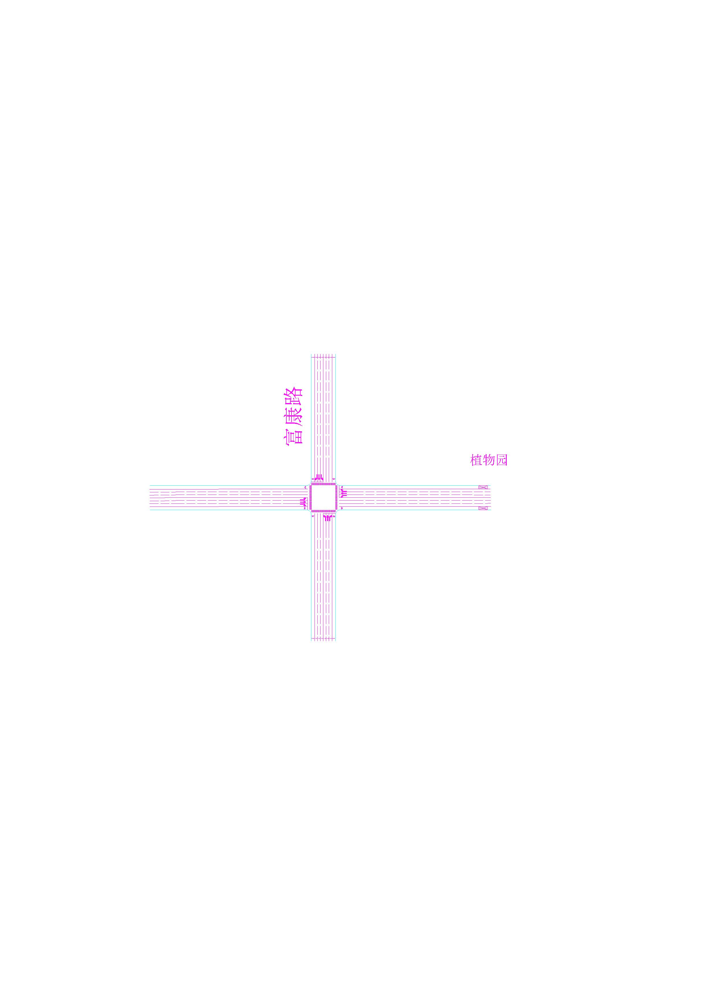

**注：机动车道宽度4.00m，非机动车道5.00m**

#### 机动车流量数据、非机动车行人流量数据

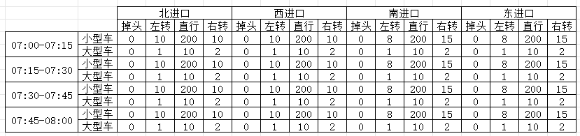
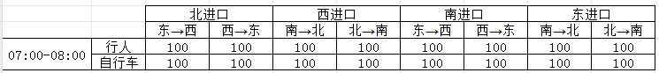

#### 信号配时方案

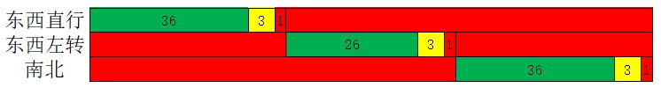

#### 公交发车数据

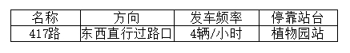

### 2. SUMO试题资料

#### 背景图


**注：机动车道宽度4.00m，非机动车道5.00m**

**viewsettings.xml**设置：

```xml
<viewsettings>
 <delay value="50"/>
 <decal file="background.jpg" centerX="0.00" centerY="0.00" centerZ="0.00" width="1050.00" height="1350.00" altitude="0.00" rotation="0.00" tilt="0.00" roll="0.00" layer="0.00" screenRelative="False"/>
</viewsettings>
```

#### 机动车流量数据


#### 信号配时方案


## B卷

### 1. Vissim试题资料

#### 背景图


#### 机动车流量数据、非机动车行人流量数据

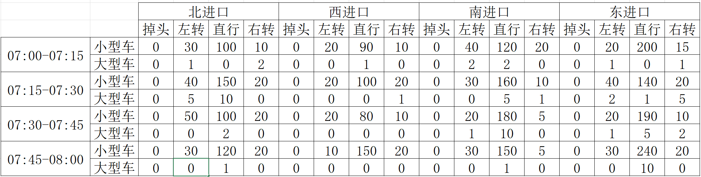


#### 信号配时方案

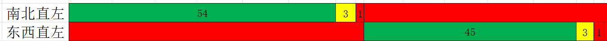

#### 公交发车数据


### 2. SUMO试题资料

#### 背景图

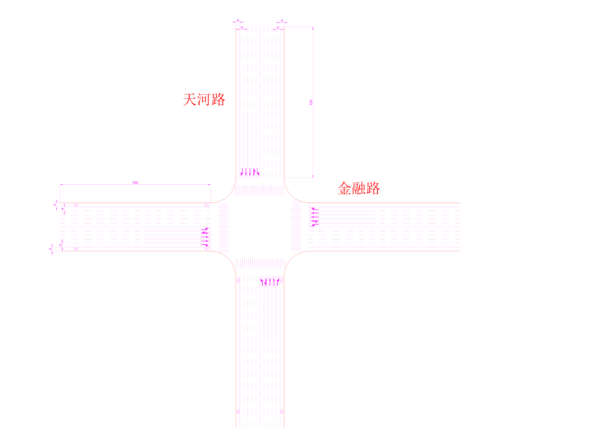

**viewsettings.xml**设置：

```xml
<viewsettings>
 <delay value="50"/>
 <decal file="background.png" centerX="0.00" centerY="0.00" centerZ="0.00" width="470" height="400" altitude="0.00" rotation="0.00" tilt="0.00" roll="0.00" layer="0.00" screenRelative="False"/>
</viewsettings>
```

#### 机动车流量数据

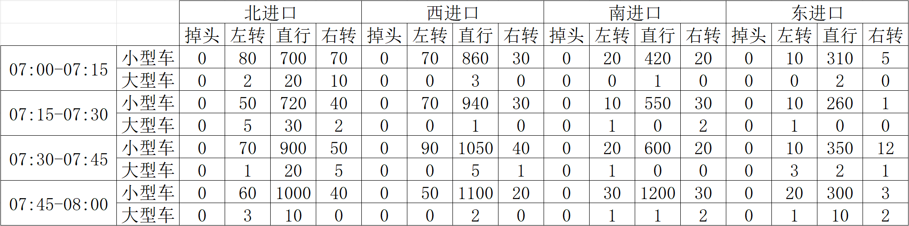

#### 信号配时方案

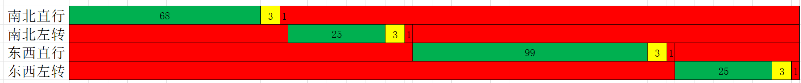

## C卷

### 1. Vissim试题资料

#### 背景图

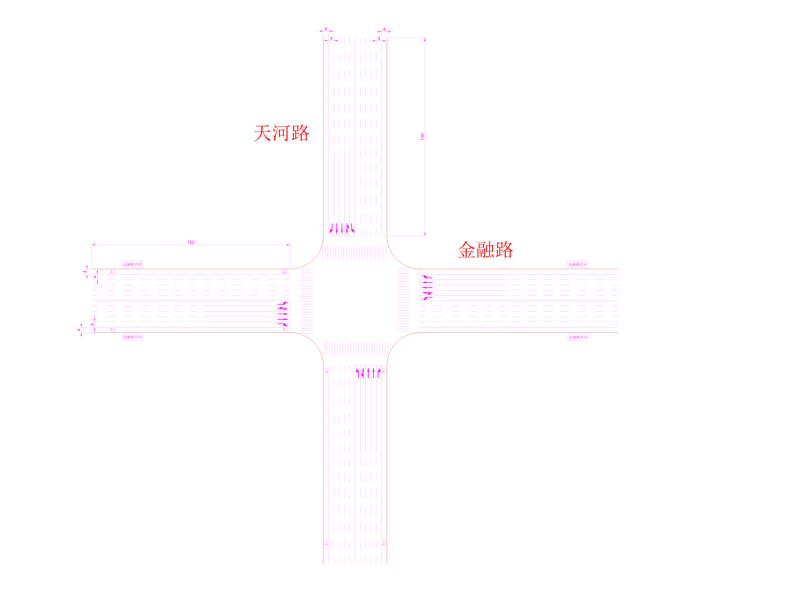

#### 机动车流量数据、非机动车行人流量数据

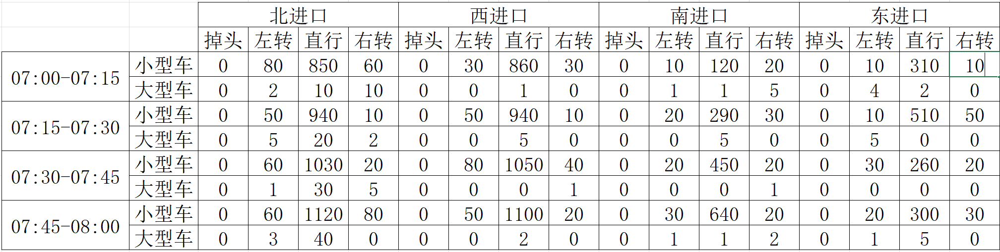


#### 信号配时方案

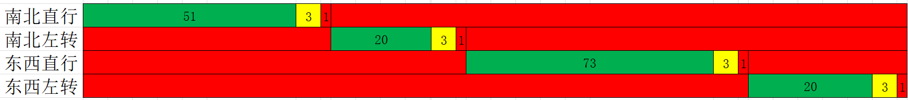

#### 公交发车数据


### 2. SUMO试题资料

#### 背景图

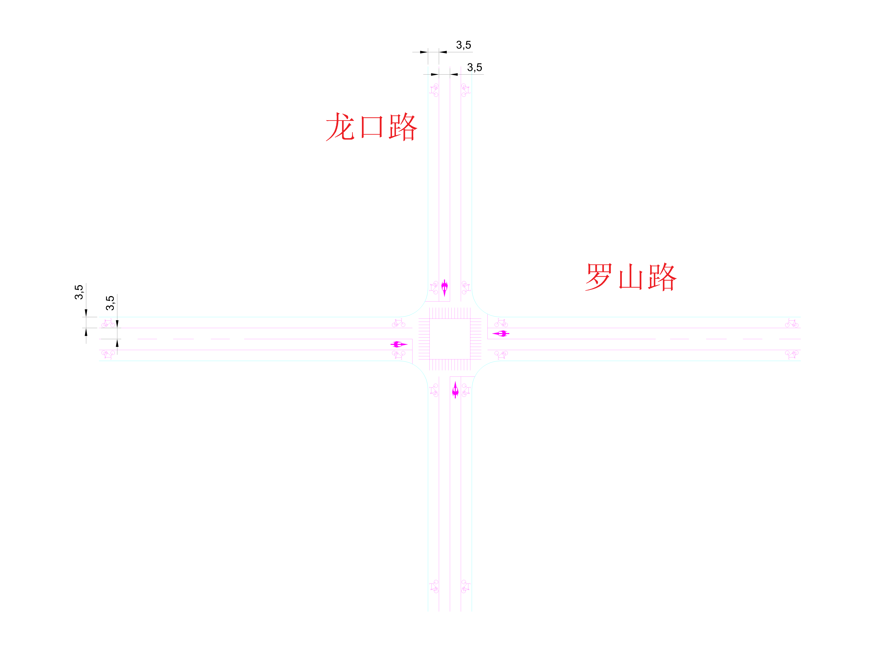

**viewsettings.xml**设置：

```xml
<viewsettings>
 <delay value="50"/>
 <decal file="background.png" centerX="0.00" centerY="0.00" centerZ="0.00" width="280" height="200" altitude="0.00" rotation="0.00" tilt="0.00" roll="0.00" layer="0.00" screenRelative="False"/>
</viewsettings>
```

#### 机动车流量数据

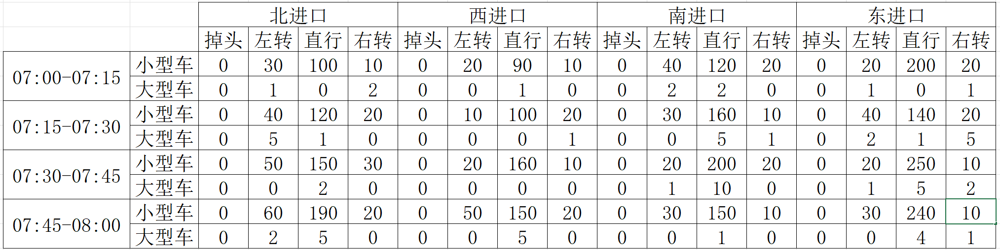

#### 信号配时方案

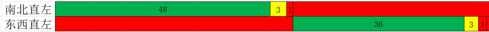

## D卷

### 1. Vissim试题资料

#### 背景图


#### 机动车流量数据、非机动车行人流量数据


#### 信号配时方案

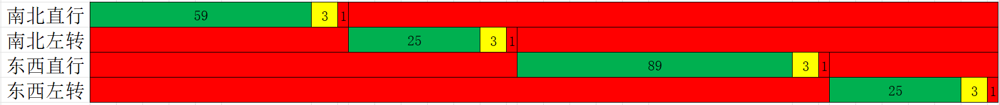

#### 公交发车数据

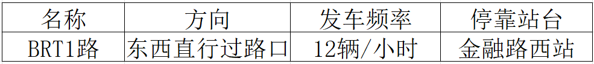

### 2. SUMO试题资料

#### 背景图


**viewsettings.xml**设置：

```xml
<viewsettings>
 <delay value="50"/>
 <decal file="background.png" centerX="0.00" centerY="0.00" centerZ="0.00" width="470" height="400" altitude="0.00" rotation="0.00" tilt="0.00" roll="0.00" layer="0.00" screenRelative="False"/>
</viewsettings>
```

#### 机动车流量数据


#### 信号配时方案


## E卷

### 1. Vissim试题资料

#### 背景图

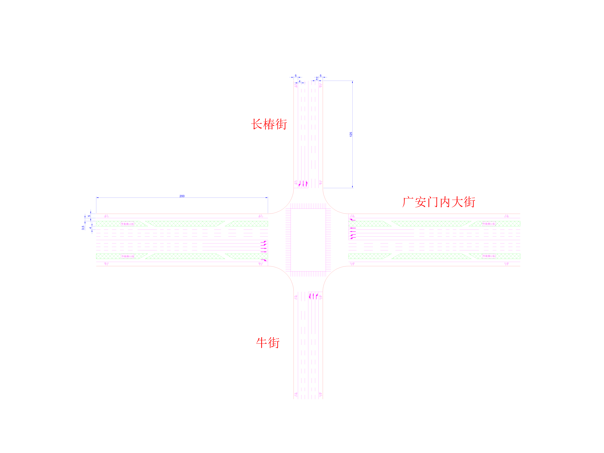

#### 机动车流量数据、非机动车行人流量数据

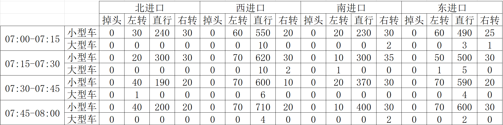
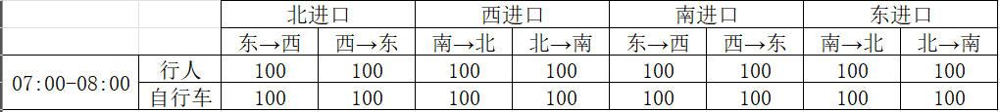

#### 信号配时方案

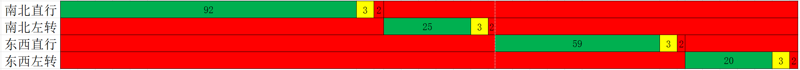

#### 公交发车数据

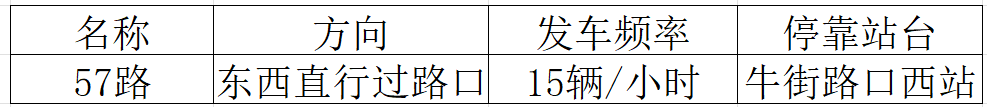

### 2. SUMO试题资料

#### 背景图


**viewsettings.xml**设置：

```xml
<viewsettings>
 <delay value="50"/>
 <decal file="background.png" centerX="0.00" centerY="0.00" centerZ="0.00" width="280" height="200" altitude="0.00" rotation="0.00" tilt="0.00" roll="0.00" layer="0.00" screenRelative="False"/>
</viewsettings>
```

#### 机动车流量数据

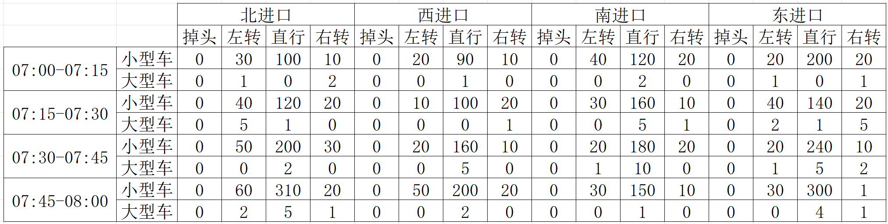

#### 信号配时方案

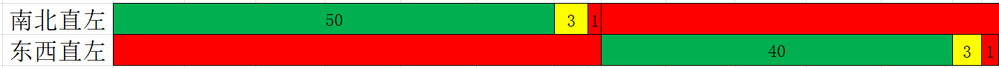

## F卷

### 1. Vissim试题资料

#### 背景图


#### 机动车流量数据、非机动车行人流量数据

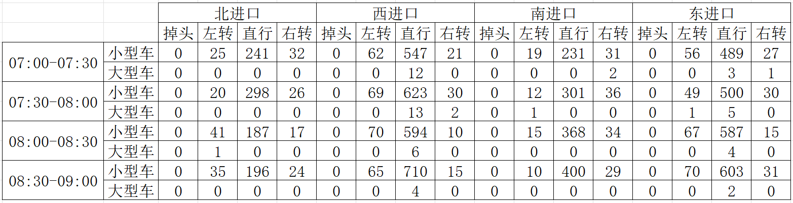


#### 信号配时方案


#### 公交发车数据

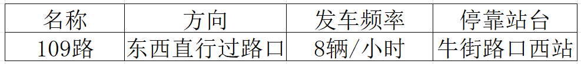

### 2. SUMO试题资料

#### 背景图


**viewsettings.xml**设置：

```xml
<viewsettings>
 <delay value="50"/>
 <decal file="background.png" centerX="0.00" centerY="0.00" centerZ="0.00" width="470" height="400" altitude="0.00" rotation="0.00" tilt="0.00" roll="0.00" layer="0.00" screenRelative="False"/>
</viewsettings>
```

#### 机动车流量数据

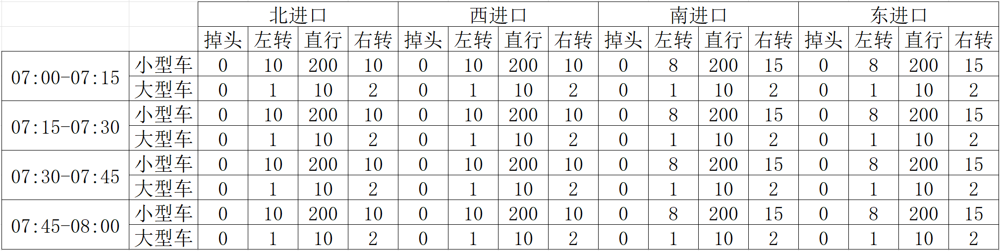

#### 信号配时方案

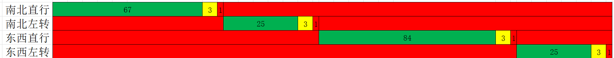

## G卷

### 1. Vissim试题资料

#### 背景图

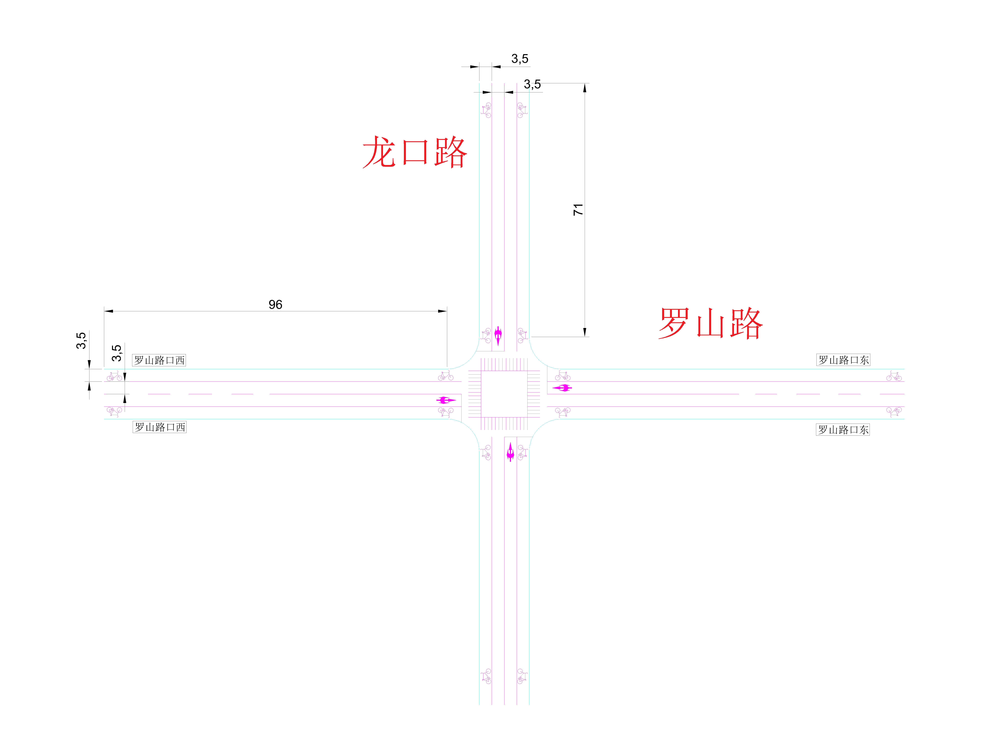

#### 机动车流量数据、非机动车行人流量数据


#### 信号配时方案

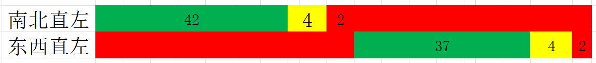

#### 公交发车数据

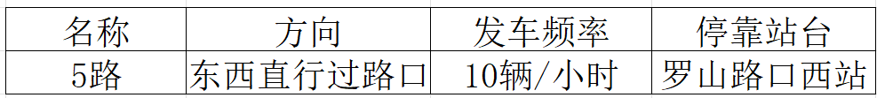

### 2. SUMO试题资料

#### 背景图


**viewsettings.xml**设置：

```xml
<viewsettings>
 <delay value="50"/>
 <decal file="background.png" centerX="0.00" centerY="0.00" centerZ="0.00" width="280" height="200" altitude="0.00" rotation="0.00" tilt="0.00" roll="0.00" layer="0.00" screenRelative="False"/>
</viewsettings>
```

#### 机动车流量数据

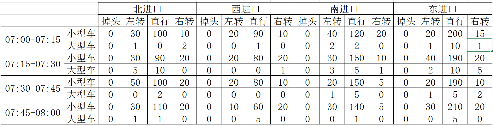

#### 信号配时方案


## H卷

### 1. Vissim试题资料

#### 背景图


**注：机动车道宽度4.00m，非机动车道5.00m**

#### 机动车流量数据、非机动车行人流量数据

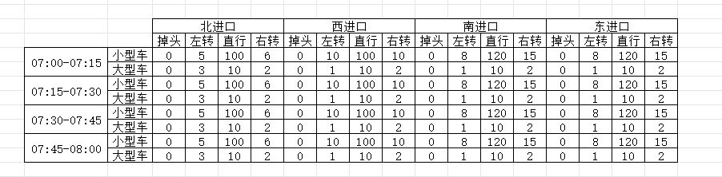
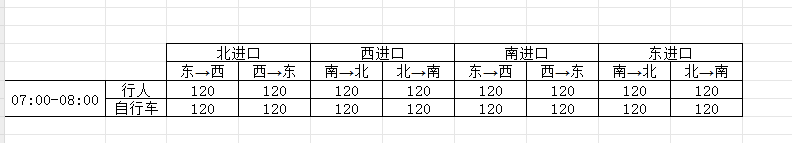

#### 信号配时方案

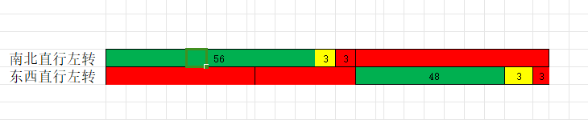

#### 公交发车数据


### 2. SUMO试题资料

#### 背景图

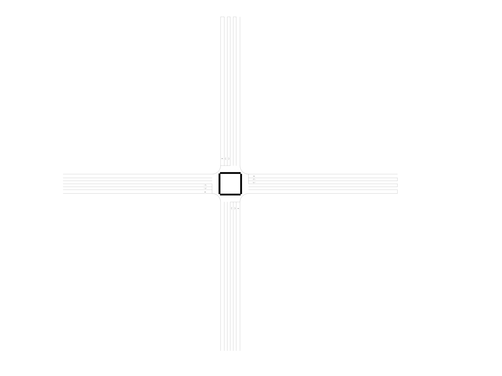

**注：机动车道宽度4.00m，非机动车道5.00m**

**viewsettings.xml**设置：

```xml
<viewsettings>
 <delay value="50"/>
 <decal file="background.png" centerX="0.00" centerY="0.00" centerZ="0.00" width="570" height="420.00" altitude="0.00" rotation="0.00" tilt="0.00" roll="0.00" layer="0.00" screenRelative="False"/>
</viewsettings>
```

#### 机动车流量数据

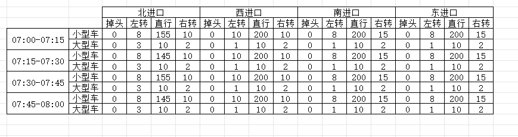

#### 信号配时方案


## I卷

### 1. Vissim试题资料

#### 背景图

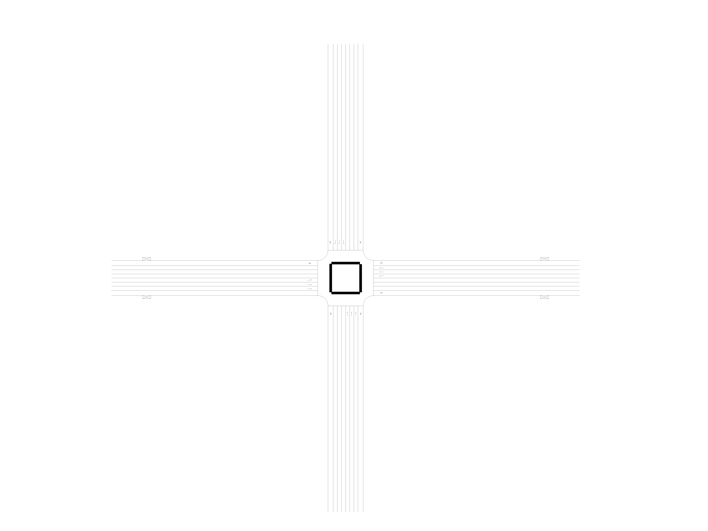

**注：机动车道宽度4.00m，非机动车道5.00m**

#### 机动车流量数据、非机动车行人流量数据

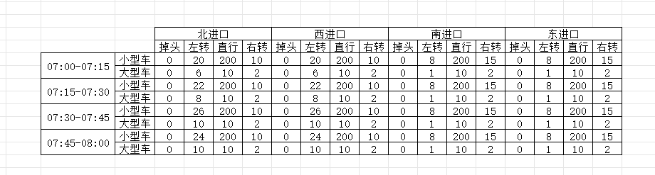
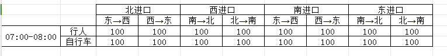

#### 信号配时方案

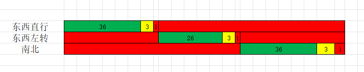

#### 公交发车数据


### 2. SUMO试题资料

#### 背景图

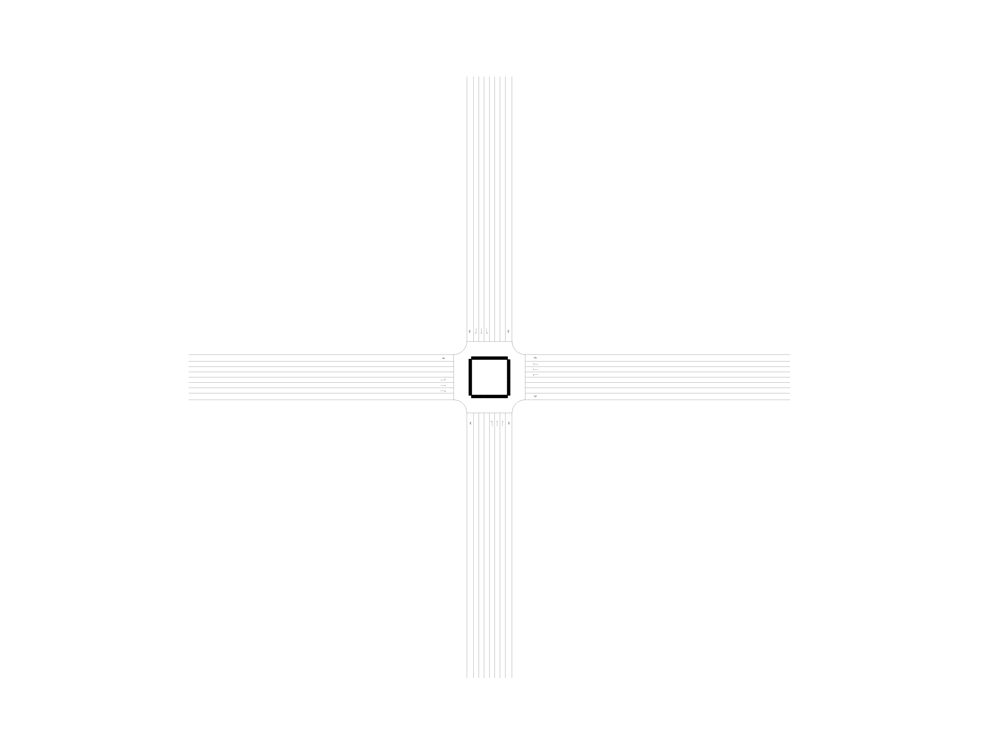

**注：机动车道宽度4.00m，非机动车道5.00m**

**viewsettings.xml**设置：

```xml
<viewsettings>
 <delay value="50"/>
 <decal file="background.png" centerX="0.00" centerY="0.00" centerZ="0.00" width="620" height="470.00" altitude="0.00" rotation="0.00" tilt="0.00" roll="0.00" layer="0.00" screenRelative="False"/>
</viewsettings>
```

#### 机动车流量数据

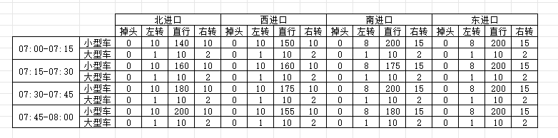

#### 信号配时方案

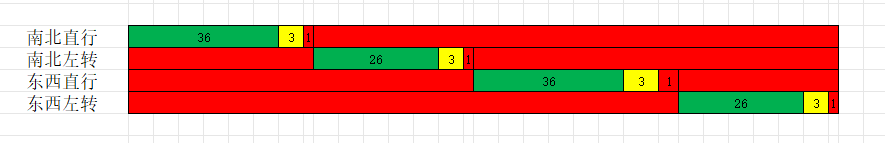

## J卷

### 1. Vissim试题资料

#### 背景图

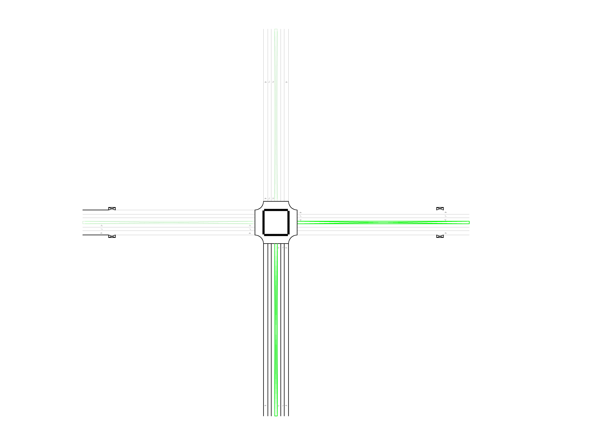

**注：机动车道宽度4.00m，非机动车道5.00m**

#### 机动车流量数据、非机动车行人流量数据

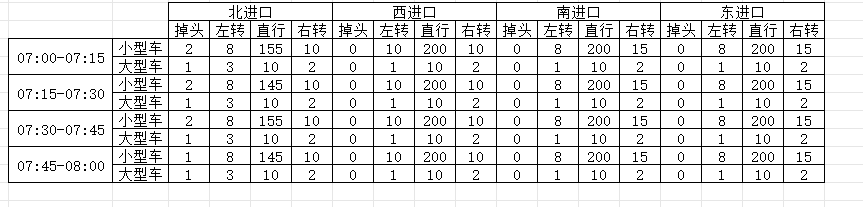
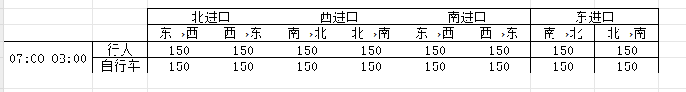

#### 信号配时方案

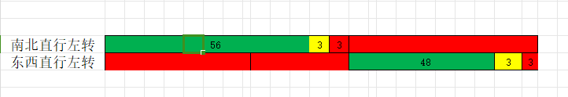

#### 公交发车数据

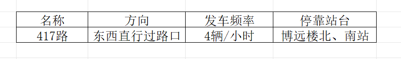

### 2. SUMO试题资料

#### 背景图

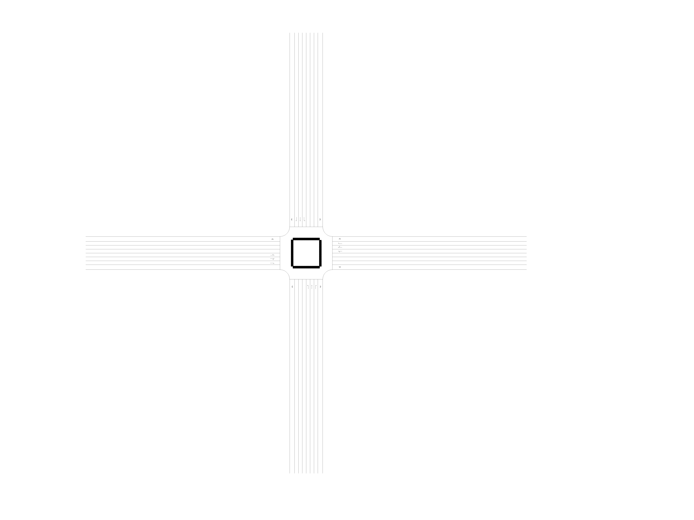

**注：机动车道宽度4.00m，非机动车道5.00m**

**viewsettings.xml**设置：

```xml
<viewsettings>
 <delay value="50"/>
 <decal file="background.png" centerX="0.00" centerY="0.00" centerZ="0.00" width="590" height="450.00" altitude="0.00" rotation="0.00" tilt="0.00" roll="0.00" layer="0.00" screenRelative="False"/>
</viewsettings>
```

#### 机动车流量数据

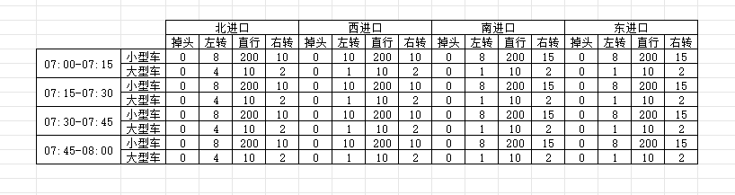

#### 信号配时方案

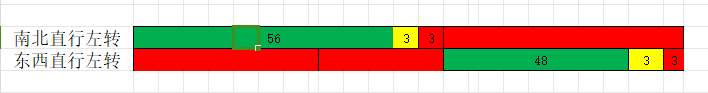

## K卷

### 1. Vissim试题资料

#### 背景图


**注：机动车道宽度4.00m，非机动车道5.00m**

#### 机动车流量数据、非机动车行人流量数据

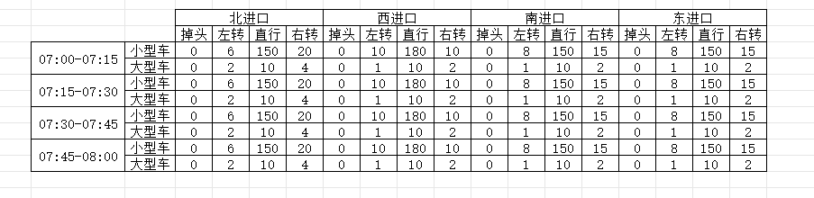
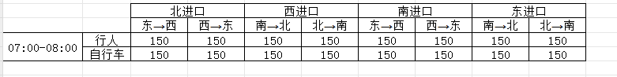

#### 信号配时方案

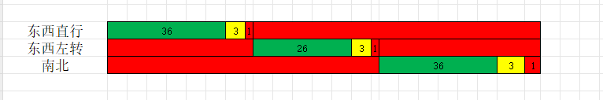

#### 公交发车数据


### 2. SUMO试题资料

#### 背景图

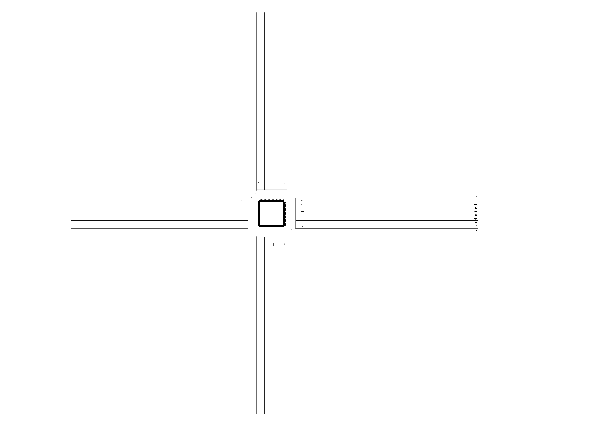

**注：机动车道宽度4.00m，非机动车道5.00m**

**viewsettings.xml**设置：

```xml
<viewsettings>
 <delay value="50"/>
 <decal file="background.png" centerX="0.00" centerY="0.00" centerZ="0.00" width="545" height="400.00" altitude="0.00" rotation="0.00" tilt="0.00" roll="0.00" layer="0.00" screenRelative="False"/>
</viewsettings>
```

#### 机动车流量数据

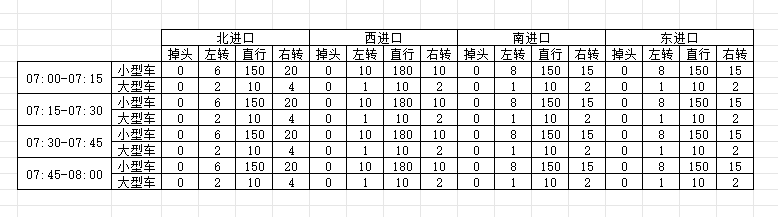

#### 信号配时方案

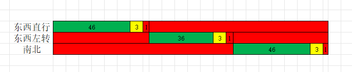

## L卷

### 1. Vissim试题资料

#### 背景图


**注：机动车道宽度4.00m，非机动车道5.00m**

#### 机动车流量数据、非机动车行人流量数据

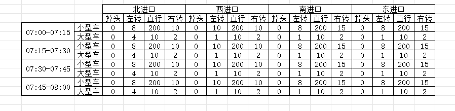
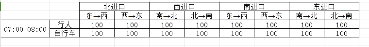

#### 信号配时方案

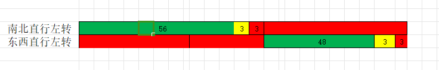

#### 公交发车数据


### 2. SUMO试题资料

#### 背景图


**注：机动车道宽度4.00m，非机动车道5.00m**

**viewsettings.xml**设置：

```xml
<viewsettings>
 <delay value="50"/>
 <decal file="background.png" centerX="0.00" centerY="0.00" centerZ="0.00" width="570" height="420.00" altitude="0.00" rotation="0.00" tilt="0.00" roll="0.00" layer="0.00" screenRelative="False"/>
</viewsettings>
```

#### 机动车流量数据

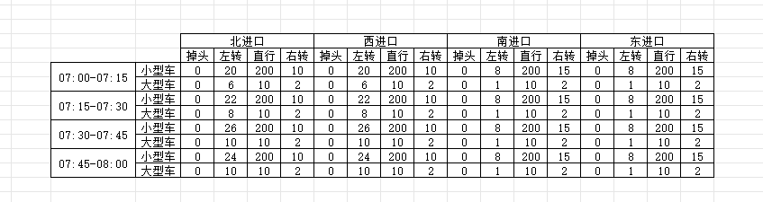

#### 信号配时方案

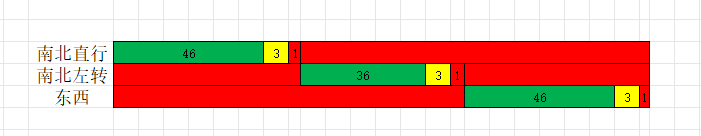

## M卷

### 1. Vissim试题资料

#### 背景图


**注：机动车道宽度4.00m，非机动车道5.00m**

#### 机动车流量数据、非机动车行人流量数据

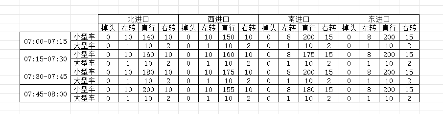
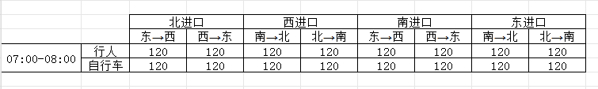

#### 信号配时方案


#### 公交发车数据


### 2. SUMO试题资料

#### 背景图


**注：机动车道宽度4.00m，非机动车道5.00m**

**viewsettings.xml**设置：

```xml
<viewsettings>
 <delay value="50"/>
 <decal file="background.png" centerX="0.00" centerY="0.00" centerZ="0.00" width="550" height="400.00" altitude="0.00" rotation="0.00" tilt="0.00" roll="0.00" layer="0.00" screenRelative="False"/>
</viewsettings>
```

#### 机动车流量数据

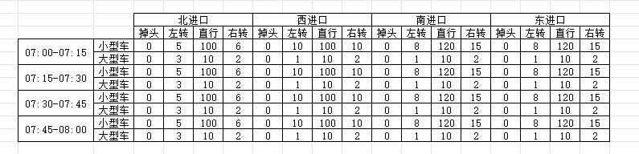

#### 信号配时方案

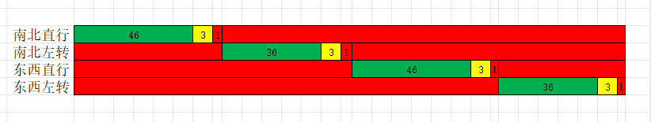
