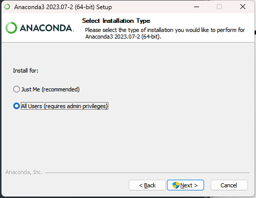
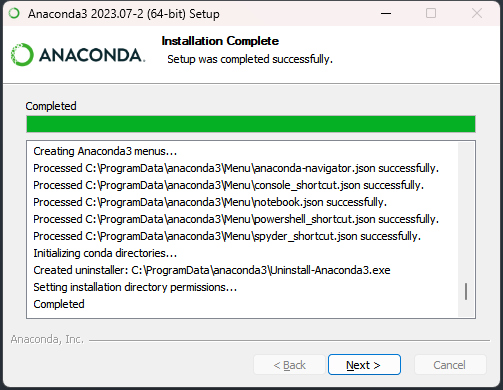
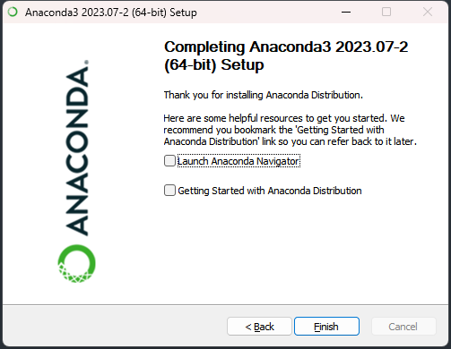
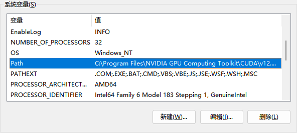
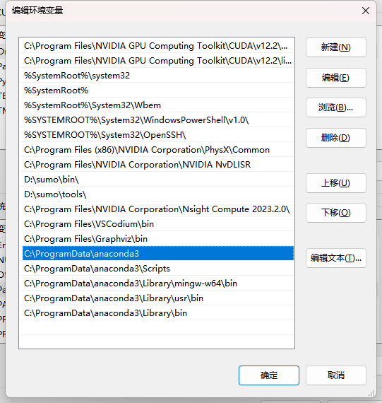

# 安装 Anaconda

## 1. 下载 Anaconda3-2023.07-2-Windows-x86_64.exe

https://mirrors.tuna.tsinghua.edu.cn/anaconda/archive/

## 2. 安装




## 3. 配置


添加系统环境变量path


```xml
C:\ProgramData\anaconda3
C:\ProgramData\anaconda3\Scripts
C:\ProgramData\anaconda3\Library\mingw-w64\bin
C:\ProgramData\anaconda3\Library\usr\bin
C:\ProgramData\anaconda3\Library\bin
```

## 4. 测试


```xml
conda --version
conda info
```

## 5. 启动Anaconda Navigator

## 6. 在Anaconda中安装包库

- 打开anaconda prompt。 （base）为当前环境
- 将当前环境转换到需要安装包库的环境
```
active 环境名
```
	
- 使用conda install 安装第三方包库
```
conda install tensorflow
```

- 很多包库conda install无法安装，显示找不到包库。需要使用pip命令进行安装

```
pip install 包库名
pip install -i https://pypi.tuna.tsinghua.edu.cn/simple some-package
```

- 安装完毕后，启动anaconda navigator 查看