# CUDA安装教程

## 1.查看适合自己的CUDA版本

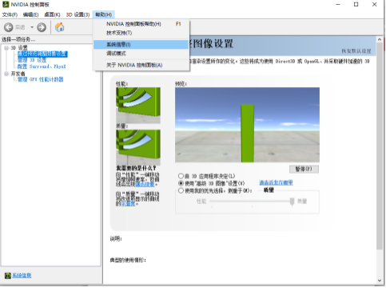

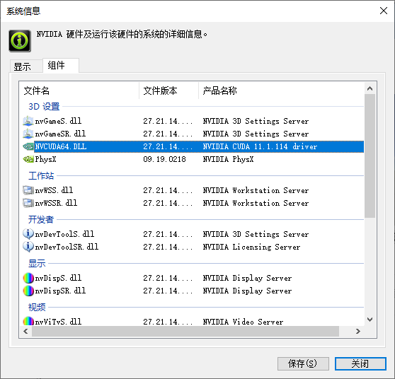

## 2.在英伟达官网下载选择适合自己系统的cuda安装

链接: [link](https://developer.nvidia.com/cuda-toolkit-archive)

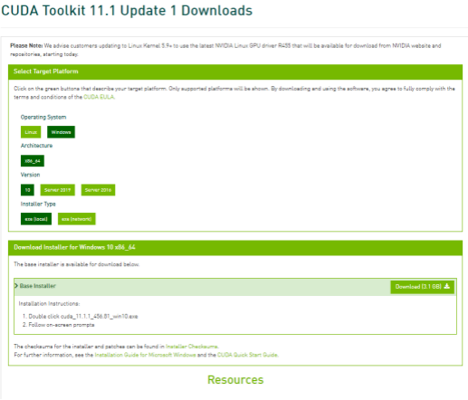

## 3.安装CUDA

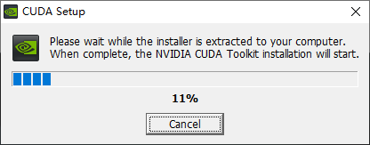

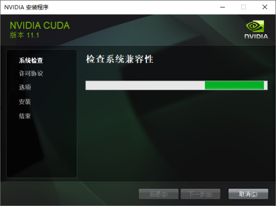


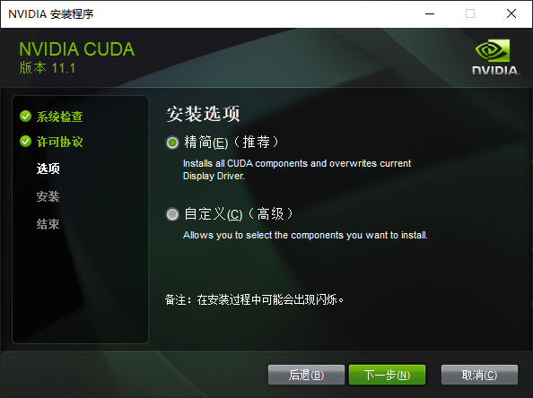


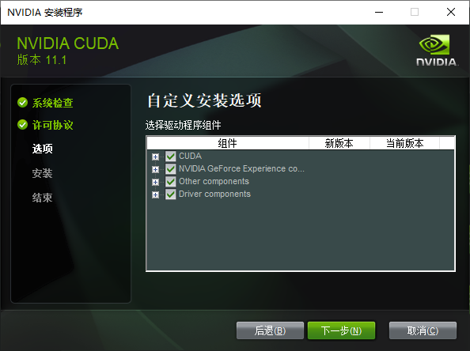

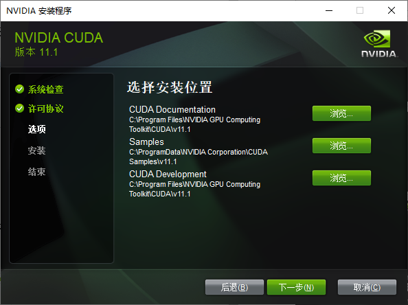

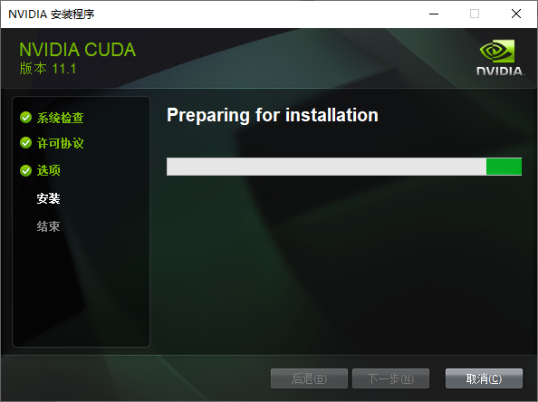

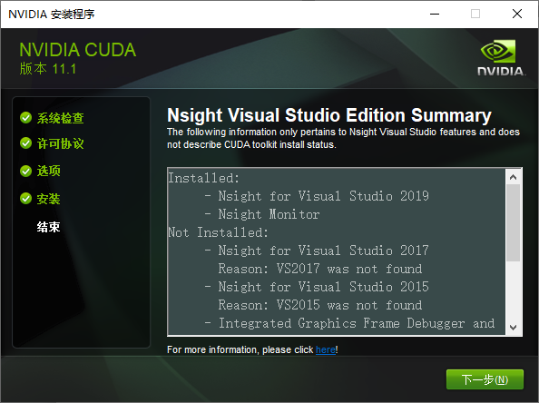

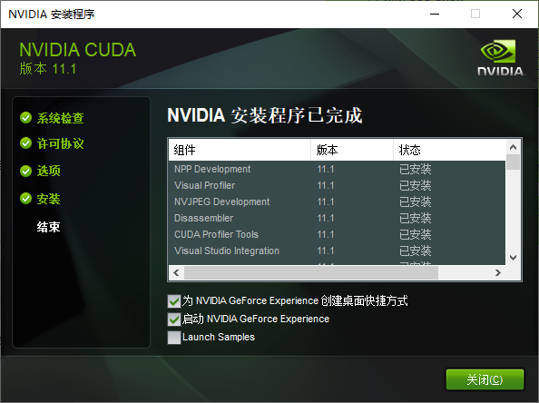

## 4.下载同一版本的cudnn

cuDNN是基于CUDA的深度学习GPU加速库，有了它才能在GPU上完成深度学习的计算，所以我们还要下载同一版本的cuDNN。
链接：[link](https://developer.nvidia.com/rdp/cudnn-download)


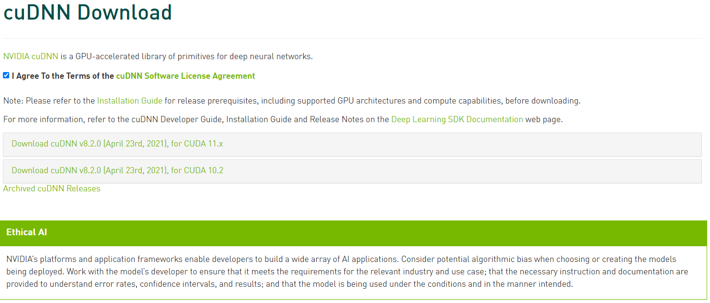

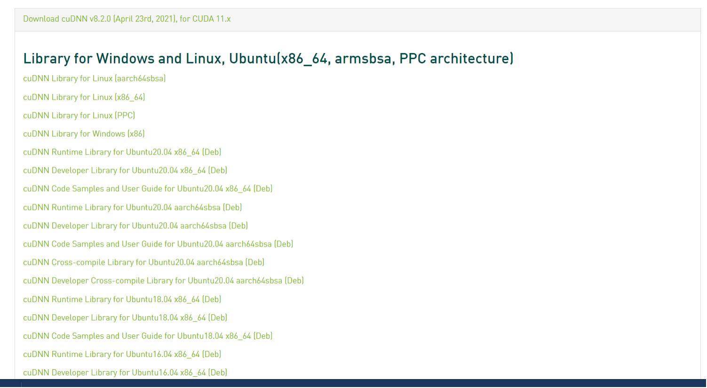

## 5.匹配

将下载好的CUdnn文件解压，得到如下所示三个文件夹。

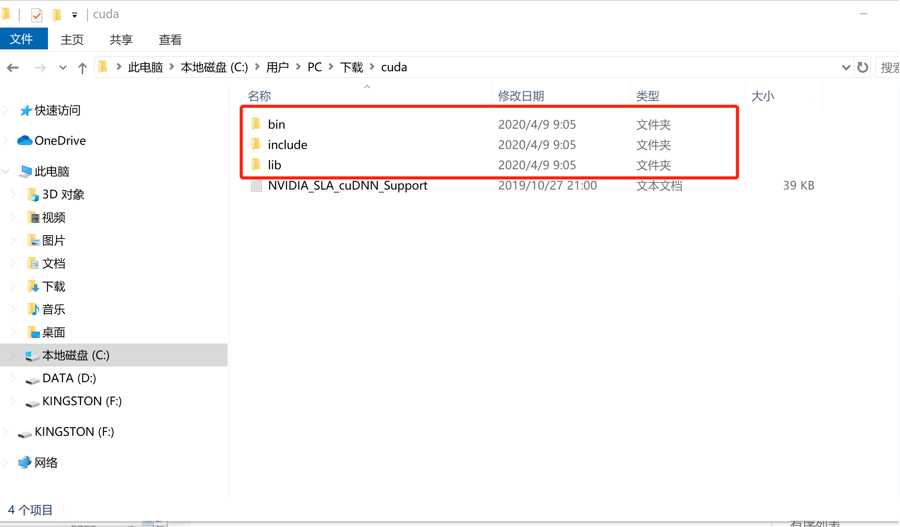

将每个文件夹下对应的文件复制到CUDA对应文件夹下。

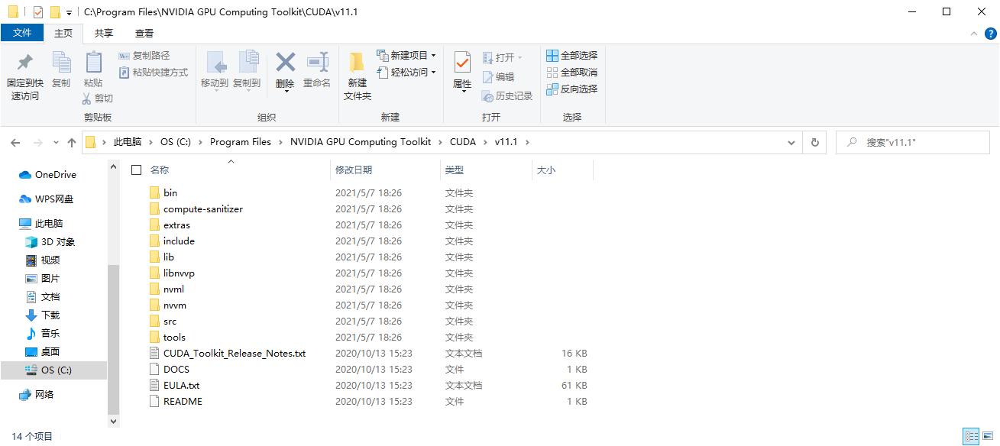

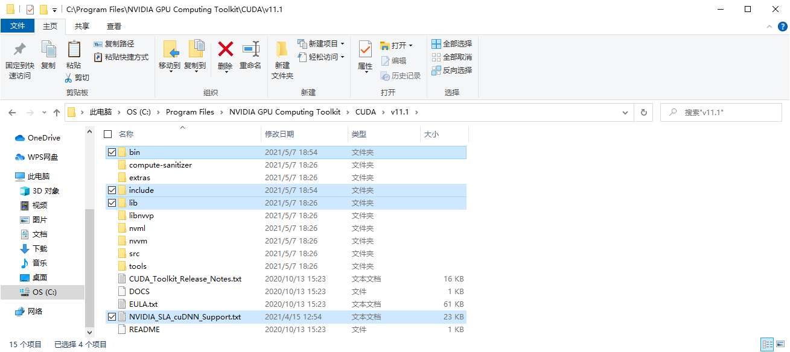

## 6.测试一下

```python
import os
import tensorflow as tf
import keras.backend as K

os.environ["CUDA_DEVICE_ORDER"] = "PCI_BUS_ID"
os.environ["CUDA_VISIBLE_DEVICES"] = "0"

msg = tf.constant('Hello, TensorFlow!')

tf.print(msg)

print(tf.__version__)

print(K.epsilon())
#print("Num GPUs Available: ", len(tf.config.list_physical_devices('GPU')))

print(tf.config.list_physical_devices('GPU'))
print(tf.test.is_gpu_available())
```

## 安装cuDNN

NVIDIA cuDNN is a GPU-accelerated library of primitives for deep neural networks.

访问 <https://developer.nvidia.com/rdp/cudnn-download>
注册账号，填充基本信息，即可进入下载页面：

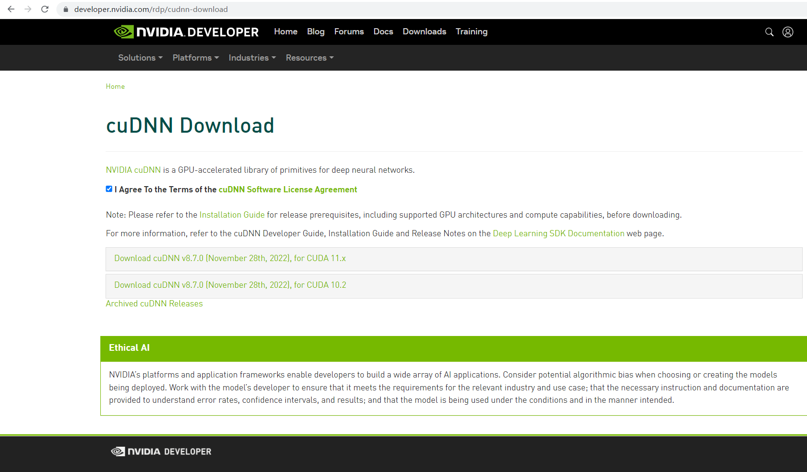

下载对应CUDA版本的cudnn安装包。

本次下载的文件“cudnn-windows-x86_64-8.7.0.84_cuda11-archive.zip”。

解压该文件，并将bin、include和lib三个文件夹复制到CUDA安装目录下。（本机安装路径为C:\Program Files\NVIDIA GPU Computing Toolkit\CUDA\v11.1）

**注意**：提示文件夹重复时选择“合并”即可。

## 查看cuda

```dos
nvcc --version
nvcc -V
```

## 安装PyTorch的GPU版本

```dos
pip3 install torch torchvision torchaudio --extra-index-url https://download.pytorch.org/whl/cu117
```

需要先卸载原来的cpu版本。如果安装失败可以尝试逐项安装torch、torchvision、torchaudio

```python
import torch

print("torch版本号:", end="")
print(torch.__version__)
print("判断torch是否可用:", end="")
print(torch.cuda.is_available())

print("gpu数量:", end="")
print(torch.cuda.device_count())

print("gpu名字，设备索引默认从0开始:", end="")
print(torch.cuda.get_device_name(0))
print("现在正在使用的GPU编号:", end="")
print(torch.cuda.current_device())
```

## 安装 torch_geometric

### 检查Pytorch 版本（要求不低于1.12.0）

```dos
python -c "import torch; print(torch.__version__)"
```
或
```python
import torch

print(torch.__version__)
```
### 检查CUDA版本

```dos
python -c "import torch; print(torch.version.cuda)"
```

### 安装相关包库

```dos
pip install pyg-lib torch-scatter torch-sparse -f https://data.pyg.org/whl/torch-${TORCH}+${CUDA}.html
pip install torch-geometric
```
其中"${TORCH}"和"${CUDA}"是具体的PyTorch和CUDA版本

例如，PyTorch版本号为1.13.*，CUDA版本号为11.7
```dos
pip install pyg-lib torch-scatter torch-sparse -f https://data.pyg.org/whl/torch-1.13.0+cu117.html
pip install torch-geometric
```

### 安装附加包库（可选）

PyG附加的功能所用到的包库，例如K-NN，或SplineConv支持等：

```dos
pip install torch-cluster torch-spline-conv -f https://data.pyg.org/whl/torch-${TORCH}+${CUDA}.html
```
