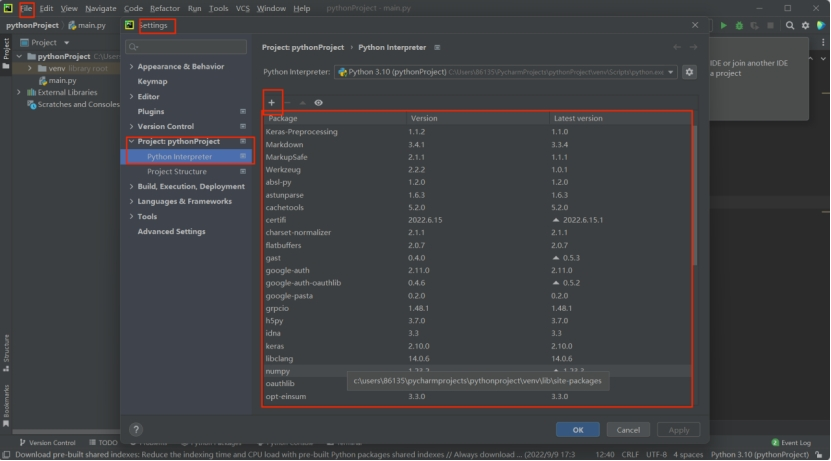
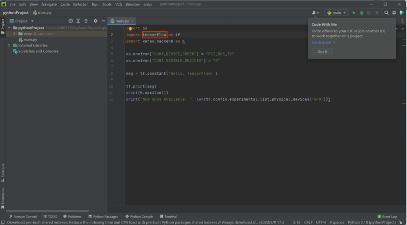
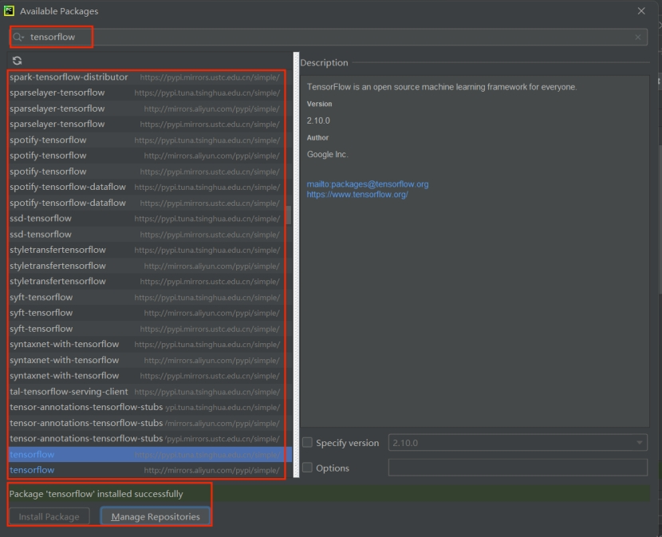
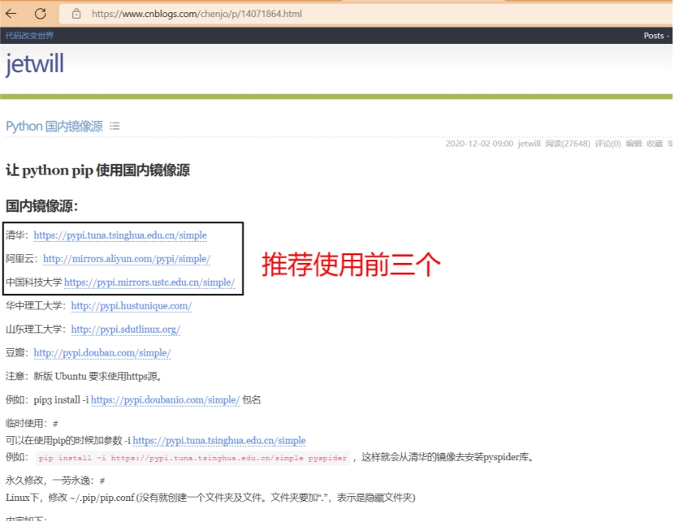
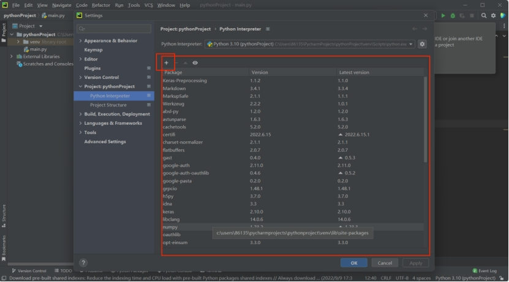
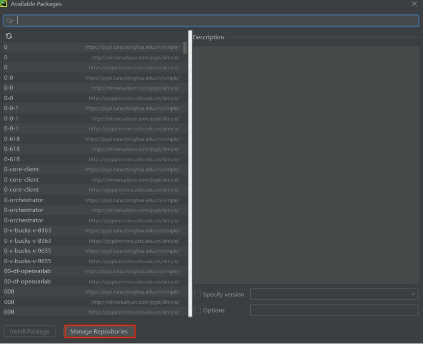
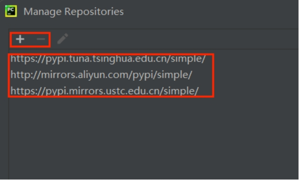

# 常见问题

## 简单问题

### 1.软件下载后无法安装：

关闭杀毒软件或者右键点击软件选择允许执行；

### 2.不知道如何创建bat或其他格式的文件：

点击文件夹上方的“查看”按钮，点击最下方的“显示”按钮，然后再点击“文件拓展名”，将文件格式的名称显示出来，再对文件进行重命名，最后更改后缀；

### 3.sumo软件打开后无法正常运行，下方显示栏显示具体哪一行出现错误：

用文本编辑器（vscode、sublime、notepad++、Atom、记事本等）打开sumocfg格式的文件，然后根据报错信息检查某一行是否出现输入错误；

### 4.对某个bat文件格式进行“以管理员方式运行”后，显示bat文件对应的xml文件不被允许，要求更改参数：

右键点击bat文件，选择编辑，认真检查代码是否有输入错误；

### 5.注册时不知道URL或者输入后显示URL无效，要求输入有效的URL：

URL全称“Uniform Resource Locator”，中文译为“网址”，表示互联网地址，所以要求我们填写某个网页的网址。如果出现显示URL无效的情况，需要我们检查网址是否输入错误，或者直接搜索相应网页进入后复制上方的网址再进行粘贴。

### 6.下载的sumo,python在命令栏中不能完成  

解决方案：下载时没有勾选栏目框，在环境变量中没有python和sumo软件实现的环境，因此，只需重新下载时勾选栏目框或者在高级系统设置中的环境变量中添加软件运行时所需的环境即可。

## Python相关问题

### 7.关于pycharm使用前须知包库设置

一，查看包库设置
   打开Pycharm，File>>settings>>Project.PythonProject>>Python Interpreter,点看就能查看你所下载的pycharm包库文件，初下者想要运行一些程序就有可能需要添加一些包库，而通过上述步骤即可到达包库修改添加处。

  

二，添加包库
  以下图为例，添加一个名为tensorflow包库，File>>>settings>>>Project:pythonproject>>>Python Interpreter,点击“+”号，进入包库添加界面，搜索tensorflow>>选择文件>>点击Install Package,如果在“Install Package”上出现绿色字幕successfully则说明包库安装成功

  

  

三，镜像设置
  假如添加包库时，网速正常而迟迟不能显示包库下载，就需要修改一下包库中镜像地址推荐如图。

  

  在包库查看过程外点击包库界面加号>>Manage Repositories,即可到达镜像修改界面，点击+/—修改镜像

  

  

  