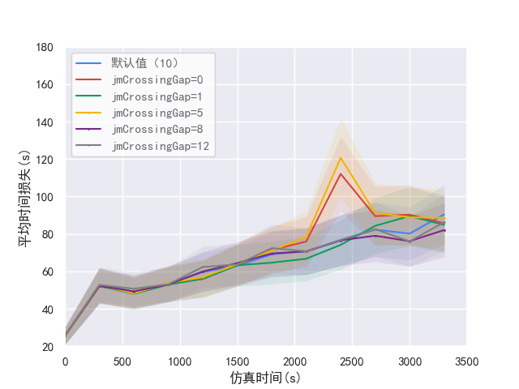

# 仿真输出数据绘图

## 1. 数据种类介绍

- E1/E2/E3/summary/emission/queue/...


## 2. 绘图示例

### 2.1 构造yaml文件

```yml
basic_info:
  pic_name: '3.4晚高峰_jmCrossingGap_首体路与车公庄西_E3_平均时间损失'
  save_path_png: 'picture/E3/3.4晚高峰_jmCrossingGap_首体路与车公庄西_E3_平均时间损失.png'
  save_path_pdf: 'picture/E3/3.4晚高峰_jmCrossingGap_首体路与车公庄西_E3_平均时间损失.pdf'
  xlabel: '仿真时间(s)'
  ylabel: '平均时间损失(s)'
  xlim: [0, 3500]
  xticks: [0, 500, 1000, 1500, 2000, 2500, 3000, 3500]
  xticklabels: ['0', '500', '1000', '1500', '2000', '2500', '3000', '3500']
  ylim: [20, 180]
  palette: ["#4285F4", "#DB4437", "#0F9D58", "#F4B400","#7A288A","#808080", ]
  markers: ["o", 'd', "^", 'x', 'o', 'v', 'p', 'd']
  marker_size: [0, 0, 0, 1, 1, 1]
  line_styles: ['-', '-', '-', '-', '-', '-']
data_from_files:
  data1:
    name: '默认值（10）'
    path: '../现状仿真/3.4晚高峰/output/OUTPUT-data_e3.xml'
    type: 'e3'
    tag_name: 'interval'
    locating_cols: {
      'id': '首体路与车公庄西',
    }
    time_col: 'begin'
    attr_col: 'meanTimeLoss'

  data2:
    name: 'jmCrossingGap=0'
    path: '../交叉口模型参数分析/jmCrossingGap/3.4晚高峰（jmCrossingGap=0）/output/OUTPUT-data_e3.xml'
    type: 'e3'
    tag_name: 'interval'
    locating_cols: {
      'id': '首体路与车公庄西',
    }
    time_col: 'begin'
    attr_col: 'meanTimeLoss'

  data3:
    name: 'jmCrossingGap=1'
    path: '../交叉口模型参数分析/jmCrossingGap/3.4晚高峰（jmCrossingGap=1）/output/OUTPUT-data_e3.xml'
    type: 'e3'
    tag_name: 'interval'
    locating_cols: {
      'id': '首体路与车公庄西',
    }
    time_col: 'begin'
    attr_col: 'meanTimeLoss'

  data4:
    name: 'jmCrossingGap=5'
    path: '../交叉口模型参数分析/jmCrossingGap/3.4晚高峰（jmCrossingGap=5）/output/OUTPUT-data_e3.xml'
    type: 'e3'
    tag_name: 'interval'
    locating_cols: {
      'id': '首体路与车公庄西',
    }
    time_col: 'begin'
    attr_col: 'meanTimeLoss'

  data5:
    name: 'jmCrossingGap=8'
    path: '../交叉口模型参数分析/jmCrossingGap/3.4晚高峰（jmCrossingGap=8）/output/OUTPUT-data_e3.xml'
    type: 'e3'
    tag_name: 'interval'
    locating_cols: {
      'id': '首体路与车公庄西',
    }
    time_col: 'begin'
    attr_col: 'meanTimeLoss'

  data6:
    name: 'jmCrossingGap=12'
    path: '../交叉口模型参数分析/jmCrossingGap/3.4晚高峰（jmCrossingGap=12）/output/OUTPUT-data_e3.xml'
    type: 'e3'
    tag_name: 'interval'
    locating_cols: {
      'id': '首体路与车公庄西',
    }
    time_col: 'begin'
    attr_col: 'meanTimeLoss'
```

### 2.2 调用函数进行绘图

```python
import os
# from plot_figures_zgr import *
from plot_figures_fill import *

os.chdir(os.path.dirname(__file__))

if __name__ == '__main__':
    plot_sumo_output_data_by2(yamlfile="yaml_config/E3/3.4晚高峰_jmCrossingGap_首体路整体_E3_平均时间损失.yaml")
```
