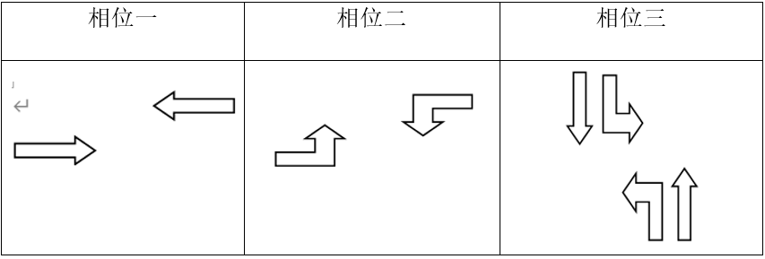
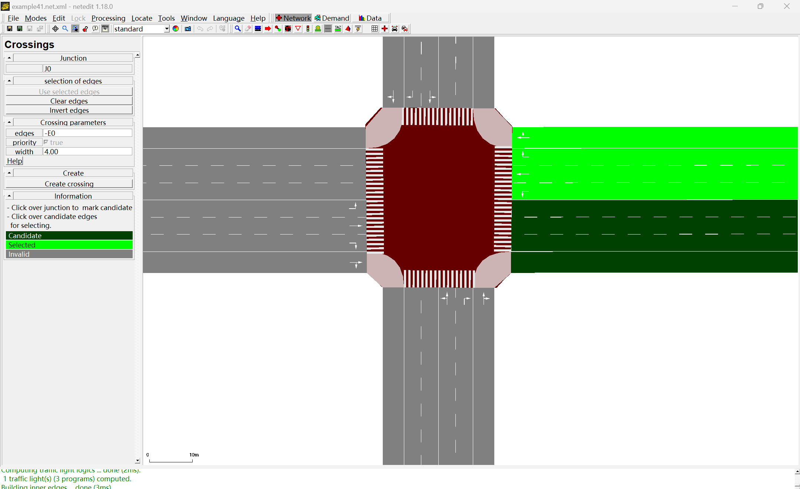
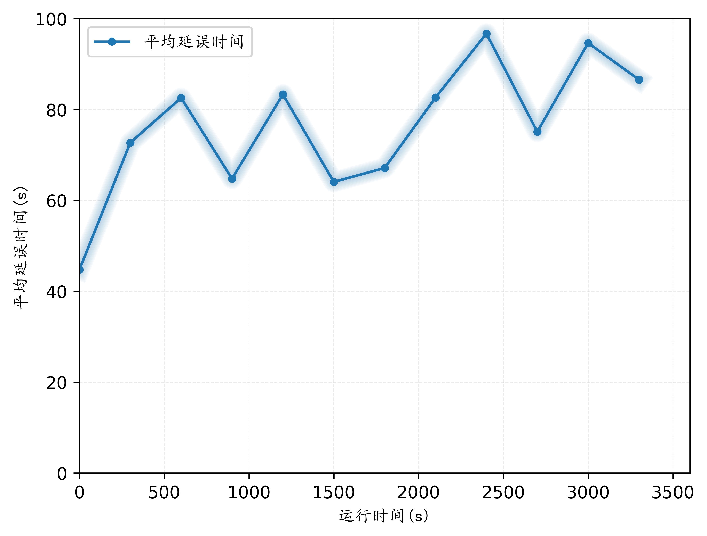

# 单交叉路口（建设路与文明路交叉路口）

## 1数据采集

### 1.1交叉路口相关信息

 (1)东西（建设路）：3个车道（3上3下）  南北（文明路）：2个车道（2上2下）

(2)东进口有3条机动车道：左转专用车道1条，右转专用车道1条，直行专用车道1条；西进口有3条机动车道：左转专用车道1条，右转专用车道1条，直行专用车道1条；南进口有2条机动车道：左转专用车道1条，右直车道1条；北进口有2条机动车道：左转专用车道1条，右直车道1条。

### 1.2车道相关信息


 表1-1 建设路与文明路交叉路口各方向车道数

### 1.3车辆信息

 
表1-2 建设路与文明路交叉路口机动车流量

### 1.4公交车信息


表1-3 建设路与文明路交叉路口公交车相关信息

### 1.5相位信息


表1-4 建设路与文明路交叉路口信号相位图

如上图所示，高峰时刻建设路与文明路交叉路口信号配时如下：
 周期长度为219s。
相位一：东西方向直行绿灯67s，黄灯3s，红灯149s。
相位二：东西方向左转红灯73s，绿灯47s，黄灯3s，红灯96s。
相位三：南北方向直行、左转红灯126s，绿灯87s，黄灯3s，红灯3s。

### 1.6 非机动车及行人信息


表1-5 建设路与文明路交叉路口非机动车及行人流量

## 2仿真建模过程

### 2.1绘制背景图

在CAD中绘制单交叉路口，包括道路名称、公交站名称等。

 图2-1 背景图

### 2.2加载背景图

新建文件，文件命名为viewsettings.xml，主要代码如下(剩余代码在附录中)：
```xml
<viewsettings>
	<delay value="50"/>
	<decal file="background.png" centerX="0.00" centerY="0.00" centerZ="0.00" width="637.82" height="451.00" altitude="0.00" rotation="0.00" tilt="0.00" roll="0.00" layer="0.00" screenRelative="False"/>
</viewsettings>
```

在.netecfg中增加背景图：
```xml
<gui_only>
	<gui-settings-file value="viewsettings.xml"/> <!-- Load visualisation settings from FILE-->
</gui_only>
```
### 2.3绘制路网

在NETEDIT中加载背景图，并按照要求绘制路网，如下图所示：

图2-2 绘制路网

### 2.4修改属性

（1）点击上方“Set inspect mode”，单击选择其中一条车道，此时屏幕左侧出现所选车道的基本信息，选择其中的“numLanes”，将其中的数字1改为数字4，此时所选车道的车道数变为四条。按照数据说明中的要求，依次调整车道数（数据说明中无非机动车道，在绘制路网时需添加非机动车道）如下图所示：

（2）设置connection，点击"set connecrion mode"，如下图所示，选择一条车道，呈现蓝色，其目标车道为绿色，冲突车道为黄色；若连接的为目标车道，单机想要连接的车道，点击回车，两条车道连接完成；若连接的为冲突车道，可用Ctrl加所选车道的方式，重复以上步骤，按照交叉路口各方向车道数进行调整。


### 2.5人行道和机动车道设置

选择最外侧车道，左侧车道设置中点击allow，进入界面之后，将所有机动车辆禁止通行，只留下行人和非机动车，如下图所示：

选择最外侧车道，左侧车道设置中点击allow，进入界面之后，将所有非机动车辆、ship和rail禁止通行，只留下机动车，如下图所示：


### 2.6斑马线设置

 选择设置斑马线模式，点击交汇点，所有车道线变成暗绿色，如图所示：

点击发车道，变成亮绿色，如下图所示，再点击同一方向的紧邻车道，按下回车键，生成灰色斑马线，按照以上步骤逐步生成四个方向的斑马线。


### 2.7调整信号配时

建设路与文明路交叉路口交叉口信号配时如下（其中直行左转用浅绿色，右转用较深的绿色）：

(1)东西直行

(2)东西直行黄灯

(3)红灯

 (4)东西左转

(5)东西左转黄灯

(6)红灯

(7)南北直行左转

(8)南北直行左转黄灯

(9)红灯


将信号配时进行存储（点击Save），存储之后打开.xml文件，在其中添加名称，代码如下：
```xml
    <tlLogic id="J0" type="static" programID="p0" offset="0">
        <phase duration="67" name="东西直行" state="grgrrgGgGrgrgrrgGgGrGrGr"/>
        <phase duration="3" name="黄灯" state="grgrrgygyrgrgrrgygyryryr"/>
        <phase duration="3" name="红灯" state="grgrrgrgrrgrgrrgrgrrrrrr"/>
        <phase duration="47" name="东西左转" state="grgrrgrgrGgrgrrgrgrGrrrr"/>
        <phase duration="3" name="黄灯" state="grgrrgrgrygrgrrgrgryrrrr"/>
        <phase duration="3" name="红灯" state="grgrrgrgrrgrgrrgrgrrrrrr"/>
        <phase duration="87" name="南北直左" state="gGgGGgrgrrgGgGGgrgrrrGrG"/>
        <phase duration="3" name="黄灯" state="gygyygrgrrgygyygrgrrryry"/>
        <phase duration="3" name="红灯" state="grgrrgrgrrgrgrrgrgrrrrrr"/>
``` 
添加完成之后，打开NETEDIT，点击Load载入文件，然后点击Save进行存储，如下图所示：

在programID中选择p0，名称加载完成，如下图所示：


### 2.8生成车辆路径

根据机动车流量(表1-2)生成车辆路径(直接构造rou.xml文件)，文件命名为example41.rou.xml，时间段分为0-899、900-1799、1800-2699、2700-3599。
```xml
<routes>

	<!--车辆类型定义：小型车、大型车-->
	<vType id="vt-car"   vClass="passenger"   color="1,0.2,1" length="5"  maxSpeed="13.89"/><!--50km/h 速度单位：m/s-->
	<vType id="vt-truck" vClass="truck"       color="0,0.2,1" length="10" maxSpeed="11"/>
	<vType id="vt-truck2" vClass="truck"      color="0,0.8,1" length="15" maxSpeed="11"/>
	
	<!--车辆构成-->
	<vTypeDistribution id="typedist-west"     vTypes="vt-car vt-truck" probabilities="0.90 0.10"/> <!--西进口车辆构成-->
	<vTypeDistribution id="typedist-south"    vTypes="vt-car vt-truck" probabilities="0.90 0.10"/> <!--南进口车辆构成-->
	<vTypeDistribution id="typedist-east"     vTypes="vt-car vt-truck" probabilities="0.90 0.10"/> <!--东进口车辆构成-->
	<vTypeDistribution id="typedist-north"    vTypes="vt-car vt-truck vt-truck2" probabilities="0.85 0.10 0.05"/> <!--北进口车辆构成-->
	
	<!--流量的定义-->
	<interval begin="0" end="899">
		<!--西进口-->
		<flow id="west-L0"  from="E0" to="E3" type="typedist-west"  departLane="best" number="45"/> <!--西左转-->
		<flow id="west-S0"  from="E0" to="E1" type="typedist-west"  departLane="best" number="93"/> <!--西直行-->
		<flow id="west-R0"  from="E0" to="E2" type="typedist-west"  departLane="best" number="29"/> <!--西右转-->
		<!--南进口-->
		<flow id="south-L0" from="-E2" to="-E0" type="typedist-south" departLane="best" number="23"/> <!--南左转-->
		<flow id="south-S0" from="-E2" to="E3"  type="typedist-south" departLane="best" number="75"/> <!--南直行-->
		<flow id="south-R0" from="-E2" to="E1"  type="typedist-south" departLane="best" number="42"/> <!--南右转-->
		<!--东进口-->
		<flow id="east-L0"  from="-E1" to="E2"  type="typedist-east"  departLane="best" number="46"/> <!--东左转-->
		<flow id="east-S0"  from="-E1" to="-E0" type="typedist-east"  departLane="best" number="86"/> <!--东直行-->
		<flow id="east-R0"  from="-E1" to="E3"  type="typedist-east"  departLane="best" number="24"/> <!--东右转-->
		<!--北进口-->
		<flow id="north-L0" from="-E3" to="E1"  type="typedist-north" departLane="best" number="17"/> <!--北左转-->
		<flow id="north-S0" from="-E3" to="E2"  type="typedist-north" departLane="best" number="78"/> <!--北直行-->
		<flow id="north-R0" from="-E3" to="-E0" type="typedist-north" departLane="best" number="41"/> <!--北右转-->
	</interval>

	<interval begin="900" end="1799">
		<!--西进口-->
		<flow id="west-L1"  from="E0" to="E3" type="typedist-west"  departLane="best" number="48"/> <!--西左转-->
		<flow id="west-S1"  from="E0" to="E1" type="typedist-west"  departLane="best" number="88"/> <!--西直行-->
		<flow id="west-R1"  from="E0" to="E2" type="typedist-west"  departLane="best" number="36"/> <!--西右转-->
		<!--南进口-->
		<flow id="south-L1" from="-E2" to="-E0" type="typedist-south" departLane="best" number="23"/> <!--南左转-->
		<flow id="south-S1" from="-E2" to="E3"  type="typedist-south" departLane="best" number="68"/> <!--南直行-->
		<flow id="south-R1" from="-E2" to="E1"  type="typedist-south" departLane="best" number="64"/> <!--南右转-->
		<!--东进口-->
		<flow id="east-L1"  from="-E1" to="E2"  type="typedist-east"  departLane="best" number="45"/> <!--东左转-->
		<flow id="east-S1"  from="-E1" to="-E0" type="typedist-east"  departLane="best" number="66"/> <!--东直行-->
		<flow id="east-R1"  from="-E1" to="E3"  type="typedist-east"  departLane="best" number="31"/> <!--东右转-->
		<!--北进口-->
		<flow id="north-L1" from="-E3" to="E1"  type="typedist-north" departLane="best" number="17"/> <!--北左转-->
		<flow id="north-S1" from="-E3" to="E2"  type="typedist-north" departLane="best" number="59"/> <!--北直行-->
		<flow id="north-R1" from="-E3" to="-E0" type="typedist-north" departLane="best" number="76"/> <!--北右转-->
	</interval>

	<interval begin="1800" end="2699">
		<!--西进口-->
		<flow id="west-L2"  from="E0" to="E3" type="typedist-west"  departLane="best" number="61"/> <!--西左转-->
		<flow id="west-S2"  from="E0" to="E1" type="typedist-west"  departLane="best" number="71"/> <!--西直行-->
		<flow id="west-R2"  from="E0" to="E2" type="typedist-west"  departLane="best" number="33"/> <!--西右转-->
		<!--南进口-->
		<flow id="south-L2" from="-E2" to="-E0" type="typedist-south" departLane="best" number="18"/> <!--南左转-->
		<flow id="south-S2" from="-E2" to="E3"  type="typedist-south" departLane="best" number="75"/> <!--南直行-->
		<flow id="south-R2" from="-E2" to="E1"  type="typedist-south" departLane="best" number="35"/> <!--南右转-->
		<!--东进口-->
		<flow id="east-L2"  from="-E1" to="E2"  type="typedist-east"  departLane="best" number="59"/> <!--东左转-->
		<flow id="east-S2"  from="-E1" to="-E0" type="typedist-east"  departLane="best" number="95"/> <!--东直行-->
		<flow id="east-R2"  from="-E1" to="E3"  type="typedist-east"  departLane="best" number="14"/> <!--东右转-->
		<!--北进口-->
		<flow id="north-L2" from="-E3" to="E1"  type="typedist-north" departLane="best" number="28"/> <!--北左转-->
		<flow id="north-S2" from="-E3" to="E2"  type="typedist-north" departLane="best" number="68"/> <!--北直行-->
		<flow id="north-R2" from="-E3" to="-E0" type="typedist-north" departLane="best" number="62"/> <!--北右转-->
	</interval>

	<interval begin="2700" end="3599">
		<!--西进口-->
		<flow id="west-L3"  from="E0" to="E3" type="typedist-west"  departLane="best" number="54"/> <!--西左转-->
		<flow id="west-S3"  from="E0" to="E1" type="typedist-west"  departLane="best" number="53"/> <!--西直行-->
		<flow id="west-R3"  from="E0" to="E2" type="typedist-west"  departLane="best" number="23"/> <!--西右转-->
		<!--南进口-->
		<flow id="south-L3" from="-E2" to="-E0" type="typedist-south" departLane="best" number="34"/> <!--南左转-->
		<flow id="south-S3" from="-E2" to="E3"  type="typedist-south" departLane="best" number="68"/> <!--南直行-->
		<flow id="south-R3" from="-E2" to="E1"  type="typedist-south" departLane="best" number="70"/> <!--南右转-->
		<!--东进口-->
		<flow id="east-L3"  from="-E1" to="E2"  type="typedist-east"  departLane="best" number="48"/> <!--东左转-->
		<flow id="east-S3"  from="-E1" to="-E0" type="typedist-east"  departLane="best" number="88"/> <!--东直行-->
		<flow id="east-R3"  from="-E1" to="E3"  type="typedist-east"  departLane="best" number="32"/> <!--东右转-->
		<!--北进口-->
		<flow id="north-L3" from="-E3" to="E1"  type="typedist-north" departLane="best" number="27"/> <!--北左转-->
		<flow id="north-S3" from="-E3" to="E2"  type="typedist-north" departLane="best" number="91"/> <!--北直行-->
		<flow id="north-R3" from="-E3" to="-E0" type="typedist-north" departLane="best" number="66"/> <!--北右转-->
	</interval>

</routes>
```

### 2.9仿真数据采集：

需放置3个检测器进行数据采集工作

#### (1)E1检测器，新建.xml文件，文件命名为det_e1.add.xml
```xml
<additional>
  <inductionLoop id="north_0" lane="-E3_0" pos="100" freq="300" file="output/data_e1.xml" friendlypos="true"/>
  <inductionLoop id="north_1" lane="-E3_1" pos="100" freq="300" file="output/data_e1.xml" friendlypos="true"/>
  <inductionLoop id="north_2" lane="-E3_2" pos="100" freq="300" file="output/data_e1.xml" friendlypos="true"/>

  <inductionLoop id="west_0" lane="E0_0" pos="100" freq="300" file="output/data_e1.xml" friendlypos="true"/>
  <inductionLoop id="west_1" lane="E0_1" pos="100" freq="300" file="output/data_e1.xml" friendlypos="true"/>
  <inductionLoop id="west_2" lane="E0_2" pos="100" freq="300" file="output/data_e1.xml" friendlypos="true"/>
  <inductionLoop id="west_3" lane="E0_3" pos="100" freq="300" file="output/data_e1.xml" friendlypos="true"/>

  <inductionLoop id="south_0" lane="-E2_0" pos="100" freq="300" file="output/data_e1.xml" friendlypos="true"/>
  <inductionLoop id="south_1" lane="-E2_1" pos="100" freq="300" file="output/data_e1.xml" friendlypos="true"/>
  <inductionLoop id="south_2" lane="-E2_2" pos="100" freq="300" file="output/data_e1.xml" friendlypos="true"/>

  <inductionLoop id="east_0" lane="-E1_0" pos="100" freq="300" file="output/data_e1.xml" friendlypos="true"/>
  <inductionLoop id="east_1" lane="-E1_1" pos="100" freq="300" file="output/data_e1.xml" friendlypos="true"/>
  <inductionLoop id="east_2" lane="-E1_2" pos="100" freq="300" file="output/data_e1.xml" friendlypos="true"/>
  <inductionLoop id="east_3" lane="-E1_3" pos="100" freq="300" file="output/data_e1.xml" friendlypos="true"/>
</additional>
```

新建.xml文件，文件命名为det_e1_instant.add.xml
```xml
<additional>
  <instantInductionLoop  id="north_0" lane="-E3_0" pos="120" freq="300" file="output/data_e1_instant.xml" friendlypos="true"/>
  <instantInductionLoop  id="north_1" lane="-E3_1" pos="120" freq="300" file="output/data_e1_instant.xml" friendlypos="true"/>
  <instantInductionLoop  id="north_2" lane="-E3_2" pos="120" freq="300" file="output/data_e1_instant.xml" friendlypos="true"/>

  <instantInductionLoop  id="west_0" lane="E0_0" pos="120" freq="300" file="output/data_e1_instant.xml" friendlypos="true"/>
  <instantInductionLoop  id="west_1" lane="E0_1" pos="120" freq="300" file="output/data_e1_instant.xml" friendlypos="true"/>
  <instantInductionLoop  id="west_2" lane="E0_2" pos="120" freq="300" file="output/data_e1_instant.xml" friendlypos="true"/>
  <instantInductionLoop  id="west_3" lane="E0_3" pos="120" freq="300" file="output/data_e1_instant.xml" friendlypos="true"/>

  <instantInductionLoop  id="south_0" lane="-E2_0" pos="120" freq="300" file="output/data_e1_instant.xml" friendlypos="true"/>
  <instantInductionLoop  id="south_1" lane="-E2_1" pos="120" freq="300" file="output/data_e1_instant.xml" friendlypos="true"/>
  <instantInductionLoop  id="south_2" lane="-E2_2" pos="120" freq="300" file="output/data_e1_instant.xml" friendlypos="true"/>

  <instantInductionLoop  id="east_0" lane="-E1_0" pos="120" freq="300" file="output/data_e1_instant.xml" friendlypos="true"/>
  <instantInductionLoop  id="east_1" lane="-E1_1" pos="120" freq="300" file="output/data_e1_instant.xml" friendlypos="true"/>
  <instantInductionLoop  id="east_2" lane="-E1_2" pos="120" freq="300" file="output/data_e1_instant.xml" friendlypos="true"/>
  <instantInductionLoop  id="east_3" lane="-E1_3" pos="120" freq="300" file="output/data_e1_instant.xml" friendlypos="true"/>
</additional>
```

#### (2)E2检测器，新建.xml文件，文件命名为det_e2.add.xml
```xml
<additional>
    <laneAreaDetector id="north_0" lane="-E3_0" pos="80" length="200" freq="300" file="output/data_e2.xml"/>
    <laneAreaDetector id="north_1" lane="-E3_1" pos="80" length="200" freq="300" file="output/data_e2.xml"/>
    <laneAreaDetector id="north_2" lane="-E3_2" pos="80" length="200" freq="300" file="output/data_e2.xml"/>

    <laneAreaDetector id="westh_0" lane="E0_0" pos="80" length="200" freq="300" file="output/data_e2.xml"/>
    <laneAreaDetector id="westh_1" lane="E0_1" pos="80" length="200" freq="300" file="output/data_e2.xml"/>
    <laneAreaDetector id="westh_2" lane="E0_2" pos="80" length="200" freq="300" file="output/data_e2.xml"/>
    <laneAreaDetector id="westh_3" lane="E0_3" pos="80" length="200" freq="300" file="output/data_e2.xml"/>

    <laneAreaDetector id="south_0" lane="-E2_0" pos="80" length="200" freq="300" file="output/data_e2.xml"/>
    <laneAreaDetector id="south_1" lane="-E2_1" pos="80" length="200" freq="300" file="output/data_e2.xml"/>
    <laneAreaDetector id="south_2" lane="-E2_2" pos="80" length="200" freq="300" file="output/data_e2.xml"/>

    <laneAreaDetector id="east_0" lane="-E1_0" pos="80" length="200" freq="300" file="output/data_e2.xml"/>
    <laneAreaDetector id="east_1" lane="-E1_1" pos="80" length="200" freq="300" file="output/data_e2.xml"/>
    <laneAreaDetector id="east_2" lane="-E1_2" pos="80" length="200" freq="300" file="output/data_e2.xml"/>
    <laneAreaDetector id="east_3" lane="-E1_3" pos="80" length="200" freq="300" file="output/data_e2.xml"/>
 </additional>
```
#### (3) E3检测器，新建,xml文件，文件命名为det_e3.add.xml
```xml
<additional>
 <entryExitDetector id="e3_det" freq="300" file="output/data_e3.xml">
      <detEntry lane="-E3_0" pos="50"/>
      <detEntry lane="-E3_1" pos="50"/>
      <detEntry lane="-E3_2" pos="50"/>

      <detEntry lane="E0_0" pos="50"/>
      <detEntry lane="E0_1" pos="50"/>
      <detEntry lane="E0_2" pos="50"/>
      <detEntry lane="E0_3" pos="50"/>

      <detEntry lane="-E2_0" pos="50"/>
      <detEntry lane="-E2_1" pos="50"/>
      <detEntry lane="-E2_2" pos="50"/>
	  
      <detEntry lane="-E1_0" pos="50"/>
      <detEntry lane="-E1_1" pos="50"/>
      <detEntry lane="-E1_2" pos="50"/>
      <detEntry lane="-E1_3" pos="50"/>

      <detExit lane="E3_0" pos="50"/>
      <detExit lane="E3_1" pos="50"/>
      <detExit lane="E3_2" pos="50"/>

      <detExit lane="-E0_0" pos="50"/>
      <detExit lane="-E0_1" pos="50"/>
      <detExit lane="-E0_2" pos="50"/>
      <detExit lane="-E0_3" pos="50"/>
	  
      <detExit lane="E2_0" pos="50"/>
      <detExit lane="E2_1" pos="50"/>
      <detExit lane="E2_2" pos="50"/>
	  
      <detExit lane="E1_0" pos="50"/>
      <detExit lane="E1_1" pos="50"/>
      <detExit lane="E1_2" pos="50"/>
      <detExit lane="E1_3" pos="50"/>
  </entryExitDetector>
</additional>
```

#### (4) 设置Edge、Lane数据采集

新建*edgelane_dump.add.xml*文件，并配置：
```xml
<additional>
    <edgeData id="edgedata_300" file="edge_300.xml" freq="300" edges="-E2 E2 -E0 E0"/>
	<laneData id="lanedata_300" file="lane_300.xml" freq="300" edges="-E2 E2 -E0 E0"/>
	<edgeData id="edgedata_120" file="edge_120.xml" freq="120" edges="-E2 E2 -E0 E0"/>
	<laneData id="lanedata_120" file="lane_120.xml" freq="120" edges="-E2 E2 -E0 E0"/>
</additional>
```
分别采集 *"-E2 E2 -E0 E0"* 四条道路的数据，时间间隔为*300s*和*120s*。

### 2.10行人流量设置

行人流量需根据表1-5单独新建.add.xml文件，文件命名为fl_person.add.xml，代码如下：
```xml
<routes>
<!-- 行人 -->
    <!-- 南进口 -->
    <personFlow id="South-W-E1" begin="0" end="900" period="16">
           <walk from="-E3" to="E0"/> <!--西到东-->
    </personFlow>
    <personFlow id="South-E-W1" begin="0" end="900" period="4.8">
           <walk from="E0" to="-E3"/> <!--东到西-->
    </personFlow>
    <!-- 北进口 -->
    <personFlow id="North-E-W1" begin="0" end="900" period="9.7">
           <walk from="-E0" to="E3"/> <!--东到西-->
    </personFlow>
    <personFlow id="North-W-E1" begin="0" end="900" period="10.3">
           <walk from="E3" to="-E0"/> <!--西到东-->
    </personFlow>
    <!-- 西进口 -->
    <personFlow id="West-N-S1" begin="0" end="900" period="22.5">
           <walk from="-E2" to="E1"/> <!--北到南-->
    </personFlow>
    <personFlow id="West-S-N1" begin="0" end="900" period="37.5">
           <walk from="E1" to="-E2"/> <!--南到北-->
    </personFlow>
    <!-- 东进口 -->
    <personFlow id="East-S-N1" begin="0" end="900" period="9.3">
           <walk from="-E1" to="E2"/> <!--南到北-->
    </personFlow>
    <personFlow id="East-N-S1" begin="0" end="900" period="450">
           <walk from="E2" to="-E1"/> <!--北到南-->
    </personFlow>


    <!-- 南进口 -->
    <personFlow id="South-W-E2" begin="901" end="1800" period="13.2">
           <walk from="-E3" to="E0"/> <!--西到东-->
    </personFlow>
    <personFlow id="South-E-W2" begin="901" end="1800" period="5.2">
           <walk from="E0" to="-E3"/> <!--东到西-->
    </personFlow>
    <!-- 北进口 -->
    <personFlow id="North-E-W2" begin="901" end="1800" period="8.6">
           <walk from="-E0" to="E3"/> <!--东到西-->
    </personFlow>
    <personFlow id="North-W-E2" begin="901" end="1800" period="11">
           <walk from="E3" to="-E0"/> <!--西到东-->
    </personFlow>
    <!-- 西进口 -->
    <personFlow id="West-N-S2" begin="901" end="1800" period="28.1">
           <walk from="-E2" to="E1"/> <!--北到南-->
    </personFlow>
    <personFlow id="West-S-N2" begin="901" end="1800" period="33.3">
           <walk from="E1" to="-E2"/> <!--南到北-->
    </personFlow>
    <!-- 东进口 -->
    <personFlow id="East-S-N2" begin="901" end="1800" period="7.7">
           <walk from="-E1" to="E2"/> <!--南到北-->
    </personFlow>


    <!-- 南进口 -->
    <personFlow id="South-W-E3" begin="1801" end="2700" period="12.5">
           <walk from="-E3" to="E0"/> <!--西到东-->
    </personFlow>
    <personFlow id="South-E-W3" begin="1801" end="2700" period="5.3">
           <walk from="E0" to="-E3"/> <!--东到西-->
    </personFlow>
    <!-- 北进口 -->
    <personFlow id="North-E-W3" begin="1801" end="2700" period="7.9">
           <walk from="-E0" to="E3"/> <!--东到西-->
    </personFlow>
    <personFlow id="North-W-E3" begin="1801" end="2700" period="10">
           <walk from="E3" to="-E0"/> <!--西到东-->
    </personFlow>
    <!-- 西进口 -->
    <personFlow id="West-N-S3" begin="1801" end="2700" period="21">
           <walk from="-E2" to="E1"/> <!--北到南-->
    </personFlow>
    <personFlow id="West-S-N3" begin="1801" end="2700" period="45">
           <walk from="E1" to="-E2"/> <!--南到北-->
    </personFlow>
    <!-- 东进口 -->
    <personFlow id="East-S-N3" begin="1801" end="2700" period="12.6">
           <walk from="-E1" to="E2"/> <!--南到北-->
    </personFlow>
    <personFlow id="East-N-S3" begin="1801" end="2700" period="300">
           <walk from="E2" to="-E1"/> <!--北到南-->
    </personFlow>


    <!-- 南进口 -->
    <personFlow id="South-W-E4" begin="2701" end="3600" period="14">
           <walk from="-E3" to="E0"/> <!--西到东-->
    <personFlow id="South-E-W4" begin="2701" end="3600" period="4.8">
           <walk from="E0" to="-E3"/> <!--东到西-->
    </personFlow>
    </personFlow>
    <!-- 北进口 -->
    <personFlow id="North-E-W4" begin="2701" end="3600" period="9.2">
           <walk from="-E0" to="E3"/> <!--东到西-->
    </personFlow>
    <personFlow id="North-W-E4" begin="2701" end="3600" period="8.6">
           <walk from="E3" to="-E0"/> <!--西到东-->
    </personFlow>
    <!-- 西进口 -->
    <personFlow id="West-N-S4" begin="2701" end="3600" period="26.4">
           <walk from="-E2" to="E1"/> <!--北到南-->
    </personFlow>
    <personFlow id="West-S-N4" begin="2701" end="3600" period="28.1">
           <walk from="E1" to="-E2"/> <!--南到北-->
    </personFlow>
    <!-- 东进口 -->
    <personFlow id="East-S-N4" begin="2701" end="3600" period="9.3">
           <walk from="-E1" to="E2"/> <!--南到北-->
    </personFlow>
</routes>
```

### 2.11公交车仿真

(1)公交车站设置，需新建.add.xml文件，文件命名为busstops_def.add.xml，代码如下：
```xml
<additional>
    <!-- StoppingPlaces -->
    <busStop id="xinshijihuayuan_north"  lane="E3_1"  startPos="149.30" endPos="162.00" lines="EToW">
        <access lane="E3_0" pos="155.00"/>
    </busStop>
    <busStop id="xinshijihuayuan_south"  lane="-E3_1" startPos="95.00" endPos="108.00" lines="WToE">
        <access lane="-E3_0" pos="100.00"/>
    </busStop>
    <busStop id="kangshenghuayuan_north" lane="-E0_1" startPos="102.50" endPos="115.00" lines="EToW">
        <access lane="-E0_0" pos="110.00"/>
    </busStop>
    <busStop id="kangshenghuayuan_south" lane="E0_1"  startPos="149.50" endPos="162.00" lines="WToE">
        <access lane="E0_0" pos="154.00"/>
    </busStop>
</additional>
```
(2)构造公交车流量，新建.rou.xml，文件命名为bus.rou.xml，代码如下：
```xml
<routes>
    <!--公交相关，公交车站在.net.xml中定义-->
    <vType id="BUS_A" personCapacity="40" vClass="bus" length="12" maxSpeed="9" guiShape="bus"/>
    <vType id="BUS_B" personCapacity="45" vClass="bus" Length="14" maxSpeed="7" guiShape="bus" />
 

    <route id="rt_W2E" edges="-E0 E3"/>
    <flow id="e2w_318" color="1,1,1"  begin="0" end= "3600" period="600"  type="BUS_B" line="EToW" route="rt_W2E"> 
      <stop busStop="kangshenghuayuan_north" duration="60"/>
      <stop busStop="xinshijihuayuan_north" duration="60"/>
    </flow>

    
    <flow id="w2e_318" color="1,1,0" begin="0" end="3600" period="600" type="BUS_A" line="WToE" from="-E3" to="E0"> 
      <stop busStop="xinshijihuayuan_south" duration="60"/>
      <stop busStop="kangshenghuayuan_south" duration="60"/>
    </flow>       

</routes>
```

### 2.12非机动车流量

非机动车流量需根据表1-5单独新建.rou.xml文件，文件命名为bicycle.rou.xml，代码如下：
```xml
<routes>
  <vType id="vt-bicycle"   vClass="bicycle" probability="0.8"/>
  <vType id="vt-moped" vClass="moped" color="0,0.2,1" probability="0.2"/>

  <vTypeDistribution id="typedist-bicycle" vTypes="vt-bicycle vt-moped"/> <!--非机动车辆构成-->


  <flow id="bike-west-S0"  from="-E3" to="E0" type="typedist-bicycle" begin="0" end="900" number="34"/> <!--西直行-->
  <flow id="bike-south-S0" from="-E1" to="E2" type="typedist-bicycle" begin="0" end="900" number="25"/> <!--南直行-->
  <flow id="bike-east-S0"  from="-E0" to="E3" type="typedist-bicycle" begin="0" end="900" number="26"/> <!--东直行-->
  <flow id="bike-north-S0" from="-E2" to="E1" type="typedist-bicycle" begin="0" end="900" number="12"/> <!--北直行-->


  <flow id="bike-west-S1"  from="-E3" to="E0" type="typedist-bicycle" begin="901" end="1800" number="31"/> <!--西直行-->
  <flow id="bike-south-S1" from="-E1" to="E2" type="typedist-bicycle" begin="901" end="1800" number="23"/> <!--南直行-->
  <flow id="bike-east-S1"  from="-E0" to="E3" type="typedist-bicycle" begin="901" end="1800" number="29"/> <!--东直行-->
  <flow id="bike-north-S1" from="-E2" to="E1" type="typedist-bicycle" begin="901" end="1800" number="14"/> <!--北直行-->


  <flow id="bike-west-S2"  from="-E3" to="E0" type="typedist-bicycle" begin="1801" end="2700" number="32"/> <!--西直行-->
  <flow id="bike-south-S2" from="-E1" to="E2" type="typedist-bicycle" begin="1801" end="2700" number="17"/> <!--南直行-->
  <flow id="bike-east-S2"  from="-E0" to="E3" type="typedist-bicycle" begin="1801" end="2700" number="17"/> <!--东直行-->
  <flow id="bike-north-S2" from="-E2" to="E1" type="typedist-bicycle" begin="1801" end="2700" number="16"/> <!--北直行-->


  <flow id="bike-west-S3"  from="-E3" to="E0" type="typedist-bicycle" begin="2701" end="3600" number="29"/> <!--西直行-->
  <flow id="bike-south-S3" from="-E1" to="E2" type="typedist-bicycle" begin="2701" end="3600" number="34"/> <!--南直行-->
  <flow id="bike-east-S3"  from="-E0" to="E3" type="typedist-bicycle" begin="2701" end="3600" number="24"/> <!--东直行-->
  <flow id="bike-north-S3" from="-E2" to="E1" type="typedist-bicycle" begin="2701" end="3600" number="10"/> <!--北直行-->
</routes>
```

### 2.13行人换乘

新建一个.rou.xml文件，文件命名为pedestrian.rou.xml，代码如下：
```xml
<routes>
  <personFlow id="person2" depart="0" number="400">
    <walk from="-E3" busStop="xinshijihuayuan_south"/>
    <ride to="E0" lines="WToE"/>  
    <walk to="E0" arrivalPos="random"/>
  </personFlow>

  <vType id="vt_p" length="2" maxSpeed="5" vClass="moped" color="1,1,1"/>
  <personFlow id="person5" depart="0" type="vt_p" number="800">
    <walk from="-E1"  to="E2" arrivalPos="random"/>
  </personFlow>

</routes>
```

### 2.14仿真

 打开“sumocfg”文件添加如下代码：
```xml
<configuration>

    <input>
        <net-file value="example41.net.xml"/>
        <route-files value="example41.rou.xml,bus.rou.xml,bicycle.rou.xml,pedestrian.rou.xml,fl_person.add.xml"/>
        <additional-files value="busstops_def.add.xml,det_e1.add.xml,det_e1_instant.add.xml,det_e2.add.xml,det_e3.add.xml,edgelane_dump.add.xml"/>
    </input>
    
    <output>
        <write-license value="false"/>  <!--  Include license info into every output file; default: false -->
        <output-prefix value="OUTPUT-"/>  <!-- Prefix which is applied to all output files. The special string 'TIME' is replaced by the current time.-->
        <precision value="2"/>  <!-- Defines the number of digits after the comma for floating point output; default: 2-->
        <human-readable-time value="false"/>  <!--Write time values as hour:minute:second or day:hour:minute:second rather than seconds; default: false -->
        <netstate-dump value="output/data_netstate.xml"/>  <!--Save complete network states into FILE -->
        <emission-output value="output/data_emission.xml"/>  <!--Save the emission values of each vehicle -->
        <emission-output.precision value="2"/>  <!--Write emission values with the given precision (default 2); default: 2 -->
        <!--full-output value="data_fulloutput.xml"/-->  <!-- Save a lot of information for each timestep (very redundant)-->
        <queue-output value="output/data_Queue.xml"/>  <!--Save the vehicle queues at the junctions (experimental) -->
        <queue-output.period value="300"/>  <!-- Save vehicle queues with the given period; default: -1-->
        <summary-output value="output/data_summary.xml"/>  <!-- Save aggregated vehicle departure info into FILE-->
        <summary-output.period value="300"/>  <!-- Save summary-output with the given period; default: -1-->
        <person-summary-output value="output/data_person_summary.xml"/>  <!-- Save aggregated person counts into FILE-->
        <personinfo-output value="output/data_personinfo.xml"/>  <!-- Save personinfo and containerinfo to separate FILE-->
        <link-output  value="output/data_link.xml"/>  <!-- Save links states into FILE-->
        <collision-output value="output/data_collision.xml"/>  <!-- Write collision information into FILE-->
        <edgedata-output value="output/data_edges.xml"/>  <!-- Write aggregated traffic statistics for all edges into FILE-->
        <lanedata-output value="output/data_lanes.xml"/>  <!-- Write aggregated traffic statistics for all lanes into FILE-->
        <statistic-output value="output/data_statistic.xml"/>  <!-- Write overall statistics into FILE-->
    </output>

    <time>
        <begin   value="0"/>
        <end     value="3600"/>
        <step-length value="1"/>  <!-- Defines the step duration in seconds; default: 1-->
    </time>

    <processing>
        <no-internal-links value="false"/>  <!-- Disable (junction) internal links; default: false-->
        <ignore-route-errors value="true"/>  <!-- Do not check whether routes are connected; default: false-->
        <collision.action value="teleport"/>  <!--How to deal with collisions: [none,warn,teleport,remove]; default: teleport -->
        <intermodal-collision.action value="warn"/>  <!--How to deal with collisions between vehicle and pedestrian: [none,warn,teleport,remove]; default: warn -->
        <collision.stoptime value="0"/>  <!--Let vehicle stop for TIME before performing collision.action (except for action 'none'); default: 0 -->
        <intermodal-collision.stoptime value="0"/>  <!--Let vehicle stop for TIME before performing intermodal-collision.action (except for action 'none'); default: 0 -->
        <collision.check-junctions value="false"/>  <!--  Enables collisions checks on junctions; default: false -->
        <max-num-vehicles value="-1"/>  <!--  Delay vehicle insertion to stay within the given maximum number; default: -1 -->
        <max-num-teleports value="-1"/>  <!--     Abort the simulation if the given maximum number of teleports is exceeded; default: -1-->
        <time-to-teleport value="300"/>  <!--Specify how long a vehicle may wait until being teleported, defaults to 300, non-positive values disable teleporting; default: 300 -->
        <time-to-teleport.remove value="false"/>  <!--    Whether vehicles shall be removed after waiting too long instead of being teleported; default: false-->
        <waiting-time-memory value="100"/>  <!-- Length of time interval, over which accumulated waiting time is taken into account (default is 100s.); default: 100-->
        <max-depart-delay value="-1"/>  <!--  How long vehicles wait for departure before being skipped, defaults to -1 which means vehicles are never skipped; default: -1 -->
        <random-depart-offset value="0"/>  <!--   Each vehicle receives a random offset to its depart value drawn uniformly from [0, TIME]; default: 0 -->
        <lanechange.duration value="0"/>  <!-- Duration of a lane change maneuver (default 0); default: 0-->
        <lanechange.overtake-right value="false"/>  <!--Whether overtaking on the right on motorways is permitted; default: false -->
        <tls.all-off value="false"/>  <!--Switches off all traffic lights.; default: false -->
        <tls.yellow.min-decel value="3"/>  <!--Minimum deceleration when braking at yellow; default: 3 -->
    </processing>

    <routing>
        <routing-algorithm value="dijkstra"/>  <!--   Select among routing algorithms ['dijkstra', 'astar', 'CH', 'CHWrapper']; default: dijkstra -->
    </routing>

    <report>
        <no-warnings        value="true"/> <!--Disables output of warnings; default: false -->
        <verbose            value="true"/> <!-- Switches to verbose output; default: false-->
        <no-step-log        value="true"/> <!-- Disable console output of current simulation step; default: false -->
        <step-log.period    value="300"/> <!-- Number of simulation steps between step-log outputs; default: 100-->
        <log value="output/data_log.xml"/>  <!-- Writes all messages to FILE (implies verbose)-->
    </report>

    <emissions>
        <device.emissions.period         value="300"/> <!--     Recording period for emission-output; default: 0-->
    </emissions>

    <mesoscopic>
        <mesosim value="false"/>  <!--  Enables mesoscopic simulation; default: false-->
    </mesoscopic>

    <random_number>
        <random value="false"/>  <!-- Initialises the random number generator with the current system time; default: false  -->
        <seed value="23423"/>  <!-- Initialises the random number generator with the given value; default: 23423-->
    </random_number>
</configuration>
```
运行完成后在文件夹中会出现命名为"OUTPUT-data_e1.xml"、"OUTPUT-data_e1_instant.xml"、"OUTPUT-data_e2.xml"、"OUTPUT-data_e3.xml"的文件，文件中所保存的是3个检测器采集的数据。

完成以上所有步骤，在sumo-gui中进行仿真。


## 3仿真数据展示

### 3.1图片展示

（1）E1检测器(文件命名为OUTPUT-data_e1.xml)

（2）E1检测器(文件命名为OUTPUT-data_e1_instant.xml)，以0到900s为例，如下图所示：

（3）E2检测器(文件命名为OUTPUT-data_e2.xml)

（4）E3检测器(文件命名为OUTPUT-data_e3.xml)

(5)Queue检测器(文件命名为OUTPUT-data_Queue.xml)


### 3.2画图过程说明

画图过程,以建设路与文明路交叉路口东进口各车道速度为例：

## 3.2.1设置Excel表格

首先，把仿真完全运行一遍，以便数据采集，将存储数据的xml文件用Excel打开并保存到新建的命名为date的文件夹中，如下图所示：


## 3.2.2设置yaml文件

新建文件夹命名为yamls，在文件夹中新建.yaml类型的文件，代码如下：
```yaml
basic_info:
  xlabel: '运行时间(s)' #x轴名称
  ylabel: '速度(m/s)' #y轴名称
  save_pic: '建设路与文明路交叉路口东进口各车道速度.png' #图片保存后的名称
plot_contents:
  file1:
    name: 'data\output\OUTPUT-data_e1.xlsx' #文件位置
    time_tags: 'begin' #时间数据
    ylim: [0, 15]  #y轴取值范围
    xlim: [0, 3600]  #x轴取值范围
    lines: 
      names: ['东进口第1车道'] #折线名称
      paras: {
        '东进口第1车道': ['id', 'east_1', 'speed'], #提取数据
      }
  
  file2:
    name: 'data\output\OUTPUT-data_e1.xlsx'
    time_tags: 'begin'
    ylim: [0, 15]
    xlim: [0, 3600]
    lines: 
      names: ['东进口第2车道']
      paras: {
        '东进口第2车道': ['id', 'east_2', 'speed'],
      }
  file4:
    name: 'data\output\OUTPUT-data_e1.xlsx'
    time_tags: 'begin'
    ylim: [0, 15]
    xlim: [0, 3600]
    lines: 
      names: ['东进口第3车道']
      paras: {
        '东进口第3车道': ['id', 'east_3', 'speed'],
      }
  ```

## 3.2.3设置Python运行文件

最后需要在VScode中编写代码运行.yaml文件，代码如下：
```py
import os
import numpy as np  # 被导入的块命名为np
import matplotlib
import matplotlib.pyplot as plt
import pandas as pd
import yaml
import mplcyberpunk
from matplotlib.font_manager import FontProperties


def read_yaml(yaml_file):
    """to read a yaml file"""
    with open(yaml_file, 'rb') as f:
        all_data = list(yaml.safe_load_all(f))
    return all_data


def plot_edge_lane_dump_data_by(yaml_file):
    """从edge、lane traffic输出文件中读取数据"""
    dict_4_yaml = read_yaml(yaml_file=yaml_file)

    basic_info = dict_4_yaml[0]['basic_info']
    plot_contents = dict_4_yaml[0]['plot_contents']

    dt_lines = {}

    for key in plot_contents.keys():
        lines_info = plot_contents[key]
        xls_file = lines_info['name']
        time_tag = lines_info['time_tags']
        ylim = lines_info['ylim']
        xlim = lines_info['xlim']
        names = lines_info['lines']['names']

        df = pd.read_excel(xls_file, header=0)

        for n in names:
            id_label = lines_info['lines']['paras'][n][0]
            id_name = lines_info['lines']['paras'][n][1]
            attr_label = lines_info['lines']['paras'][n][2]
            data_col_specific = df[df[id_label] == id_name]
            data_timetag = data_col_specific[time_tag]
            data_line = pd.DataFrame(data_col_specific[attr_label])
            dt_lines[n] = (data_timetag, data_line)

    fig = plt.figure()

    plt.gca().set_xlim(xlim)
    plt.gca().set_ylim(ylim)
    plt.grid(True, color='silver', linewidth=0.5, linestyle='--', alpha=0.3, axis='both', which='major')
    #plt.style.use("cyberpunk")  # 赛博朋克


    markers = ['.',  '*', 's','x','o', 'v',  'p',  'd']
    marker_size = [7.5,6,5,3,3,3,3,3]
    line_styles = ['-', '--', '--','--', '--','--', '--','--']
    i = 0
    for key, value in dt_lines.items():
        plt.plot(value[0], value[1], label=key, marker=markers[i], markersize=marker_size[i], linestyle=line_styles[i])
        i += 1

    font_dict = dict(fontsize=10,
                     color='w',
                     family='kaiti',
                     weight='light',
                     style='normal',
                     )
    plt.xlabel(basic_info['xlabel'], color='black', fontdict=font_dict)
    plt.ylabel(basic_info['ylabel'], color='black', fontdict=font_dict)

    legend_labels = plt.legend().get_texts()
    [label.set_fontname('kaiti') for label in legend_labels]
    #    '''赛博朋克风格'''
    # mplcyberpunk.add_glow_effects()
    mplcyberpunk.make_lines_glow()
    # mplcyberpunk.add_underglow()
    # mplcyberpunk.make_lines_glow()

    plt.savefig(basic_info['save_pic'], dpi=600, bbox_inches='tight')
    # fig.tight_layout()
    plt.show()
    plt.close()


if __name__ == '__main__':

    os.chdir(os.path.dirname(__file__))

    plot_edge_lane_dump_data_by(yaml_file='yamls/E1_speed.yaml')
```
## 3.2.4运行Python

单机右键，运行Python，如下图所示：

如果未出错，会绘出折线图，如果出错，按提示进行改错后继续运行。


## 附录

构造的viewsettings.xml文件剩余代码如下所示：
```xml
<scheme name="custom_1">
        <opengl dither="0" fps="0" drawBoundaries="0" forceDrawPositionSelection="0" disableDottedContours="0" forceDrawRectangleSelection="0" geometryIndices_show="0" geometryIndices_size="50.00" geometryIndices_color="255,0,128" geometryIndices_bgColor="128,0,0,0" geometryIndices_constantSize="1" geometryIndices_onlySelected="0"/>
        <background backgroundColor="51,128,51" showGrid="0" gridXSize="100.00" gridYSize="100.00"/>
        <edges laneEdgeMode="0" scaleMode="0" laneShowBorders="1" showBikeMarkings="1" showLinkDecals="1" realisticLinkRules="0" showLinkRules="1" showRails="1" secondaryShape="0" hideConnectors="1" widthExaggeration="1.00" minSize="0.00" showDirection="0" showSublanes="0" spreadSuperposed="0" edgeParam="EDGE_KEY" laneParam="LANE_KEY" vehicleParam="PARAM_NUMERICAL" vehicleScaleParam="PARAM_NUMERICAL" vehicleTextParam="PARAM_TEXT" edgeData="speed" edgeDataID="" edgeDataScaling="" edgeValueHideCheck="0" edgeValueHideThreshold="-5.00" edgeValueHideCheck2="0" edgeValueHideThreshold2="200.00"
                edgeName_show="0" edgeName_size="60.00" edgeName_color="orange" edgeName_bgColor="128,0,0,0" edgeName_constantSize="1" edgeName_onlySelected="0"
                internalEdgeName_show="0" internalEdgeName_size="43.00" internalEdgeName_color="128,64,0" internalEdgeName_bgColor="128,0,0,0" internalEdgeName_constantSize="1" internalEdgeName_onlySelected="0"
                cwaEdgeName_show="0" cwaEdgeName_size="60.00" cwaEdgeName_color="magenta" cwaEdgeName_bgColor="128,0,0,0" cwaEdgeName_constantSize="1" cwaEdgeName_onlySelected="0"
                streetName_show="0" streetName_size="60.00" streetName_color="yellow" streetName_bgColor="128,0,0,0" streetName_constantSize="1" streetName_onlySelected="0"
                edgeValue_show="0" edgeValue_size="100.00" edgeValue_color="cyan" edgeValue_bgColor="128,0,0,0" edgeValue_constantSize="1" edgeValue_onlySelected="0" edgeScaleValue_show="0" edgeScaleValue_size="100.00" edgeScaleValue_color="blue" edgeScaleValue_bgColor="128,0,0,0" edgeScaleValue_constantSize="1" edgeScaleValue_onlySelected="0">
            <colorScheme name="uniform">
                <entry color="139,131,120" name="road"/>
                <entry color="grey" name="sidewalk"/>
                <entry color="192,66,44" name="bike lane"/>
                <entry color="invisible" name="green verge"/>
                <entry color="150,200,200" name="waterway"/>
                <entry color="black" name="railway"/>
                <entry color="64,0,64" name="rails on road"/>
                <entry color="69,139,116" name="no passenger"/>
                <entry color="red" name="closed"/>
                <entry color="green" name="connector"/>
                <entry color="orange" name="forbidden"/>
            </colorScheme>
            <colorScheme name="by selection">
                <entry color="grey" name="unselected"/>
                <entry color="0,80,180" name="selected"/>
            </colorScheme>
            <colorScheme name="by permission code" interpolated="1">
                <entry color="240,240,240" threshold="0.00" name="nobody"/>
                <entry color="grey" threshold="32.00" name="pedestrian"/>
                <entry color="10,10,10" threshold="64.00" name="passenger"/>
                <entry color="166,147,26" threshold="256.00" name="taxi"/>
                <entry color="40,100,40" threshold="512.00" name="bus"/>
                <entry color="80,80,80" threshold="2080.00" name="pedestrian_delivery"/>
                <entry color="192,66,44" threshold="65536.00" name="bicycle"/>
                <entry color="150,200,200" threshold="8388608.00" name="waterway"/>
                <entry color="255,206,0" threshold="50495455.00" name="motorway"/>
                <entry color="black" threshold="50593759.00" name="disallow_pedestrian"/>
                <entry color="black" threshold="50593791.00" name="normal_road"/>
                <entry color="green" threshold="67108863.00" name="all"/>
            </colorScheme>
            <colorScheme name="by allowed speed (lanewise)" interpolated="1">
                <entry color="red" threshold="0.00"/>
                <entry color="yellow" threshold="8.33"/>
                <entry color="green" threshold="15.28"/>
                <entry color="cyan" threshold="22.22"/>
                <entry color="blue" threshold="33.33"/>
                <entry color="magenta" threshold="41.67"/>
            </colorScheme>
            <colorScheme name="by current occupancy (lanewise, brutto)" interpolated="1">
                <entry color="235,235,235" threshold="0.00"/>
                <entry color="green" threshold="0.25"/>
                <entry color="yellow" threshold="0.50"/>
                <entry color="orange" threshold="0.75"/>
                <entry color="red" threshold="1.00"/>
            </colorScheme>
            <colorScheme name="by current occupancy (lanewise, netto)" interpolated="1">
                <entry color="235,235,235" threshold="0.00"/>
                <entry color="green" threshold="0.25"/>
                <entry color="yellow" threshold="0.50"/>
                <entry color="orange" threshold="0.75"/>
                <entry color="red" threshold="1.00"/>
            </colorScheme>
            <colorScheme name="by first vehicle waiting time (lanewise)" interpolated="1">
                <entry color="235,235,235" threshold="0.00"/>
                <entry color="cyan" threshold="30.00"/>
                <entry color="green" threshold="100.00"/>
                <entry color="yellow" threshold="200.00"/>
                <entry color="red" threshold="300.00"/>
            </colorScheme>
            <colorScheme name="by lane number (streetwise)" interpolated="1">
                <entry color="red" threshold="0.00"/>
                <entry color="blue" threshold="5.00"/>
            </colorScheme>
            <colorScheme name="by CO2 emissions" interpolated="1">
                <entry color="grey" threshold="0.00"/>
                <entry color="cyan" threshold="450.00"/>
                <entry color="green" threshold="900.00"/>
                <entry color="yellow" threshold="1350.00"/>
                <entry color="orange" threshold="1800.00"/>
                <entry color="red" threshold="2250.00"/>
                <entry color="magenta" threshold="3000.00"/>
            </colorScheme>
            <colorScheme name="by CO emissions" interpolated="1">
                <entry color="grey" threshold="0.00"/>
                <entry color="cyan" threshold="30.00"/>
                <entry color="green" threshold="60.00"/>
                <entry color="yellow" threshold="90.00"/>
                <entry color="orange" threshold="120.00"/>
                <entry color="red" threshold="150.00"/>
                <entry color="magenta" threshold="200.00"/>
            </colorScheme>
            <colorScheme name="by PMx emissions" interpolated="1">
                <entry color="grey" threshold="0.00"/>
                <entry color="cyan" threshold="0.30"/>
                <entry color="green" threshold="0.50"/>
                <entry color="yellow" threshold="0.80"/>
                <entry color="orange" threshold="1.00"/>
                <entry color="red" threshold="1.30"/>
                <entry color="magenta" threshold="1.60"/>
            </colorScheme>
            <colorScheme name="by NOx emissions" interpolated="1">
                <entry color="grey" threshold="0.00"/>
                <entry color="cyan" threshold="6.00"/>
                <entry color="green" threshold="12.00"/>
                <entry color="yellow" threshold="18.00"/>
                <entry color="orange" threshold="24.00"/>
                <entry color="red" threshold="30.00"/>
                <entry color="magenta" threshold="40.00"/>
            </colorScheme>
            <colorScheme name="by HC emissions" interpolated="1">
                <entry color="grey" threshold="0.00"/>
                <entry color="cyan" threshold="8.00"/>
                <entry color="green" threshold="16.00"/>
                <entry color="yellow" threshold="24.00"/>
                <entry color="orange" threshold="32.00"/>
                <entry color="red" threshold="40.00"/>
                <entry color="magenta" threshold="50.00"/>
            </colorScheme>
            <colorScheme name="by fuel consumption" interpolated="1">
                <entry color="grey" threshold="0.00"/>
                <entry color="cyan" threshold="0.20"/>
                <entry color="green" threshold="0.40"/>
                <entry color="yellow" threshold="0.60"/>
                <entry color="orange" threshold="0.80"/>
                <entry color="red" threshold="1.00"/>
                <entry color="magenta" threshold="1.30"/>
            </colorScheme>
            <colorScheme name="by noise emissions (Harmonoise)" interpolated="1">
                <entry color="grey" threshold="0.00"/>
                <entry color="cyan" threshold="1.30"/>
                <entry color="green" threshold="1.40"/>
                <entry color="yellow" threshold="1.60"/>
                <entry color="orange" threshold="1.70"/>
                <entry color="red" threshold="1.90"/>
                <entry color="magenta" threshold="2.40"/>
            </colorScheme>
            <colorScheme name="by global travel time" interpolated="1">
                <entry color="green" threshold="0.00"/>
                <entry color="red" threshold="100.00"/>
            </colorScheme>
            <colorScheme name="by global speed percentage" interpolated="1">
                <entry color="red" threshold="0.00"/>
                <entry color="yellow" threshold="50.00"/>
                <entry color="green" threshold="100.00"/>
            </colorScheme>
            <colorScheme name="by given length/geometrical length" interpolated="1">
                <entry color="red" threshold="0.00"/>
                <entry color="orange" threshold="0.25"/>
                <entry color="yellow" threshold="0.50"/>
                <entry color="179,179,179" threshold="1.00"/>
                <entry color="green" threshold="2.00"/>
                <entry color="cyan" threshold="4.00"/>
                <entry color="blue" threshold="100.00"/>
            </colorScheme>
            <colorScheme name="by angle">
                <entry color="yellow"/>
            </colorScheme>
            <colorScheme name="by loaded weight" interpolated="1">
                <entry color="green" threshold="0.00"/>
                <entry color="red" threshold="100.00"/>
            </colorScheme>
            <colorScheme name="by priority" interpolated="1">
                <entry color="red" threshold="-20.00"/>
                <entry color="yellow" threshold="0.00"/>
                <entry color="green" threshold="20.00"/>
            </colorScheme>
            <colorScheme name="by height at start" interpolated="1">
                <entry color="blue" threshold="-10.00"/>
                <entry color="grey" threshold="0.00"/>
                <entry color="red" threshold="10.00"/>
                <entry color="yellow" threshold="50.00"/>
                <entry color="green" threshold="100.00"/>
                <entry color="magenta" threshold="200.00"/>
            </colorScheme>
            <colorScheme name="by height at geometry-segment start" interpolated="1">
                <entry color="blue" threshold="-10.00"/>
                <entry color="grey" threshold="0.00"/>
                <entry color="red" threshold="10.00"/>
                <entry color="yellow" threshold="50.00"/>
                <entry color="green" threshold="100.00"/>
                <entry color="magenta" threshold="200.00"/>
            </colorScheme>
            <colorScheme name="by inclination" interpolated="1">
                <entry color="blue" threshold="-0.30"/>
                <entry color="green" threshold="-0.10"/>
                <entry color="grey" threshold="0.00"/>
                <entry color="yellow" threshold="0.10"/>
                <entry color="red" threshold="0.30"/>
            </colorScheme>
            <colorScheme name="by geometry-segment inclination" interpolated="1">
                <entry color="blue" threshold="-0.30"/>
                <entry color="green" threshold="-0.10"/>
                <entry color="grey" threshold="0.00"/>
                <entry color="yellow" threshold="0.10"/>
                <entry color="red" threshold="0.30"/>
            </colorScheme>
            <colorScheme name="by average speed" interpolated="1">
                <entry color="red" threshold="0.00"/>
                <entry color="yellow" threshold="8.33"/>
                <entry color="green" threshold="15.28"/>
                <entry color="cyan" threshold="22.22"/>
                <entry color="blue" threshold="33.33"/>
                <entry color="magenta" threshold="41.67"/>
            </colorScheme>
            <colorScheme name="by average relative speed " interpolated="1">
                <entry color="red" threshold="0.00"/>
                <entry color="yellow" threshold="0.25"/>
                <entry color="green" threshold="0.50"/>
                <entry color="cyan" threshold="0.75"/>
                <entry color="blue" threshold="1.00"/>
                <entry color="magenta" threshold="1.25"/>
            </colorScheme>
            <colorScheme name="by routing device assumed speed " interpolated="1">
                <entry color="red" threshold="0.00"/>
                <entry color="yellow" threshold="8.33"/>
                <entry color="green" threshold="15.28"/>
                <entry color="cyan" threshold="22.22"/>
                <entry color="blue" threshold="33.33"/>
                <entry color="magenta" threshold="41.67"/>
            </colorScheme>
            <colorScheme name="by electricity consumption" interpolated="1">
                <entry color="green" threshold="0.00"/>
                <entry color="cyan" threshold="0.20"/>
                <entry color="green" threshold="0.40"/>
                <entry color="yellow" threshold="0.60"/>
                <entry color="orange" threshold="0.80"/>
                <entry color="red" threshold="1.00"/>
                <entry color="magenta" threshold="2.00"/>
            </colorScheme>
            <colorScheme name="by insertion-backlog (streetwise)" interpolated="1">
                <entry color="204,204,204" threshold="0.00"/>
                <entry color="green" threshold="1.00"/>
                <entry color="yellow" threshold="10.00"/>
                <entry color="red" threshold="100.00"/>
            </colorScheme>
            <colorScheme name="by TAZ (streetwise)">
                <entry color="204,204,204" name="no TAZ"/>
            </colorScheme>
            <colorScheme name="by param (numerical, streetwise)" interpolated="1">
                <entry color="204,204,204" threshold="0.00"/>
            </colorScheme>
            <colorScheme name="by param (numerical, lanewise)" interpolated="1">
                <entry color="204,204,204" threshold="0.00"/>
            </colorScheme>
            <colorScheme name="by edgeData (numerical, streetwise)" interpolated="1">
                <entry color="225,225,225" name="missing data"/>
            </colorScheme>
            <colorScheme name="by distance (kilometrage)" interpolated="1">
                <entry color="blue" threshold="-10000.00"/>
                <entry color="204,204,255" threshold="-1.00"/>
                <entry color="204,204,204" threshold="0.00"/>
                <entry color="255,204,204" threshold="1.00"/>
                <entry color="red" threshold="10000.00"/>
            </colorScheme>
            <colorScheme name="by abs distance (kilometrage)" interpolated="1">
                <entry color="204,204,204" threshold="0.00"/>
                <entry color="red" threshold="1.00"/>
            </colorScheme>
            <colorScheme name="by reachability (traveltime)" interpolated="1">
                <entry color="red" threshold="0.00"/>
                <entry color="grey" name="unreachable"/>
            </colorScheme>
            <colorScheme name="by thread index" interpolated="1">
                <entry color="204,204,204" threshold="0.00"/>
                <entry color="red" threshold="1.00"/>
            </colorScheme>
            <colorScheme name="free parking spaces" interpolated="1">
                <entry color="204,204,204" threshold="0.00"/>
                <entry color="red" threshold="1.00"/>
                <entry color="yellow" threshold="10.00"/>
                <entry color="green" threshold="100.00"/>
                <entry color="blue" threshold="1000.00"/>
            </colorScheme>
            <colorScheme name="by live edgeData" interpolated="1">
                <entry color="225,225,225" name="missing data"/>
            </colorScheme>
            <scalingScheme name="default">
                <entry color="1.00" name="uniform"/>
            </scalingScheme>
            <scalingScheme name="by selection">
                <entry color="0.50" name="unselected"/>
                <entry color="5.00" name="selected"/>
            </scalingScheme>
            <scalingScheme name="by allowed speed (lanewise)" interpolated="1">
                <entry color="0.00" threshold="0.00"/>
                <entry color="10.00" threshold="41.67"/>
            </scalingScheme>
            <scalingScheme name="by current occupancy (lanewise, brutto)" interpolated="1">
                <entry color="0.00" threshold="0.00"/>
                <entry color="10.00" threshold="0.95"/>
            </scalingScheme>
            <scalingScheme name="by current occupancy (lanewise, netto)" interpolated="1">
                <entry color="0.00" threshold="0.00"/>
                <entry color="10.00" threshold="0.95"/>
            </scalingScheme>
            <scalingScheme name="by first vehicle waiting time (lanewise)" interpolated="1">
                <entry color="0.00" threshold="0.00"/>
                <entry color="10.00" threshold="300.00"/>
            </scalingScheme>
            <scalingScheme name="by lane number (streetwise)" interpolated="1">
                <entry color="1.00" threshold="0.00"/>
                <entry color="10.00" threshold="5.00"/>
            </scalingScheme>
            <scalingScheme name="by CO2 emissions" interpolated="1">
                <entry color="0.00" threshold="0.00"/>
                <entry color="10.00" threshold="0.27"/>
            </scalingScheme>
            <scalingScheme name="by CO emissions" interpolated="1">
                <entry color="0.00" threshold="0.00"/>
                <entry color="10.00" threshold="0.00333333"/>
            </scalingScheme>
            <scalingScheme name="by PMx emissions" interpolated="1">
                <entry color="0.00" threshold="0.00"/>
                <entry color="10.00" threshold="0.00013333"/>
            </scalingScheme>
            <scalingScheme name="by NOx emissions" interpolated="1">
                <entry color="0.00" threshold="0.00"/>
                <entry color="10.00" threshold="0.00333333"/>
            </scalingScheme>
            <scalingScheme name="by HC emissions" interpolated="1">
                <entry color="0.00" threshold="0.00"/>
                <entry color="10.00" threshold="0.00066667"/>
            </scalingScheme>
            <scalingScheme name="by fuel consumption" interpolated="1">
                <entry color="0.00" threshold="0.00"/>
                <entry color="10.00" threshold="0.07"/>
            </scalingScheme>
            <scalingScheme name="by noise emissions (Harmonoise)" interpolated="1">
                <entry color="0.00" threshold="0.00"/>
                <entry color="10.00" threshold="100.00"/>
            </scalingScheme>
            <scalingScheme name="by global travel time" interpolated="1">
                <entry color="0.00" threshold="0.00"/>
                <entry color="10.00" threshold="100.00"/>
            </scalingScheme>
            <scalingScheme name="by global speed percentage" interpolated="1">
                <entry color="0.00" threshold="0.00"/>
                <entry color="10.00" threshold="100.00"/>
            </scalingScheme>
            <scalingScheme name="by given length/geometrical length" interpolated="1">
                <entry color="0.00" threshold="0.00"/>
                <entry color="10.00" threshold="10.00"/>
            </scalingScheme>
            <scalingScheme name="by loaded weight" interpolated="1">
                <entry color="-1000.00" threshold="-1000.00"/>
                <entry color="0.00" threshold="0.00"/>
                <entry color="1000.00" threshold="1000.00"/>
            </scalingScheme>
            <scalingScheme name="by priority" interpolated="1">
                <entry color="0.50" threshold="-20.00"/>
                <entry color="1.00" threshold="0.00"/>
                <entry color="5.00" threshold="20.00"/>
            </scalingScheme>
            <scalingScheme name="by average speed" interpolated="1">
                <entry color="0.00" threshold="0.00"/>
                <entry color="10.00" threshold="41.67"/>
            </scalingScheme>
            <scalingScheme name="by average relative speed" interpolated="1">
                <entry color="0.00" threshold="0.00"/>
                <entry color="0.50" threshold="0.50"/>
                <entry color="2.00" threshold="1.00"/>
                <entry color="10.00" threshold="2.00"/>
            </scalingScheme>
            <scalingScheme name="by electricity consumption" interpolated="1">
                <entry color="0.00" threshold="0.00"/>
                <entry color="10.00" threshold="0.03"/>
            </scalingScheme>
            <scalingScheme name="by insertion-backlog (streetwise)" interpolated="1">
                <entry color="0.00" threshold="0.00"/>
                <entry color="1.00" threshold="1.00"/>
                <entry color="10.00" threshold="10.00"/>
                <entry color="50.00" threshold="100.00"/>
            </scalingScheme>
            <scalingScheme name="by edgeData (numerical, streetwise)" interpolated="1">
                <entry color="1.00" threshold="1.00"/>
                <entry color="2.00" threshold="10.00"/>
                <entry color="5.00" threshold="100.00"/>
                <entry color="10.00" threshold="1000.00"/>
                <entry color="0.10" name="missing data"/>
            </scalingScheme>
            <colorScheme name="meso:uniform">
                <entry color="invisible"/>
            </colorScheme>
            <colorScheme name="meso:by selection">
                <entry color="grey" name="unselected"/>
                <entry color="0,80,180" name="selected"/>
            </colorScheme>
            <colorScheme name="meso:by purpose (streetwise)">
                <entry color="invisible" name="normal"/>
                <entry color="128,0,128" name="connector"/>
                <entry color="blue" name="internal"/>
            </colorScheme>
            <colorScheme name="meso:by allowed speed (streetwise)" interpolated="1">
                <entry color="red" threshold="0.00"/>
                <entry color="yellow" threshold="8.33"/>
                <entry color="green" threshold="15.28"/>
                <entry color="cyan" threshold="22.22"/>
                <entry color="blue" threshold="33.33"/>
                <entry color="magenta" threshold="41.67"/>
            </colorScheme>
            <colorScheme name="meso:by current occupancy (streetwise, brutto)" interpolated="1">
                <entry color="blue" threshold="0.00"/>
                <entry color="red" threshold="0.95"/>
            </colorScheme>
            <colorScheme name="meso:by current speed (streetwise)" interpolated="1">
                <entry color="red" threshold="0.00"/>
                <entry color="yellow" threshold="8.33"/>
                <entry color="green" threshold="15.28"/>
                <entry color="cyan" threshold="22.22"/>
                <entry color="blue" threshold="33.33"/>
                <entry color="magenta" threshold="41.67"/>
            </colorScheme>
            <colorScheme name="meso:by current flow (streetwise)" interpolated="1">
                <entry color="blue" threshold="0.00"/>
                <entry color="red" threshold="5000.00"/>
            </colorScheme>
            <colorScheme name="meso:by relative speed (streetwise)" interpolated="1">
                <entry color="red" threshold="0.00"/>
                <entry color="yellow" threshold="0.25"/>
                <entry color="green" threshold="0.50"/>
                <entry color="cyan" threshold="0.75"/>
                <entry color="blue" threshold="1.00"/>
                <entry color="magenta" threshold="1.25"/>
            </colorScheme>
            <colorScheme name="meso:by routing device assumed speed" interpolated="1">
                <entry color="red" threshold="0.00"/>
                <entry color="yellow" threshold="8.33"/>
                <entry color="green" threshold="15.28"/>
                <entry color="cyan" threshold="22.22"/>
                <entry color="blue" threshold="33.33"/>
                <entry color="magenta" threshold="41.67"/>
            </colorScheme>
            <colorScheme name="meso:by angle">
                <entry color="yellow"/>
            </colorScheme>
            <colorScheme name="meso:by segments (alternating)">
                <entry color="blue" name="odd"/>
                <entry color="red" name="even"/>
            </colorScheme>
            <colorScheme name="meso:by jammed state (segmentwise)">
                <entry color="green" name="free"/>
                <entry color="yellow" name="limitedControl"/>
                <entry color="red" name="jammed"/>
            </colorScheme>
            <colorScheme name="meso:by current occupancy (segmentwise, brutto)" interpolated="1">
                <entry color="blue" threshold="0.00"/>
                <entry color="red" threshold="0.95"/>
            </colorScheme>
            <colorScheme name="meso:by current speed (segmentwise)" interpolated="1">
                <entry color="red" threshold="0.00"/>
                <entry color="yellow" threshold="8.33"/>
                <entry color="green" threshold="15.28"/>
                <entry color="cyan" threshold="22.22"/>
                <entry color="blue" threshold="33.33"/>
                <entry color="magenta" threshold="41.67"/>
            </colorScheme>
            <colorScheme name="meso:by current flow (segmentwise)" interpolated="1">
                <entry color="blue" threshold="0.00"/>
                <entry color="red" threshold="5000.00"/>
            </colorScheme>
            <colorScheme name="meso:by relative speed (segmentwise)" interpolated="1">
                <entry color="red" threshold="0.00"/>
                <entry color="yellow" threshold="0.25"/>
                <entry color="green" threshold="0.50"/>
                <entry color="cyan" threshold="0.75"/>
                <entry color="blue" threshold="1.00"/>
                <entry color="magenta" threshold="1.25"/>
            </colorScheme>
            <colorScheme name="meso:by insertion-backlog (streetwise)" interpolated="1">
                <entry color="grey" threshold="0.00"/>
                <entry color="green" threshold="1.00"/>
                <entry color="yellow" threshold="10.00"/>
                <entry color="red" threshold="100.00"/>
            </colorScheme>
            <colorScheme name="meso:by TAZ (streetwise)">
                <entry color="204,204,204" name="no TAZ"/>
            </colorScheme>
            <colorScheme name="meso:by param (numerical, streetwise)" interpolated="1">
                <entry color="204,204,204" threshold="0.00"/>
            </colorScheme>
            <colorScheme name="meso:by edgeData (numerical, streetwise)" interpolated="1">
                <entry color="225,225,225" name="missing data"/>
            </colorScheme>
            <scalingScheme name="uniform">
                <entry color="1.00"/>
            </scalingScheme>
            <scalingScheme name="by selection">
                <entry color="0.50" name="unselected"/>
                <entry color="5.00" name="selected"/>
            </scalingScheme>
            <scalingScheme name="by allowed speed (streetwise)" interpolated="1">
                <entry color="0.00" threshold="0.00"/>
                <entry color="10.00" threshold="41.67"/>
            </scalingScheme>
            <scalingScheme name="by current occupancy (streetwise, brutto)" interpolated="1">
                <entry color="0.00" threshold="0.00"/>
                <entry color="10.00" threshold="0.95"/>
            </scalingScheme>
            <scalingScheme name="by current speed (streetwise)" interpolated="1">
                <entry color="0.00" threshold="0.00"/>
                <entry color="10.00" threshold="41.67"/>
            </scalingScheme>
            <scalingScheme name="by current flow (streetwise)" interpolated="1">
                <entry color="0.00" threshold="0.00"/>
                <entry color="20.00" threshold="5000.00"/>
            </scalingScheme>
            <scalingScheme name="by relative speed (streetwise)" interpolated="1">
                <entry color="0.00" threshold="0.00"/>
                <entry color="20.00" threshold="1.00"/>
            </scalingScheme>
            <scalingScheme name="by insertion-backlog (streetwise)" interpolated="1">
                <entry color="0.00" threshold="0.00"/>
                <entry color="1.00" threshold="1.00"/>
                <entry color="10.00" threshold="10.00"/>
                <entry color="50.00" threshold="100.00"/>
            </scalingScheme>
            <scalingScheme name="by edgeData (numerical, streetwise)" interpolated="1">
                <entry color="1.00" threshold="1.00"/>
                <entry color="2.00" threshold="10.00"/>
                <entry color="5.00" threshold="100.00"/>
                <entry color="10.00" threshold="1000.00"/>
                <entry color="0.10" name="missing data"/>
            </scalingScheme>
            <scalingScheme name="by edgeData (numerical, streetwise)" interpolated="1">
                <entry color="1.00" threshold="1.00"/>
                <entry color="2.00" threshold="10.00"/>
                <entry color="5.00" threshold="100.00"/>
                <entry color="10.00" threshold="1000.00"/>
                <entry color="0.10" name="missing data"/>
            </scalingScheme>
        </edges>
        <vehicles vehicleMode="0" vehicleScaleMode="0" vehicleQuality="2" vehicle_minSize="0.00" vehicle_exaggeration="1.00" vehicle_constantSize="0" vehicle_constantSizeSelected="0" showBlinker="1" drawMinGap="0" drawBrakeGap="0" showBTRange="0" showRouteIndex="0" scaleLength="1" drawReversed="0" showParkingInfo="0"
                  vehicleName_show="0" vehicleName_size="60.00" vehicleName_color="204,153,0" vehicleName_bgColor="128,0,0,0" vehicleName_constantSize="1" vehicleName_onlySelected="0"
                  vehicleValue_show="0" vehicleValue_size="80.00" vehicleValue_color="cyan" vehicleValue_bgColor="128,0,0,0" vehicleValue_constantSize="1" vehicleValue_onlySelected="0"
                  vehicleScaleValue_show="0" vehicleScaleValue_size="80.00" vehicleScaleValue_color="grey" vehicleScaleValue_bgColor="128,0,0,0" vehicleScaleValue_constantSize="1" vehicleScaleValue_onlySelected="0"
                  vehicleText_show="0" vehicleText_size="80.00" vehicleText_color="red" vehicleText_bgColor="128,0,0,0" vehicleText_constantSize="1" vehicleText_onlySelected="0">
            <colorScheme name="given vehicle/type/route color">
                <entry color="yellow"/>
            </colorScheme>
            <colorScheme name="uniform">
                <entry color="yellow"/>
            </colorScheme>
            <colorScheme name="given/assigned vehicle color">
                <entry color="yellow"/>
            </colorScheme>
            <colorScheme name="given/assigned type color">
                <entry color="yellow"/>
            </colorScheme>
            <colorScheme name="given/assigned route color">
                <entry color="yellow"/>
            </colorScheme>
            <colorScheme name="depart position as HSV">
                <entry color="yellow"/>
            </colorScheme>
            <colorScheme name="arrival position as HSV">
                <entry color="yellow"/>
            </colorScheme>
            <colorScheme name="direction/distance as HSV">
                <entry color="yellow"/>
            </colorScheme>
            <colorScheme name="by speed" interpolated="1">
                <entry color="grey" threshold="-2.00"/>
                <entry color="red" threshold="-1.00"/>
                <entry color="red" threshold="0.00"/>
                <entry color="yellow" threshold="8.33"/>
                <entry color="green" threshold="15.28"/>
                <entry color="cyan" threshold="22.22"/>
                <entry color="blue" threshold="33.33"/>
                <entry color="magenta" threshold="41.67"/>
            </colorScheme>
            <colorScheme name="by action step">
                <entry color="grey" name="no action"/>
                <entry color="green" name="action in next step"/>
                <entry color="80,160,80" name="had action step"/>
            </colorScheme>
            <colorScheme name="by waiting time" interpolated="1">
                <entry color="blue" threshold="0.00"/>
                <entry color="cyan" threshold="30.00"/>
                <entry color="green" threshold="100.00"/>
                <entry color="yellow" threshold="200.00"/>
                <entry color="red" threshold="300.00"/>
            </colorScheme>
            <colorScheme name="by accumulated waiting time" interpolated="1">
                <entry color="blue" threshold="0.00"/>
                <entry color="cyan" threshold="25.00"/>
                <entry color="green" threshold="50.00"/>
                <entry color="yellow" threshold="75.00"/>
                <entry color="red" threshold="100.00"/>
            </colorScheme>
            <colorScheme name="by time since lane change" interpolated="1">
                <entry color="189,189,179" threshold="-180.00"/>
                <entry color="yellow" threshold="-20.00"/>
                <entry color="red" threshold="-0.01"/>
                <entry color="179,179,179" threshold="0.00" name="0"/>
                <entry color="blue" threshold="0.01"/>
                <entry color="cyan" threshold="20.00"/>
                <entry color="179,189,189" threshold="180.00"/>
            </colorScheme>
            <colorScheme name="by max speed" interpolated="1">
                <entry color="red" threshold="0.00"/>
                <entry color="yellow" threshold="8.33"/>
                <entry color="green" threshold="15.28"/>
                <entry color="cyan" threshold="22.22"/>
                <entry color="blue" threshold="33.33"/>
                <entry color="magenta" threshold="41.67"/>
            </colorScheme>
            <colorScheme name="by CO2 emissions" interpolated="1">
                <entry color="grey" threshold="0.00"/>
                <entry color="cyan" threshold="23000.00"/>
                <entry color="green" threshold="46000.00"/>
                <entry color="yellow" threshold="69000.00"/>
                <entry color="orange" threshold="92000.00"/>
                <entry color="red" threshold="115000.00"/>
                <entry color="magenta" threshold="150000.00"/>
            </colorScheme>
            <colorScheme name="by CO emissions" interpolated="1">
                <entry color="grey" threshold="0.00"/>
                <entry color="cyan" threshold="1500.00"/>
                <entry color="green" threshold="3000.00"/>
                <entry color="yellow" threshold="4500.00"/>
                <entry color="orange" threshold="6000.00"/>
                <entry color="red" threshold="7500.00"/>
                <entry color="magenta" threshold="10000.00"/>
            </colorScheme>
            <colorScheme name="by PMx emissions" interpolated="1">
                <entry color="grey" threshold="0.00"/>
                <entry color="cyan" threshold="12.00"/>
                <entry color="green" threshold="24.00"/>
                <entry color="yellow" threshold="36.00"/>
                <entry color="orange" threshold="48.00"/>
                <entry color="red" threshold="60.00"/>
                <entry color="magenta" threshold="80.00"/>
            </colorScheme>
            <colorScheme name="by NOx emissions" interpolated="1">
                <entry color="grey" threshold="0.00"/>
                <entry color="cyan" threshold="300.00"/>
                <entry color="green" threshold="600.00"/>
                <entry color="yellow" threshold="900.00"/>
                <entry color="orange" threshold="1200.00"/>
                <entry color="red" threshold="1500.00"/>
                <entry color="magenta" threshold="2000.00"/>
            </colorScheme>
            <colorScheme name="by HC emissions" interpolated="1">
                <entry color="grey" threshold="0.00"/>
                <entry color="cyan" threshold="400.00"/>
                <entry color="green" threshold="800.00"/>
                <entry color="yellow" threshold="1200.00"/>
                <entry color="orange" threshold="1600.00"/>
                <entry color="red" threshold="2000.00"/>
                <entry color="magenta" threshold="2500.00"/>
            </colorScheme>
            <colorScheme name="by fuel consumption" interpolated="1">
                <entry color="grey" threshold="0.00"/>
                <entry color="cyan" threshold="10.00"/>
                <entry color="green" threshold="20.00"/>
                <entry color="yellow" threshold="30.00"/>
                <entry color="orange" threshold="40.00"/>
                <entry color="red" threshold="50.00"/>
                <entry color="magenta" threshold="60.00"/>
            </colorScheme>
            <colorScheme name="by noise emissions (Harmonoise)" interpolated="1">
                <entry color="grey" threshold="0.00"/>
                <entry color="cyan" threshold="60.00"/>
                <entry color="green" threshold="70.00"/>
                <entry color="yellow" threshold="80.00"/>
                <entry color="orange" threshold="90.00"/>
                <entry color="red" threshold="100.00"/>
                <entry color="magenta" threshold="120.00"/>
            </colorScheme>
            <colorScheme name="by reroute number" interpolated="1">
                <entry color="grey" threshold="0.00"/>
                <entry color="yellow" threshold="1.00"/>
                <entry color="red" threshold="10.00"/>
            </colorScheme>
            <colorScheme name="by selection">
                <entry color="179,179,179" name="unselected"/>
                <entry color="0,102,204" name="selected"/>
            </colorScheme>
            <colorScheme name="by offset from best lane" interpolated="1">
                <entry color="magenta" threshold="-100.00" name="opposite lane"/>
                <entry color="red" threshold="-3.00" name="-3"/>
                <entry color="yellow" threshold="-1.00" name="-1"/>
                <entry color="179,179,179" threshold="0.00" name="0"/>
                <entry color="cyan" threshold="1.00" name="1"/>
                <entry color="blue" threshold="3.00" name="3"/>
            </colorScheme>
            <colorScheme name="by acceleration" interpolated="1">
                <entry color="64,0,0" threshold="-9.00"/>
                <entry color="red" threshold="-4.50"/>
                <entry color="yellow" threshold="-0.10"/>
                <entry color="179,179,179" threshold="0.00" name="0"/>
                <entry color="cyan" threshold="0.10"/>
                <entry color="blue" threshold="2.60"/>
                <entry color="magenta" threshold="5.20"/>
            </colorScheme>
            <colorScheme name="by time gap on lane" interpolated="1">
                <entry color="179,179,179" threshold="-1.00"/>
                <entry color="yellow" threshold="0.00" name="0"/>
                <entry color="cyan" threshold="1.00"/>
                <entry color="blue" threshold="2.00"/>
            </colorScheme>
            <colorScheme name="by depart delay" interpolated="1">
                <entry color="blue" threshold="0.00"/>
                <entry color="cyan" threshold="30.00"/>
                <entry color="green" threshold="100.00"/>
                <entry color="yellow" threshold="200.00"/>
                <entry color="red" threshold="300.00"/>
            </colorScheme>
            <colorScheme name="by electricity consumption" interpolated="1">
                <entry color="grey" threshold="0.00"/>
                <entry color="cyan" threshold="10.00"/>
                <entry color="green" threshold="20.00"/>
                <entry color="yellow" threshold="30.00"/>
                <entry color="orange" threshold="40.00"/>
                <entry color="red" threshold="60.00"/>
                <entry color="magenta" threshold="100.00"/>
            </colorScheme>
            <colorScheme name="by time loss" interpolated="1">
                <entry color="blue" threshold="0.00"/>
                <entry color="cyan" threshold="10.00"/>
                <entry color="green" threshold="60.00"/>
                <entry color="yellow" threshold="180.00"/>
                <entry color="red" threshold="900.00"/>
            </colorScheme>
            <colorScheme name="by stop delay" interpolated="1">
                <entry color="grey" threshold="-1.00"/>
                <entry color="blue" threshold="0.00"/>
                <entry color="cyan" threshold="10.00"/>
                <entry color="green" threshold="60.00"/>
                <entry color="yellow" threshold="120.00"/>
                <entry color="orange" threshold="300.00"/>
                <entry color="red" threshold="900.00"/>
            </colorScheme>
            <colorScheme name="by stop arrival delay" interpolated="1">
                <entry color="magenta" threshold="-10.00"/>
                <entry color="blue" threshold="0.00"/>
                <entry color="cyan" threshold="10.00"/>
                <entry color="green" threshold="60.00"/>
                <entry color="yellow" threshold="120.00"/>
                <entry color="orange" threshold="300.00"/>
                <entry color="red" threshold="900.00"/>
                <entry color="grey"/>
            </colorScheme>
            <colorScheme name="by lateral speed" interpolated="1">
                <entry color="red" threshold="-3.00" name="-1.5"/>
                <entry color="yellow" threshold="-1.00" name="-0.5"/>
                <entry color="179,179,179" threshold="0.00" name="0"/>
                <entry color="cyan" threshold="1.00" name="0.5"/>
                <entry color="blue" threshold="3.00" name="1.5"/>
            </colorScheme>
            <colorScheme name="by param (numerical)" interpolated="1">
                <entry color="204,204,204" threshold="0.00"/>
            </colorScheme>
            <colorScheme name="random">
                <entry color="yellow"/>
            </colorScheme>
            <colorScheme name="by angle">
                <entry color="yellow"/>
            </colorScheme>
            <scalingScheme name="uniform">
                <entry color="1.00"/>
            </scalingScheme>
            <scalingScheme name="by selection">
                <entry color="1.00" name="unselected"/>
                <entry color="5.00" name="selected"/>
            </scalingScheme>
            <scalingScheme name="by speed" interpolated="1">
                <entry color="0.50" threshold="-2.00"/>
                <entry color="1.00" threshold="-1.00"/>
                <entry color="1.00" threshold="1.00"/>
                <entry color="5.00" threshold="41.67"/>
            </scalingScheme>
            <scalingScheme name="by waiting time" interpolated="1">
                <entry color="1.00" threshold="1.00"/>
                <entry color="1.00" threshold="30.00"/>
                <entry color="2.00" threshold="100.00"/>
                <entry color="4.00" threshold="200.00"/>
                <entry color="10.00" threshold="300.00"/>
            </scalingScheme>
            <scalingScheme name="by accumulated waiting time" interpolated="1">
                <entry color="1.00" threshold="1.00"/>
                <entry color="5.00" threshold="100.00"/>
            </scalingScheme>
            <scalingScheme name="by max speed" interpolated="1">
                <entry color="1.00" threshold="0.00"/>
                <entry color="1.00" threshold="8.33"/>
                <entry color="1.00" threshold="15.28"/>
                <entry color="1.00" threshold="22.22"/>
                <entry color="1.00" threshold="33.33"/>
                <entry color="1.00" threshold="41.67"/>
            </scalingScheme>
            <scalingScheme name="by reroute number" interpolated="1">
                <entry color="1.00" threshold="0.00"/>
                <entry color="1.00" threshold="1.00"/>
                <entry color="5.00" threshold="10.00"/>
            </scalingScheme>
            <scalingScheme name="by offset from best lane" interpolated="1">
                <entry color="5.00" threshold="-100.00" name="opposite lane"/>
                <entry color="3.00" threshold="-3.00" name="-3"/>
                <entry color="1.50" threshold="-1.00" name="-1"/>
                <entry color="0.80" threshold="0.00" name="0"/>
                <entry color="1.50" threshold="1.00" name="1"/>
                <entry color="3.00" threshold="3.00" name="3"/>
            </scalingScheme>
            <scalingScheme name="by acceleration" interpolated="1">
                <entry color="4.00" threshold="-9.00"/>
                <entry color="2.00" threshold="-4.50"/>
                <entry color="1.00" threshold="-0.10"/>
                <entry color="0.80" threshold="0.00" name="0"/>
                <entry color="1.00" threshold="0.10"/>
                <entry color="1.00" threshold="2.60"/>
                <entry color="3.00" threshold="5.20"/>
            </scalingScheme>
            <scalingScheme name="by time gap on lane" interpolated="1">
                <entry color="1.00" threshold="-1.00"/>
                <entry color="5.00" threshold="0.00" name="0"/>
                <entry color="1.00" threshold="1.00"/>
                <entry color="0.50" threshold="2.00"/>
            </scalingScheme>
            <scalingScheme name="by depart delay" interpolated="1">
                <entry color="0.80" threshold="0.00"/>
                <entry color="1.00" threshold="10.00"/>
                <entry color="2.00" threshold="100.00"/>
                <entry color="3.00" threshold="200.00"/>
                <entry color="5.00" threshold="300.00"/>
            </scalingScheme>
            <scalingScheme name="by time loss" interpolated="1">
                <entry color="1.00" threshold="0.00"/>
                <entry color="1.00" threshold="10.00"/>
                <entry color="2.00" threshold="60.00"/>
                <entry color="3.00" threshold="180.00"/>
                <entry color="10.00" threshold="900.00"/>
            </scalingScheme>
            <scalingScheme name="by stop delay" interpolated="1">
                <entry color="0.10" threshold="-1.00"/>
                <entry color="1.00" threshold="0.00"/>
                <entry color="2.00" threshold="10.00"/>
                <entry color="3.00" threshold="60.00"/>
                <entry color="4.00" threshold="120.00"/>
                <entry color="5.00" threshold="300.00"/>
                <entry color="10.00" threshold="900.00"/>
            </scalingScheme>
            <scalingScheme name="by stop arrival delay" interpolated="1">
                <entry color="0.50" threshold="-10.00"/>
                <entry color="1.00" threshold="0.00"/>
                <entry color="2.00" threshold="10.00"/>
                <entry color="3.00" threshold="60.00"/>
                <entry color="4.00" threshold="120.00"/>
                <entry color="5.00" threshold="300.00"/>
                <entry color="10.00" threshold="900.00"/>
                <entry color="0.10"/>
            </scalingScheme>
            <scalingScheme name="by param (numerical)" interpolated="1">
                <entry color="1.00" threshold="0.00"/>
            </scalingScheme>
        </vehicles>
        <persons personMode="0" personQuality="2" person_minSize="1.00" person_exaggeration="1.00" person_constantSize="0" person_constantSizeSelected="0"
                 personName_show="0" personName_size="60.00" personName_color="0,153,204" personName_bgColor="128,0,0,0" personName_constantSize="1" personName_onlySelected="0"
                  personValue_show="0" personValue_size="80.00" personValue_color="cyan" personValue_bgColor="128,0,0,0" personValue_constantSize="1" personValue_onlySelected="0">
            <colorScheme name="given person/type color">
                <entry color="blue"/>
            </colorScheme>
            <colorScheme name="uniform">
                <entry color="blue"/>
            </colorScheme>
            <colorScheme name="given/assigned person color">
                <entry color="blue"/>
            </colorScheme>
            <colorScheme name="given/assigned type color">
                <entry color="blue"/>
            </colorScheme>
            <colorScheme name="by speed" interpolated="1">
                <entry color="grey" threshold="-2.00"/>
                <entry color="grey" threshold="-1.00"/>
                <entry color="red" threshold="0.00"/>
                <entry color="yellow" threshold="0.69"/>
                <entry color="green" threshold="1.39"/>
                <entry color="blue" threshold="2.78"/>
            </colorScheme>
            <colorScheme name="by mode">
                <entry color="grey" name="waiting for insertion"/>
                <entry color="red" name="stopped"/>
                <entry color="green" name="walking"/>
                <entry color="blue" name="riding"/>
                <entry color="cyan" name="accessing trainStop"/>
                <entry color="yellow" name="waiting for ride"/>
            </colorScheme>
            <colorScheme name="by waiting time" interpolated="1">
                <entry color="blue" threshold="0.00"/>
                <entry color="cyan" threshold="30.00"/>
                <entry color="green" threshold="100.00"/>
                <entry color="yellow" threshold="200.00"/>
                <entry color="red" threshold="300.00"/>
            </colorScheme>
            <colorScheme name="by jammed state" interpolated="1">
                <entry color="blue" threshold="0.00"/>
                <entry color="red" threshold="1.00"/>
            </colorScheme>
            <colorScheme name="by selection">
                <entry color="179,179,179" name="unselected"/>
                <entry color="0,102,204" name="selected"/>
            </colorScheme>
            <colorScheme name="by angle">
                <entry color="yellow"/>
            </colorScheme>
            <colorScheme name="random">
                <entry color="yellow"/>
            </colorScheme>
        </persons>
        <containers containerMode="0" containerQuality="2" container_minSize="1.00" container_exaggeration="1.00" container_constantSize="0" container_constantSizeSelected="0"
                 containerName_show="0" containerName_size="60.00" containerName_color="0,153,204" containerName_bgColor="128,0,0,0" containerName_constantSize="1" containerName_onlySelected="0">
            <colorScheme name="given container/type color">
                <entry color="yellow"/>
            </colorScheme>
            <colorScheme name="uniform">
                <entry color="yellow"/>
            </colorScheme>
            <colorScheme name="given/assigned container color">
                <entry color="yellow"/>
            </colorScheme>
            <colorScheme name="given/assigned type color">
                <entry color="yellow"/>
            </colorScheme>
            <colorScheme name="by speed" interpolated="1">
                <entry color="red" threshold="0.00"/>
                <entry color="yellow" threshold="0.69"/>
                <entry color="green" threshold="1.39"/>
                <entry color="blue" threshold="2.78"/>
            </colorScheme>
            <colorScheme name="by mode">
                <entry color="grey" name="waiting for insertion"/>
                <entry color="red" name="stopped"/>
                <entry color="blue" name="transport"/>
                <entry color="cyan" name="accessing trainStop"/>
                <entry color="yellow" name="waiting for transport"/>
                <entry color="green" name="tranship"/>
            </colorScheme>
            <colorScheme name="by waiting time" interpolated="1">
                <entry color="blue" threshold="0.00"/>
                <entry color="cyan" threshold="30.00"/>
                <entry color="green" threshold="100.00"/>
                <entry color="yellow" threshold="200.00"/>
                <entry color="red" threshold="300.00"/>
            </colorScheme>
            <colorScheme name="by selection">
                <entry color="179,179,179" name="unselected"/>
                <entry color="0,102,204" name="selected"/>
            </colorScheme>
            <colorScheme name="by angle">
                <entry color="yellow"/>
            </colorScheme>
            <colorScheme name="random">
                <entry color="yellow"/>
            </colorScheme>
        </containers>
        <junctions junctionMode="0"
                   drawLinkTLIndex_show="0" drawLinkTLIndex_size="65.00" drawLinkTLIndex_color="128,128,255" drawLinkTLIndex_bgColor="invisible" drawLinkTLIndex_constantSize="0" drawLinkTLIndex_onlySelected="0"
                   drawLinkJunctionIndex_show="1" drawLinkJunctionIndex_size="65.00" drawLinkJunctionIndex_color="128,128,255" drawLinkJunctionIndex_bgColor="invisible" drawLinkJunctionIndex_constantSize="0" drawLinkJunctionIndex_onlySelected="0"
                   junctionID_show="0" junctionID_size="60.00" junctionID_color="0,255,128" junctionID_bgColor="128,0,0,0" junctionID_constantSize="1" junctionID_onlySelected="0"
                   junctionName_show="0" junctionName_size="60.00" junctionName_color="192,255,128" junctionName_bgColor="128,0,0,0" junctionName_constantSize="1" junctionName_onlySelected="0"
                   internalJunctionName_show="0" internalJunctionName_size="50.00" internalJunctionName_color="0,204,128" internalJunctionName_bgColor="128,0,0,0" internalJunctionName_constantSize="1" internalJunctionName_onlySelected="0"
                   tlsPhaseIndex_show="0" tlsPhaseIndex_size="150.00" tlsPhaseIndex_color="yellow" tlsPhaseIndex_bgColor="128,0,0,0" tlsPhaseIndex_constantSize="1" tlsPhaseIndex_onlySelected="0" tlsPhaseName_show="0" tlsPhaseName_size="150.00" tlsPhaseName_color="orange" tlsPhaseName_bgColor="128,0,0,0" tlsPhaseName_constantSize="1" tlsPhaseName_onlySelected="0"
                   showLane2Lane="0" drawShape="1" drawCrossingsAndWalkingareas="1" junction_minSize="1.00" junction_exaggeration="1.00" junction_constantSize="0" junction_constantSizeSelected="0">
            <colorScheme name="uniform">
                <entry color="139,125,107"/>
                <entry color="150,200,200" name="waterway"/>
                <entry color="invisible" name="railway"/>
            </colorScheme>
            <colorScheme name="by selection">
                <entry color="grey" name="unselected"/>
                <entry color="0,80,180" name="selected"/>
            </colorScheme>
            <colorScheme name="by type">
                <entry color="green" name="traffic_light"/>
                <entry color="0,128,0" name="traffic_light_unregulated"/>
                <entry color="yellow" name="priority"/>
                <entry color="red" name="priority_stop"/>
                <entry color="blue" name="right_before_left"/>
                <entry color="cyan" name="allway_stop"/>
                <entry color="grey" name="district"/>
                <entry color="magenta" name="unregulated"/>
                <entry color="black" name="dead_end"/>
                <entry color="orange" name="rail_signal"/>
                <entry color="172,108,44" name="zipper"/>
                <entry color="192,255,192" name="traffic_light_right_on_red"/>
                <entry color="128,0,128" name="rail_crossing"/>
                <entry color="0,0,128" name="left_before_right"/>
            </colorScheme>
            <colorScheme name="by height" interpolated="1">
                <entry color="blue" threshold="-10.00"/>
                <entry color="grey" threshold="0.00"/>
                <entry color="red" threshold="10.00"/>
                <entry color="yellow" threshold="50.00"/>
                <entry color="green" threshold="100.00"/>
                <entry color="magenta" threshold="200.00"/>
            </colorScheme>
        </junctions>
        <additionals addMode="0" add_minSize="1.00" add_exaggeration="1.00" add_constantSize="0" add_constantSizeSelected="0" addName_show="0" addName_size="60.00" addName_color="255,0,128" addName_bgColor="128,0,0,0" addName_constantSize="1" addName_onlySelected="0" addFullName_show="0" addFullName_size="60.00" addFullName_color="255,0,128" addFullName_bgColor="128,0,0,0" addFullName_constantSize="1" addFullName_onlySelected="0" busStopColor="76,170,50" busStopColorSign="255,235,0" chargingStationColor="114,210,252" chargingStationColorCharge="255,180,0" chargingStationColorSign="255,235,0" containerStopColor="83,89,172" containerStopColorSign="177,184,186,171" parkingAreaColor="83,89,172" parkingAreaColorSign="177,184,186" parkingSpaceColor="255,200,200" parkingSpaceColorContour="green" personTripColor="200,0,255" personTripWidth="0.25" rideColor="blue" rideWidth="0.25" selectedAdditionalColor="0,0,150" selectedConnectionColor="0,0,100" selectedContainerColor="0,0,120" selectedContainerPlanColor="0,0,130" selectedCrossingColor="0,100,196" selectedEdgeColor="0,0,204" selectedEdgeDataColor="0,0,150" selectedLaneColor="0,0,128" selectedPersonColor="0,0,120" selectedPersonPlanColor="0,0,130" selectedProhibitionColor="0,0,120" selectedRouteColor="0,0,150" selectedVehicleColor="0,0,100" selectionColor="0,0,204" stopColor="220,20,30" waypointColor="0,127,14" stopContainerColor="red" stopPersonColor="red" trainStopColor="76,170,50" trainStopColorSign="255,235,0" transhipColor="100,0,200" transhipWidth="0.25" transportColor="100,200,0" transportWidth="0.25" tripWidth="0.20" vehicleTripColor="200,0,255" walkColor="green" walkWidth="0.25"/>
        <pois poiTextParam="PARAM_TEXT" poi_minSize="0.00" poi_exaggeration="1.00" poi_constantSize="0" poi_constantSizeSelected="0" poiDetail="16" poiName_show="0" poiName_size="50.00" poiName_color="255,0,128" poiName_bgColor="128,0,0,0" poiName_constantSize="1" poiName_onlySelected="0" poiType_show="0" poiType_size="60.00" poiType_color="255,0,128" poiType_bgColor="128,0,0,0" poiType_constantSize="1" poiType_onlySelected="0" poiText_show="0" poiText_size="80.00" poiText_color="140,0,255" poiText_bgColor="128,0,0,0" poiText_constantSize="1" poiText_onlySelected="0">
            <colorScheme name="given POI color">
                <entry color="red"/>
            </colorScheme>
            <colorScheme name="by selection">
                <entry color="179,179,179" name="unselected"/>
                <entry color="0,102,204" name="selected"/>
            </colorScheme>
            <colorScheme name="uniform">
                <entry color="red"/>
            </colorScheme>
        </pois>
        <polys poly_minSize="0.00" poly_exaggeration="1.00" poly_constantSize="0" poly_constantSizeSelected="0" polyName_show="0" polyName_size="50.00" polyName_color="255,0,128" polyName_bgColor="128,0,0,0" polyName_constantSize="1" polyName_onlySelected="0" polyType_show="0" polyType_size="60.00" polyType_color="255,0,128" polyType_bgColor="128,0,0,0" polyType_constantSize="1" polyType_onlySelected="0">
            <colorScheme name="given polygon color">
                <entry color="orange"/>
            </colorScheme>
            <colorScheme name="by selection">
                <entry color="179,179,179" name="unselected"/>
                <entry color="0,102,204" name="selected"/>
            </colorScheme>
            <colorScheme name="uniform">
                <entry color="orange"/>
            </colorScheme>
            <colorScheme name="random">
                <entry color="yellow"/>
            </colorScheme>
        </polys>
        <view3D show3DTLSLinkMarkers="1" show3DTLSDomes="1" show3DHeadUpDisplay="1" generate3DTLSModels="0" ambient3DLight="32,32,32" diffuse3DLight="64,64,64"/>
        <legend showSizeLegend="1" showColorLegend="0" showVehicleColorLegend="0"/>
    </scheme>
```