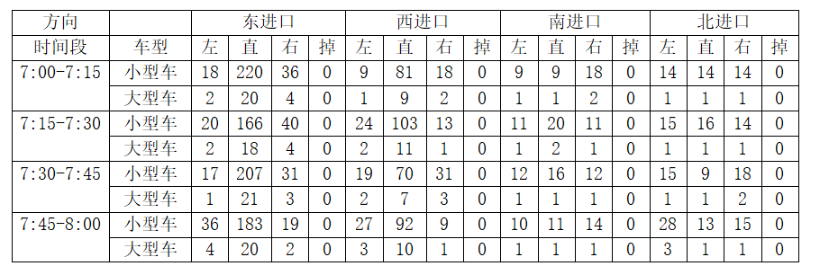

主干路仿真教程
===
# 1 数据采集
## 1.1 交叉路口相关信息
我们选取的主干路包含三个路口，分别为园林路与兴民路交叉路口、园林路与富康路交叉路口以及园林路与飞天路交叉路口。
## 1.2 车道相关信息
经过观察可知，东西向的园林路以及南北向的富康路为四车道，分别为左转车道、直行车道、右转车道以及非机动车道，南北向的兴民路以及飞天路为三车道，分别为直左车道、右转车道以及非机动车道。


表1-1 园林路与兴民路交叉路口各方向车道数


表1-2 园林路与富康路交叉路口各方向车道数


表1-3 园林路与飞天路交叉路口各方向车道数

## 1.3 车辆信息
我们统计了一小时内各车道的车辆信息，每15分钟各进口车道小型车以及大型车的转向车辆数。


表1-4 园林路与兴民路交叉路口机动车流量


表1-5 园林路与富康路交叉路口机动车流量



表1-6 园林路与飞天路交叉路口机动车流量

## 1.4 相位信息
园林路与兴民路交叉路口以及园林路与飞天路交叉路口为三相位，第一相位为东西向直行，第二相位为东西向左转，第三相位为南北向直左；园林路与富康路交叉路口为四相位，第一相位为东西向直行，第二相位为东西向左转，第三相位为南北向直行，第四相位为南北向左转。


表1-7 园林路与兴民路交叉路口信号相位图

第一相位绿灯27s，黄灯3s，全红3s；第二相位绿灯17s，黄灯3s，全红3s；第三相位绿灯27s，黄灯3s，全红3s。


表1-8 园林路与富康路交叉路口信号相位图

第一相位绿灯27s，黄灯3s，全红3s；第二相位绿灯17s，黄灯3s，全红3s；第三相位绿灯27s，黄灯3s，全红3s；第四相位绿灯17s，黄灯3s，全红3s。


表1-9 园林路与飞天路交叉路口信号相位图

第一相位绿灯27s，黄灯3s，全红3s；第二相位绿灯17s，黄灯3s，全红3s；第三相位绿灯27s，黄灯3s，全红3s。
## 1.5 公交车信息


表1-10 主干路公交车相关信息

# 2 绘制路口
## 2.1 绘制背景图
首先在CAD中对主干路进行绘制，包括道路信息、周边环境等内容。


图2-1 主干路背景图

## 2.2 导入背景图
在文件夹中新建文件命名为viewsettings.xml，主要内容为下列代码所示：
```xml
<viewsettings>
    <scheme name="real world"/>
    <delay value="100"/>
    <decal file="background.png" centerX="0.00" centerY="0.00" centerZ="0.00" width="712.50" height="525.00" altitude="0.00" rotation="0.00" tilt="0.00" roll="0.00"   layer="0.00" screenRelative="False"/>
</viewsettings>
```
其中需要按照实际情况调整width和height的值调整图片的尺寸。
构建完成后，在NETEDIT中点击上方，在弹出的界面中选择“Load Decals”，导入viewsettings.xml文件。


图2-2 导入背景图界面

此时背景图导入完成。
## 2.3 绘制路网
1、点击上方“set create edge mode”,在适当位置单击鼠标左键出现第一个红圈，在适当位置再次单击鼠标左键出现第二个红圈，此时一条单向车道绘制完成。

2、鼠标左键单击第二个红圈，再次单击第一个红圈，此时一条双向车道绘制完成。

3、点击上方“set inspect mode”,点击其中一条车道，在左侧弹出的信息中修改“numLanes”调整车道数。

4、点击上方“set move mode”,长按红圈并拖拽调整车道位置，将十字路口四个方向的道路进行连接.

5、点击上方“set crossing mode”,选择某一方向的双向车道，点击回车，此时一条人行横道绘制完成，重复上述步骤，绘制四个方向的人行横道，此时主干路路网绘制完成。


图2-3 主干路路网

## 2.4 调整连接流向
点击上方“set connection mode”,选择一条车道，所选车道呈现为蓝色，目标车道显示为绿色，冲突车道为黄色，单击想要连接的车道，点击回车，此时两条车道连接完成。如果想要连接的车道为冲突车道，则可以按住ctrl键再选择连接车道，此时车道连接完成。重复上述步骤，按照交叉口车道转向信息调整连接车道。


图2-4 车道连接

## 2.5 添加信号灯并修改配时
点击上方“set traffic light mode”，点击其中一个交叉路口，在左侧弹出的信息中点击“create”，此时信号灯创建完成，左侧下方会显示每一阶段各信号灯的灯态以及持续时间。


图2-5 信号灯配时信息

在交叉路口中，会根据之前的连接流向生成若干条线，绿色代表绿灯，黄色代表黄灯，红色代表红灯，右键点击其中一条线便可修改线的颜色，以此来修改信号灯每一阶段的灯态信息。修改完当前阶段可在左侧选择下一阶段进行修改。根据之前统计的信号灯状态的信息对路网中的信号灯状态进行修改，若出现阶段数不足或超出所给阶段可以在阶段信息右侧点击和增加或减少阶段数量。


图2-6 信号灯灯态


此时仿真路网全部绘制完成。
# 3 生成车辆路径
## 3.1 构建flows文件

新建*“vtype_def.xml”*，用于定义车辆类型：
```xml
<routes>
    <vType id="vt_car"   vClass="passenger" accel="2.6" decel="4.5" sigma="0.5" laneChangeModel="LC2013" maxSpeed="15" color="1,1,0" minGap="2.5"/>
    <vType id="vt_truck" vClass="truck"     accel="2.6" decel="4.5" sigma="0.5" laneChangeModel="LC2013" maxSpeed="11" color="1,0,0" minGap="2.5"/>
</routes>
```
新建*“vdistribution_def.xml”*，用于定义车辆构成：
```xml
<routes>
    <vTypeDistribution id="vtd_yuanlinlu_east_T1"  vTypes="vt_car vt_truck" probabilities="0.913 0.087"/>
    <vTypeDistribution id="vtd_yuanlinlu_west_T1"  vTypes="vt_car vt_truck" probabilities="0.935 0.065"/>
    <vTypeDistribution id="vtd_xingminlu_north_T1" vTypes="vt_car vt_truck" probabilities="0.952 0.048"/>
    <vTypeDistribution id="vtd_xingminlu_south_T1" vTypes="vt_car vt_truck" probabilities="0.909 0.091"/>
    <vTypeDistribution id="vtd_fukanglu_north_T1"  vTypes="vt_car vt_truck" probabilities="0.900 0.100"/>
    <vTypeDistribution id="vtd_fukanglu_south_T1"  vTypes="vt_car vt_truck" probabilities="0.900 0.100"/>
    <vTypeDistribution id="vtd_feitianlu_north_T1" vTypes="vt_car vt_truck" probabilities="0.933 0.067"/>
    <vTypeDistribution id="vtd_feitianlu_south_T1" vTypes="vt_car vt_truck" probabilities="0.900 0.100"/>

    
    <vTypeDistribution id="vtd_yuanlinlu_east_T2"  vTypes="vt_car vt_truck" probabilities="0.896 0.104"/>
    <vTypeDistribution id="vtd_yuanlinlu_west_T2"  vTypes="vt_car vt_truck" probabilities="0.917 0.083"/>
    <vTypeDistribution id="vtd_xingminlu_north_T2" vTypes="vt_car vt_truck" probabilities="0.958 0.042"/>
    <vTypeDistribution id="vtd_xingminlu_south_T2" vTypes="vt_car vt_truck" probabilities="0.911 0.089"/>
    <vTypeDistribution id="vtd_fukanglu_north_T2"  vTypes="vt_car vt_truck" probabilities="0.915 0.085"/>
    <vTypeDistribution id="vtd_fukanglu_south_T2"  vTypes="vt_car vt_truck" probabilities="0.927 0.073"/>
    <vTypeDistribution id="vtd_feitianlu_north_T2" vTypes="vt_car vt_truck" probabilities="0.937 0.063"/>
    <vTypeDistribution id="vtd_feitianlu_south_T2" vTypes="vt_car vt_truck" probabilities="0.913 0.087"/>

    <vTypeDistribution id="vtd_yuanlinlu_east_T3"  vTypes="vt_car vt_truck" probabilities="0.911 0.089"/>
    <vTypeDistribution id="vtd_yuanlinlu_west_T3"  vTypes="vt_car vt_truck" probabilities="0.910 0.090"/>
    <vTypeDistribution id="vtd_xingminlu_north_T3" vTypes="vt_car vt_truck" probabilities="0.952 0.048"/>
    <vTypeDistribution id="vtd_xingminlu_south_T3" vTypes="vt_car vt_truck" probabilities="0.900 0.100"/>
    <vTypeDistribution id="vtd_fukanglu_north_T3"  vTypes="vt_car vt_truck" probabilities="0.909 0.091"/>
    <vTypeDistribution id="vtd_fukanglu_south_T3"  vTypes="vt_car vt_truck" probabilities="0.917 0.083"/>
    <vTypeDistribution id="vtd_feitianlu_north_T3" vTypes="vt_car vt_truck" probabilities="0.913 0.087"/>
    <vTypeDistribution id="vtd_feitianlu_south_T3" vTypes="vt_car vt_truck" probabilities="0.930 0.070"/>

    <vTypeDistribution id="vtd_yuanlinlu_east_T4"  vTypes="vt_car vt_truck" probabilities="0.902 0.098"/>
    <vTypeDistribution id="vtd_yuanlinlu_west_T4"  vTypes="vt_car vt_truck" probabilities="0.908 0.092"/>
    <vTypeDistribution id="vtd_xingminlu_north_T4" vTypes="vt_car vt_truck" probabilities="0.912 0.088"/>
    <vTypeDistribution id="vtd_xingminlu_south_T4" vTypes="vt_car vt_truck" probabilities="0.917 0.083"/>
    <vTypeDistribution id="vtd_fukanglu_north_T4"  vTypes="vt_car vt_truck" probabilities="0.932 0.068"/>
    <vTypeDistribution id="vtd_fukanglu_south_T4"  vTypes="vt_car vt_truck" probabilities="0.927 0.073"/>
    <vTypeDistribution id="vtd_feitianlu_north_T4" vTypes="vt_car vt_truck" probabilities="0.911 0.089"/>
    <vTypeDistribution id="vtd_feitianlu_south_T4" vTypes="vt_car vt_truck" probabilities="0.921 0.079"/>

</routes>
```

在文件夹中新建文件命名为*flows.xml*，文件中主要包含起止时间，车辆类型以及占比，各进口车道的车辆数等信息，如下列代码所示：
```xml
<routes>
  <interval begin="0" end="899">
		<flow id="yuanlinlu_east_T1"  from="E0"  departLane="best" vehsPerHour="1200" type="vtd_yuanlinlu_east_T1"/>
		<flow id="yuanlinlu_west_T1"  from="-E8" departLane="best" vehsPerHour="856" type="vtd_yuanlinlu_west_T1"/>
		<flow id="xingminlu_north_T1" from="-E3" departLane="best" vehsPerHour="84" type="vtd_xingminlu_north_T1"/>
		<flow id="xingminlu_south_T1" from="-E1" departLane="best" vehsPerHour="176" type="vtd_xingminlu_south_T1"/>
		<flow id="fukanglu_north_T1"  from="-E6" departLane="best" vehsPerHour="240" type="vtd_fukanglu_north_T1"/>
		<flow id="fukanglu_south_T1"  from="-E4" departLane="best" vehsPerHour="160" type="vtd_fukanglu_south_T1"/>
		<flow id="feitianlu_north_T1" from="-E9" departLane="best" vehsPerHour="180" type="vtd_feitianlu_north_T1"/>
		<flow id="feitianlu_south_T1" from="-E7" departLane="best" vehsPerHour="160" type="vtd_feitianlu_south_T1"/>
	</interval>

  <interval begin="900" end="1799">
		<flow id="yuanlinlu_east_T2"  from="E0"  departLane="best" vehsPerHour="1000" type="vtd_yuanlinlu_east_T2"/>
		<flow id="yuanlinlu_west_T2"  from="-E8" departLane="best" vehsPerHour="920" type="vtd_yuanlinlu_west_T2"/>
		<flow id="xingminlu_north_T2" from="-E3" departLane="best" vehsPerHour="96" type="vtd_xingminlu_north_T2"/>
		<flow id="xingminlu_south_T2" from="-E1" departLane="best" vehsPerHour="180" type="vtd_xingminlu_south_T2"/>
		<flow id="fukanglu_north_T2"  from="-E6" departLane="best" vehsPerHour="328" type="vtd_fukanglu_north_T2"/>
		<flow id="fukanglu_south_T2"  from="-E4" departLane="best" vehsPerHour="220" type="vtd_fukanglu_south_T2"/>
		<flow id="feitianlu_north_T2" from="-E9" departLane="best" vehsPerHour="192" type="vtd_feitianlu_north_T2"/>
		<flow id="feitianlu_south_T2" from="-E7" departLane="best" vehsPerHour="184" type="vtd_feitianlu_south_T2"/>
	</interval>

  <interval begin="1800" end="2699">
		<flow id="yuanlinlu_east_T3"  from="E0"  departLane="best" vehsPerHour="1120" type="vtd_yuanlinlu_east_T3"/>
		<flow id="yuanlinlu_west_T3"  from="-E8" departLane="best" vehsPerHour="848" type="vtd_yuanlinlu_west_T3"/>
		<flow id="xingminlu_north_T3" from="-E3" departLane="best" vehsPerHour="168" type="vtd_xingminlu_north_T3"/>
		<flow id="xingminlu_south_T3" from="-E1" departLane="best" vehsPerHour="240" type="vtd_xingminlu_south_T3"/>
		<flow id="fukanglu_north_T3"  from="-E6" departLane="best" vehsPerHour="220" type="vtd_fukanglu_north_T3"/>
		<flow id="fukanglu_south_T3"  from="-E4" departLane="best" vehsPerHour="192" type="vtd_fukanglu_south_T3"/>
		<flow id="feitianlu_north_T3" from="-E9" departLane="best" vehsPerHour="184" type="vtd_feitianlu_north_T3"/>
		<flow id="feitianlu_south_T3" from="-E7" departLane="best" vehsPerHour="172" type="vtd_feitianlu_south_T3"/>
	</interval>

  <interval begin="2700" end="3599">
		<flow id="yuanlinlu_east_T4"  from="E0"  departLane="best" vehsPerHour="1056" type="vtd_yuanlinlu_east_T4"/>
		<flow id="yuanlinlu_west_T4"  from="-E8" departLane="best" vehsPerHour="872" type="vtd_yuanlinlu_west_T4"/>
		<flow id="xingminlu_north_T4" from="-E3" departLane="best" vehsPerHour="136" type="vtd_xingminlu_north_T4"/>
		<flow id="xingminlu_south_T4" from="-E1" departLane="best" vehsPerHour="144" type="vtd_xingminlu_south_T4"/>
		<flow id="fukanglu_north_T4"  from="-E6" departLane="best" vehsPerHour="176" type="vtd_fukanglu_north_T4"/>
		<flow id="fukanglu_south_T4"  from="-E4" departLane="best" vehsPerHour="164" type="vtd_fukanglu_south_T4"/>
		<flow id="feitianlu_north_T4" from="-E9" departLane="best" vehsPerHour="224" type="vtd_feitianlu_north_T4"/>
		<flow id="feitianlu_south_T4" from="-E7" departLane="best" vehsPerHour="152" type="vtd_feitianlu_south_T4"/>
	</interval>
</routes>
```
其中“vTypes”表示车辆类型，“probabilities”表示车辆类型的占比，“vehsPerHour”表示每小时的车辆数，“from”指车辆开始运行时所在的车道。
## 3.2 构建turns文件
车流量文件构建完成后，还需构建车辆转向相关的文件，在文件夹中新建文件并命名为turns.xml，文件内容包含车辆的行驶路线以及各路线车辆的占比，如下列代码所示：
```xml
<edgeRelations>
    <interval begin="0" end="900">
        <!--园林路与兴民路交叉口转向比例-->
        <edgeRelation from="E0"  to="E3"  probability="0.154"/> <!--西左转-->
        <edgeRelation from="E0"  to="E2"  probability="0.654"/> <!--西直行-->
        <edgeRelation from="E0"  to="E1"  probability="0.192"/> <!--西右转-->

        <edgeRelation from="-E2" to="E1"  probability="0.361"/> <!--东左转-->
        <edgeRelation from="-E2" to="-E0" probability="0.481"/> <!--东直行-->
        <edgeRelation from="-E2" to="E3"  probability="0.158"/> <!--东右转-->

        <edgeRelation from="-E1" to="-E0" probability="0.250"/> <!--南左转-->
        <edgeRelation from="-E1" to="E3"  probability="0.500"/> <!--南直行-->
        <edgeRelation from="-E1" to="E2"  probability="0.250"/> <!--南右转-->

        <edgeRelation from="-E3" to="E2"  probability="0.524"/> <!--北左转-->
        <edgeRelation from="-E3" to="E1"  probability="0.238"/> <!--北直行-->
        <edgeRelation from="-E3" to="-E0" probability="0.238"/> <!--北右转-->

        <!--园林路与富康路交叉口转向比例-->
        <edgeRelation from="E2"  to="E6"  probability="0.286"/> <!--西左转-->
        <edgeRelation from="E2"  to="E5"  probability="0.584"/> <!--西直行-->
        <edgeRelation from="E2"  to="E4"  probability="0.130"/> <!--西右转-->

        <edgeRelation from="-E5" to="E4"  probability="0.186"/> <!--东左转-->
        <edgeRelation from="-E5" to="-E2" probability="0.659"/> <!--东直行-->
        <edgeRelation from="-E5" to="E6"  probability="0.155"/> <!--东右转-->

        <edgeRelation from="-E4" to="-E2" probability="0.250"/> <!--南左转-->
        <edgeRelation from="-E4" to="E6"  probability="0.500"/> <!--南直行-->
        <edgeRelation from="-E4" to="E5"  probability="0.250"/> <!--南右转-->

        <edgeRelation from="-E6" to="E5"  probability="0.333"/> <!--北左转-->
        <edgeRelation from="-E6" to="E4"  probability="0.167"/> <!--北直行-->
        <edgeRelation from="-E6" to="-E2" probability="0.500"/> <!--北右转-->

        <!--园林路与飞天路交叉口转向比例-->
        <edgeRelation from="E5"  to="E9"  probability="0.083"/> <!--西左转-->
        <edgeRelation from="E5"  to="E8"  probability="0.750"/> <!--西直行-->
        <edgeRelation from="E5"  to="E7"  probability="0.167"/> <!--西右转-->

        <edgeRelation from="-E8" to="E7"  probability="0.067"/> <!--东左转-->
        <edgeRelation from="-E8" to="-E5" probability="0.800"/> <!--东直行-->
        <edgeRelation from="-E8" to="E9"  probability="0.133"/> <!--东右转-->

        <edgeRelation from="-E7" to="-E5" probability="0.250"/> <!--南左转-->
        <edgeRelation from="-E7" to="E9"  probability="0.250"/> <!--南直行-->
        <edgeRelation from="-E7" to="E8"  probability="0.500"/> <!--南右转-->

        <edgeRelation from="-E9" to="E8"  probability="0.333"/> <!--北左转-->
        <edgeRelation from="-E9" to="E7"  probability="0.334"/> <!--北直行-->
        <edgeRelation from="-E9" to="-E5" probability="0.333"/> <!--北右转-->
    </interval>

    <interval begin="900" end="1800">
        <!--园林路与兴民路交叉口转向比例-->
        <edgeRelation from="E0"  to="E3"  probability="0.178"/> <!--西左转-->
        <edgeRelation from="E0"  to="E2"  probability="0.722"/> <!--西直行-->
        <edgeRelation from="E0"  to="E1"  probability="0.100"/> <!--西右转-->

        <edgeRelation from="-E2" to="E1"  probability="0.440"/> <!--东左转-->
        <edgeRelation from="-E2" to="-E0" probability="0.234"/> <!--东直行-->
        <edgeRelation from="-E2" to="E3"  probability="0.326"/> <!--东右转-->

        <edgeRelation from="-E1" to="-E0" probability="0.333"/> <!--南左转-->
        <edgeRelation from="-E1" to="E3"  probability="0.222"/> <!--南直行-->
        <edgeRelation from="-E1" to="E2"  probability="0.445"/> <!--南右转-->

        <edgeRelation from="-E3" to="E2"  probability="0.250"/> <!--北左转-->
        <edgeRelation from="-E3" to="E1"  probability="0.250"/> <!--北直行-->
        <edgeRelation from="-E3" to="-E0" probability="0.500"/> <!--北右转-->

        <!--园林路与富康路交叉口转向比例-->
        <edgeRelation from="E2"  to="E6"  probability="0.194"/> <!--西左转-->
        <edgeRelation from="E2"  to="E5"  probability="0.647"/> <!--西直行-->
        <edgeRelation from="E2"  to="E4"  probability="0.159"/> <!--西右转-->

        <edgeRelation from="-E5" to="E4"  probability="0.265"/> <!--东左转-->
        <edgeRelation from="-E5" to="-E2" probability="0.406"/> <!--东直行-->
        <edgeRelation from="-E5" to="E6"  probability="0.329"/> <!--东右转-->

        <edgeRelation from="-E4" to="-E2" probability="0.218"/> <!--南左转-->
        <edgeRelation from="-E4" to="E6"  probability="0.418"/> <!--南直行-->
        <edgeRelation from="-E4" to="E5"  probability="0.364"/> <!--南右转-->

        <edgeRelation from="-E6" to="E5"  probability="0.268"/> <!--北左转-->
        <edgeRelation from="-E6" to="E4"  probability="0.146"/> <!--北直行-->
        <edgeRelation from="-E6" to="-E2" probability="0.586"/> <!--北右转-->

        <!--园林路与飞天路交叉口转向比例-->
        <edgeRelation from="E5"  to="E9"  probability="0.169"/> <!--西左转-->
        <edgeRelation from="E5"  to="E8"  probability="0.740"/> <!--西直行-->
        <edgeRelation from="E5"  to="E7"  probability="0.091"/> <!--西右转-->

        <edgeRelation from="-E8" to="E7"  probability="0.088"/> <!--东左转-->
        <edgeRelation from="-E8" to="-E5" probability="0.736"/> <!--东直行-->
        <edgeRelation from="-E8" to="E9"  probability="0.176"/> <!--东右转-->

        <edgeRelation from="-E7" to="-E5" probability="0.261"/> <!--南左转-->
        <edgeRelation from="-E7" to="E9"  probability="0.478"/> <!--南直行-->
        <edgeRelation from="-E7" to="E8"  probability="0.261"/> <!--南右转-->

        <edgeRelation from="-E9" to="E8"  probability="0.333"/> <!--北左转-->
        <edgeRelation from="-E9" to="E7"  probability="0.354"/> <!--北直行-->
        <edgeRelation from="-E9" to="-E5" probability="0.313"/> <!--北右转-->
    </interval>

    <interval begin="1800" end="2700">
        <!--园林路与兴民路交叉口转向比例-->
        <edgeRelation from="E0"  to="E3"  probability="0.132"/> <!--西左转-->
        <edgeRelation from="E0"  to="E2"  probability="0.792"/> <!--西直行-->
        <edgeRelation from="E0"  to="E1"  probability="0.075"/> <!--西右转-->

        <edgeRelation from="-E2" to="E1"  probability="0.459"/> <!--东左转-->
        <edgeRelation from="-E2" to="-E0" probability="0.322"/> <!--东直行-->
        <edgeRelation from="-E2" to="E3"  probability="0.219"/> <!--东右转-->

        <edgeRelation from="-E1" to="-E0" probability="0.333"/> <!--南左转-->
        <edgeRelation from="-E1" to="E3"  probability="0.500"/> <!--南直行-->
        <edgeRelation from="-E1" to="E2"  probability="0.167"/> <!--南右转-->

        <edgeRelation from="-E3" to="E2"  probability="0.405"/> <!--北左转-->
        <edgeRelation from="-E3" to="E1"  probability="0.262"/> <!--北直行-->
        <edgeRelation from="-E3" to="-E0" probability="0.333"/> <!--北右转-->

        <!--园林路与富康路交叉口转向比例-->
        <edgeRelation from="E2"  to="E6"  probability="0.285"/> <!--西左转-->
        <edgeRelation from="E2"  to="E5"  probability="0.535"/> <!--西直行-->
        <edgeRelation from="E2"  to="E4"  probability="0.180"/> <!--西右转-->

        <edgeRelation from="-E5" to="E4"  probability="0.205"/> <!--东左转-->
        <edgeRelation from="-E5" to="-E2" probability="0.553"/> <!--东直行-->
        <edgeRelation from="-E5" to="E6"  probability="0.242"/> <!--东右转-->

        <edgeRelation from="-E4" to="-E2" probability="0.500"/> <!--南左转-->
        <edgeRelation from="-E4" to="E6"  probability="0.292"/> <!--南直行-->
        <edgeRelation from="-E4" to="E5"  probability="0.208"/> <!--南右转-->

        <edgeRelation from="-E6" to="E5"  probability="0.273"/> <!--北左转-->
        <edgeRelation from="-E6" to="E4"  probability="0.364"/> <!--北直行-->
        <edgeRelation from="-E6" to="-E2" probability="0.363"/> <!--北右转-->

        <!--园林路与飞天路交叉口转向比例-->
        <edgeRelation from="E5"  to="E9"  probability="0.159"/> <!--西左转-->
        <edgeRelation from="E5"  to="E8"  probability="0.583"/> <!--西直行-->
        <edgeRelation from="E5"  to="E7"  probability="0.258"/> <!--西右转-->

        <edgeRelation from="-E8" to="E7"  probability="0.064"/> <!--东左转-->
        <edgeRelation from="-E8" to="-E5" probability="0.814"/> <!--东直行-->
        <edgeRelation from="-E8" to="E9"  probability="0.122"/> <!--东右转-->

        <edgeRelation from="-E7" to="-E5" probability="0.302"/> <!--南左转-->
        <edgeRelation from="-E7" to="E9"  probability="0.395"/> <!--南直行-->
        <edgeRelation from="-E7" to="E8"  probability="0.303"/> <!--南右转-->

        <edgeRelation from="-E9" to="E8"  probability="0.348"/> <!--北左转-->
        <edgeRelation from="-E9" to="E7"  probability="0.217"/> <!--北直行-->
        <edgeRelation from="-E9" to="-E5" probability="0.435"/> <!--北右转-->
    </interval>

    <interval begin="2700" end="3600">
        <!--园林路与兴民路交叉口转向比例-->
        <edgeRelation from="E0"  to="E3"  probability="0.202"/> <!--西左转-->
        <edgeRelation from="E0"  to="E2"  probability="0.683"/> <!--西直行-->
        <edgeRelation from="E0"  to="E1"  probability="0.115"/> <!--西右转-->

        <edgeRelation from="-E2" to="E1"  probability="0.210"/> <!--东左转-->
        <edgeRelation from="-E2" to="-E0" probability="0.496"/> <!--东直行-->
        <edgeRelation from="-E2" to="E3"  probability="0.294"/> <!--东右转-->

        <edgeRelation from="-E1" to="-E0" probability="0.389"/> <!--南左转-->
        <edgeRelation from="-E1" to="E3"  probability="0.333"/> <!--南直行-->
        <edgeRelation from="-E1" to="E2"  probability="0.278"/> <!--南右转-->

        <edgeRelation from="-E3" to="E2"  probability="0.324"/> <!--北左转-->
        <edgeRelation from="-E3" to="E1"  probability="0.294"/> <!--北直行-->
        <edgeRelation from="-E3" to="-E0" probability="0.382"/> <!--北右转-->

        <!--园林路与富康路交叉口转向比例-->
        <edgeRelation from="E2"  to="E6"  probability="0.248"/> <!--西左转-->
        <edgeRelation from="E2"  to="E5"  probability="0.713"/> <!--西直行-->
        <edgeRelation from="E2"  to="E4"  probability="0.039"/> <!--西右转-->

        <edgeRelation from="-E5" to="E4"  probability="0.136"/> <!--东左转-->
        <edgeRelation from="-E5" to="-E2" probability="0.529"/> <!--东直行-->
        <edgeRelation from="-E5" to="E6"  probability="0.335"/> <!--东右转-->

        <edgeRelation from="-E4" to="-E2" probability="0.318"/> <!--南左转-->
        <edgeRelation from="-E4" to="E6"  probability="0.318"/> <!--南直行-->
        <edgeRelation from="-E4" to="E5"  probability="0.364"/> <!--南右转-->

        <edgeRelation from="-E6" to="E5"  probability="0.362"/> <!--北左转-->
        <edgeRelation from="-E6" to="E4"  probability="0.383"/> <!--北直行-->
        <edgeRelation from="-E6" to="-E2" probability="0.255"/> <!--北右转-->

        <!--园林路与飞天路交叉口转向比例-->
        <edgeRelation from="E5"  to="E9"  probability="0.211"/> <!--西左转-->
        <edgeRelation from="E5"  to="E8"  probability="0.718"/> <!--西直行-->
        <edgeRelation from="E5"  to="E7"  probability="0.071"/> <!--西右转-->

        <edgeRelation from="-E8" to="E7"  probability="0.152"/> <!--东左转-->
        <edgeRelation from="-E8" to="-E5" probability="0.769"/> <!--东直行-->
        <edgeRelation from="-E8" to="E9"  probability="0.081"/> <!--东右转-->

        <edgeRelation from="-E7" to="-E5" probability="0.289"/> <!--南左转-->
        <edgeRelation from="-E7" to="E9"  probability="0.316"/> <!--南直行-->
        <edgeRelation from="-E7" to="E8"  probability="0.395"/> <!--南右转-->

        <edgeRelation from="-E9" to="E8"  probability="0.508"/> <!--北左转-->
        <edgeRelation from="-E9" to="E7"  probability="0.230"/> <!--北直行-->
        <edgeRelation from="-E9" to="-E5" probability="0.262"/> <!--北右转-->
    </interval>
</edgeRelations>
```
其中“from”、“to”表示车辆的行驶路线，“probability”表示车辆占比。
## 3.3 生成车辆路径

### 方法一
flows和turns文件构建完成后，手动创建*jtrrouter.bat*文件，写入以下内容：
```bat
call="%SUMO_HOME%bin\jtrrouter" -n net.xml -r vtype_def.xml,vdistribution_def.xml,flows.xml -t turns.xml -o rou.xml --accept-all-destinations
pause
```
其中net.xml为路网文件，flows.xml为车流量文件，turns.xml为车辆转向文件，rou.xml为生成的车辆路径文件，添加完成后运行该文件，若没有出现报错，则会显示success,关闭界面后在当前文件夹内会自动生成rou.xml文件，此时车辆路径文件创建完成。

### 方法二
新建*.jtrcfg*文件，配置内容如下：
```xml
<configuration>
    <input>
        <net-file value="example42.net.xml"/>
        <route-files value="vtype_def.xml,vdistribution_def.xml,example42.flows.xml"/>
        <turn-ratio-files value="example42.turns.xml"/>
        
    </input>
    <output>
        <write-license value="true"/>
        <output-file value="example42.rou.xml"/>
    </output>
    <processing>
        <sources-are-sinks value="true"/>
        <accept-all-destinations value="true"/>
    </processing>
    <report>
        <ignore-errors value="true"/>
        <no-step-log value="true"/>
    </report>

</configuration>
```

创建*jtrrouter.bat*文件，写入以下内容：
```bat
call="%SUMO_HOME%bin\jtrrouter" -c example42.jtrcfg --accept-all-destinations
pause
```

## 3.4 创建公交车路径
### （1） 设置公交站点
在文件夹内新建文件并命名为busstop_def.add.xml，主要内容如下：
```xml
<additional>
    <!-- StoppingPlaces -->
    <busStop id="ertongleyuan_north" lane="-E0_1" startPos="147.30" endPos="159.50" lines="EToW">
        <access lane="-E0_0" pos="155.00"/>
    </busStop>
    <busStop id="ertongleyuan_south" lane="E0_1" startPos="202.00" endPos="215.00" lines="WToE">
        <access lane="E0_0" pos="210.00"/>
    </busStop>
    <busStop id="guangmingxiaoqu_east" lane="-E7_1" startPos="28.00" endPos="40.50" lines="DownRight2UpLeft">
        <access lane="-E7_0" pos="30.00"/>
    </busStop>
    <busStop id="guangmingxiaoqu_west" lane="E7_1" startPos="143.00" endPos="156.00" lines="UpLeft2DownRight">
        <access lane="E7_0" pos="144.00"/>
    </busStop>
    <busStop id="postoffice_east" lane="E3_1" startPos="142.50" endPos="155.00" lines="DownRight2UpLeft">
        <access lane="E3_0" pos="140.00"/>
    </busStop>
    <busStop id="postoffice_west" lane="-E3_1" startPos="25.00" endPos="38.00" lines="UpLeft2DownRight">
        <access lane="-E3_0" pos="34.00"/>
    </busStop>
    <busStop id="shuidianju_north" lane="-E8_1" startPos="166.30" endPos="178.50" lines="EToW">
        <access lane="-E8_0" pos="170.00"/>
    </busStop>
    <busStop id="shuidianju_south" lane="E8_1" startPos="147.00" endPos="160.00" lines="WToE">
        <access lane="E8_0" pos="150.00"/>
    </busStop>
    <busStop id="zhiwuyuan_north" lane="-E5_1" startPos="155.00" endPos="167.50" lines="EToW">
        <access lane="-E5_0" pos="159.00"/>
    </busStop>
    <busStop id="zhiwuyuan_south" lane="E5_1" startPos="197.00" endPos="210.00" lines="WToE">
        <access lane="E5_0" pos="200.00"/>
    </busStop>
</additional>
```
其中“lane”表示公交车站所在道路，“startpos”和“endpos”表示车站的具体位置，“access lane”和“access pos”表示公交车停靠的具体位置。
### （2） 构建公交车路径
除构建公交车的路径，直接在文件夹内新建文件并命名为bus.rou.xml，相关内容如下：
```xml
<routes>
    <!--公交相关，公交车站在.net.xml中定义-->
    <vType id="BUS_A" personCapacity="40" vClass="bus" length="12" maxSpeed="9" guiShape="bus"/>
    <vType id="BUS_B" personCapacity="45" vClass="bus" Length="14" maxSpeed="7" guiShape="bus" />


    <route id="rt_W2E" edges="E0 E2 E5 E8"/>
    <route id="rt_E2W" edges="-E8 -E5 -E2 -E0"/>

    <route id="rt_UP2DOWN" edges="-E3 E2 E5 E7"/>
    <route id="rt_DOWN2UP" edges="-E7 -E5 -E2 E3"/>


    <flow id="e2w_106" color="1,1,1"  begin="0" end= "3600" period="600"  type="BUS_B" line="EToW" route="rt_E2W"> 
    <stop busStop="shuidianju_north" duration="60"/>
    <stop busStop="zhiwuyuan_north" duration="60"/>
    <stop busStop="ertongleyuan_north" duration="60"/>
    </flow>

    <flow id="w2e_106" color="1,0,1"  begin="0" end= "3600" period="600"  type="BUS_A" line="WToE" route="rt_W2E"> 
    <stop busStop="ertongleyuan_south" duration="60"/>
    <stop busStop="zhiwuyuan_south" duration="60"/>
    <stop busStop="shuidianju_south" duration="60"/>
    </flow>

    <flow id="up2down_211" color="0.2,1,1"  begin="0" end= "3600" period="600"  type="BUS_B" line="UP2DOWN" route="rt_UP2DOWN"> 
    <stop busStop="postoffice_west" duration="60"/>
    <stop busStop="zhiwuyuan_south" duration="60"/>
    <stop busStop="guangmingxiaoqu_west" duration="60"/>
    </flow>

    <flow id="down2up_211" color="1,0.5,1"  begin="0" end= "3600" period="600"  type="BUS_A" line="DOWN2UP" route="rt_DOWN2UP"> 
    <stop busStop="guangmingxiaoqu_east" duration="60"/>
    <stop busStop="zhiwuyuan_north" duration="60"/>
    <stop busStop="postoffice_east" duration="60"/>
    </flow>
</routes>
```
其中“edges”表示公交车行驶路线，“period”表示两辆公交车之间的时间间隔，“duration”表示公交车在站点停靠的时间。
## 3.5 创建行人路径
行人路径分为两种，一种为步行的行人，一种为乘坐公交车的行人，两种都可在文件中实现。在文件夹中新建文件并命名为pedestrian.rou.xml，主要内容如下：
```xml
<routes>                                                         <!--行人过街-->
    <personFlow id="walk1" depart="0" number="300">
    <walk from="-E1" to="E9" arrivalPos="random"/>
    </personFlow>

    <personFlow id="bus1" depart="0" color="1,0,1" period="100">     <!--行人换乘-->
    <walk from="E0" busStop="ertongleyuan_south"/>
    <ride to="E5" lines="WToE"/>  
    <walk to="-E5" busStop="zhiwuyuan_north"/>
    <ride to="E3" lines="DOWN2UP"/>  
    <walk to="E3" arrivalPos="max"/>
    </personFlow>

    <personFlow id="bus2" depart="0" number="100">                   <!--行人换乘-->
    <walk from="E0" busStop="ertongleyuan_south"/>
    <ride to="E8" lines="WToE"/>  
    <walk to="E8" arrivalPos="random"/>
    </personFlow>

    <personFlow id="walk2" depart="0" number="300">                  <!--行人过街-->
    <walk from="-E9"  to="E6" arrivalPos="random"/>
    </personFlow>

    <personFlow id="walk3" depart="0" number="800">                  <!--行人过街-->
    <walk from="-E4"  to="E6" arrivalPos="random"/>
    </personFlow>

    <vType id="vt_p" length="2" maxSpeed="5" vClass="moped" color="1,1,1"/>  <!--行人过街-->
    <personFlow id="walk4" depart="0" type="vt_p" number="800">
    <walk from="-E6"  to="E4" arrivalPos="random"/>
    </personFlow>
</routes>
```
其中id为“walk”的为步行的行人，id为“bus”的为乘坐公交车的行人，乘坐公交车相关的内容中，“walk from”表示步行至公交站点等待公交车，“ride to”表示乘坐公交车至下一个公交站点下车，“walk to”表示下车后步行至目的地。
# 4 其他内容构建
## 4.1 E1检测器设置
### (1)E1检测器，新建.xml文件，文件命名为det_e1.add.xml
```xml
<additional>
  <inductionLoop id="north_0" lane="-E3_0" pos="100" period="300" file="output/data_e1.xml" friendlypos="true"/>
  <inductionLoop id="north_1" lane="-E3_1" pos="100" period="300" file="output/data_e1.xml" friendlypos="true"/>
  <inductionLoop id="north_2" lane="-E3_2" pos="100" period="300" file="output/data_e1.xml" friendlypos="true"/>

  <inductionLoop id="west_0" lane="E0_0" pos="100" period="300" file="output/data_e1.xml" friendlypos="true"/>
  <inductionLoop id="west_1" lane="E0_1" pos="100" period="300" file="output/data_e1.xml" friendlypos="true"/>
  <inductionLoop id="west_2" lane="E0_2" pos="100" period="300" file="output/data_e1.xml" friendlypos="true"/>
  <inductionLoop id="west_3" lane="E0_3" pos="100" period="300" file="output/data_e1.xml" friendlypos="true"/>

  <inductionLoop id="south_0" lane="-E2_0" pos="100" period="300" file="output/data_e1.xml" friendlypos="true"/>
  <inductionLoop id="south_1" lane="-E2_1" pos="100" period="300" file="output/data_e1.xml" friendlypos="true"/>
  <inductionLoop id="south_2" lane="-E2_2" pos="100" period="300" file="output/data_e1.xml" friendlypos="true"/>

  <inductionLoop id="east_0" lane="-E1_0" pos="100" period="300" file="output/data_e1.xml" friendlypos="true"/>
  <inductionLoop id="east_1" lane="-E1_1" pos="100" period="300" file="output/data_e1.xml" friendlypos="true"/>
  <inductionLoop id="east_2" lane="-E1_2" pos="100" period="300" file="output/data_e1.xml" friendlypos="true"/>
  <inductionLoop id="east_3" lane="-E1_3" pos="100" period="300" file="output/data_e1.xml" friendlypos="true"/>
</additional>
```
### (1)E1 instant检测器，新建.xml文件，文件命名为det_e1_instant.add.xml
```xml
<additional>
  <instantInductionLoop  id="north_0" lane="-E3_0" pos="120" period="300" file="output/data_e1_instant.xml" friendlypos="true"/>
  <instantInductionLoop  id="north_1" lane="-E3_1" pos="120" period="300" file="output/data_e1_instant.xml" friendlypos="true"/>
  <instantInductionLoop  id="north_2" lane="-E3_2" pos="120" period="300" file="output/data_e1_instant.xml" friendlypos="true"/>

  <instantInductionLoop  id="west_0" lane="E0_0" pos="120" period="300" file="output/data_e1_instant.xml" friendlypos="true"/>
  <instantInductionLoop  id="west_1" lane="E0_1" pos="120" period="300" file="output/data_e1_instant.xml" friendlypos="true"/>
  <instantInductionLoop  id="west_2" lane="E0_2" pos="120" period="300" file="output/data_e1_instant.xml" friendlypos="true"/>
  <instantInductionLoop  id="west_3" lane="E0_3" pos="120" period="300" file="output/data_e1_instant.xml" friendlypos="true"/>

  <instantInductionLoop  id="south_0" lane="-E2_0" pos="120" period="300" file="output/data_e1_instant.xml" friendlypos="true"/>
  <instantInductionLoop  id="south_1" lane="-E2_1" pos="120" period="300" file="output/data_e1_instant.xml" friendlypos="true"/>
  <instantInductionLoop  id="south_2" lane="-E2_2" pos="120" period="300" file="output/data_e1_instant.xml" friendlypos="true"/>

  <instantInductionLoop  id="east_0" lane="-E1_0" pos="120" period="300" file="output/data_e1_instant.xml" friendlypos="true"/>
  <instantInductionLoop  id="east_1" lane="-E1_1" pos="120" period="300" file="output/data_e1_instant.xml" friendlypos="true"/>
  <instantInductionLoop  id="east_2" lane="-E1_2" pos="120" period="300" file="output/data_e1_instant.xml" friendlypos="true"/>
  <instantInductionLoop  id="east_3" lane="-E1_3" pos="120" period="300" file="output/data_e1_instant.xml" friendlypos="true"/>
</additional>
```
## 4.2 设置E2检测器
E2检测器的作用是在仿真运行过程中实时采集运行的数据。在文件夹中新建文件并命名为det_e2.add.xml，主要内容如下：
```xml
<additional>
<laneAreaDetector id="yuanlinlu_west_entry0" lane="E0_0" pos="0" length="361.73" period="300" file="output/data_e2.xml"/>
<laneAreaDetector id="yuanlinlu_west_entry1" lane="E0_1" pos="0" length="361.73" period="300" file="output/data_e2.xml"/>
<laneAreaDetector id="yuanlinlu_west_entry2" lane="E0_2" pos="0" length="361.73" period="300" file="output/data_e2.xml"/>
<laneAreaDetector id="yuanlinlu_west_entry3" lane="E0_3" pos="0" length="361.73" period="300" file="output/data_e2.xml"/>

<laneAreaDetector id="yuanlinlu_west_exit0" lane="-E0_0" pos="0" length="361.73" period="300" file="output/data_e2.xml"/>
<laneAreaDetector id="yuanlinlu_west_exit1" lane="-E0_1" pos="0" length="361.73" period="300" file="output/data_e2.xml"/>
<laneAreaDetector id="yuanlinlu_west_exit2" lane="-E0_2" pos="0" length="361.73" period="300" file="output/data_e2.xml"/>
<laneAreaDetector id="yuanlinlu_west_exit3" lane="-E0_3" pos="0" length="361.73" period="300" file="output/data_e2.xml"/>

<laneAreaDetector id="yuanlinlu_east_entry0" lane="-E8_0" pos="0" length="325.62" period="300" file="output/data_e2.xml"/>
<laneAreaDetector id="yuanlinlu_east_entry1" lane="-E8_1" pos="0" length="325.62" period="300" file="output/data_e2.xml"/>
<laneAreaDetector id="yuanlinlu_east_entry2" lane="-E8_2" pos="0" length="325.62" period="300" file="output/data_e2.xml"/>
<laneAreaDetector id="yuanlinlu_east_entry3" lane="-E8_3" pos="0" length="325.62" period="300" file="output/data_e2.xml"/>

<laneAreaDetector id="yuanlinlu_east_exit0" lane="E8_0" pos="0" length="325.62" period="300" file="output/data_e2.xml"/>
<laneAreaDetector id="yuanlinlu_east_exit1" lane="E8_1" pos="0" length="325.62" period="300" file="output/data_e2.xml"/>
<laneAreaDetector id="yuanlinlu_east_exit2" lane="E8_2" pos="0" length="325.62" period="300" file="output/data_e2.xml"/>
<laneAreaDetector id="yuanlinlu_east_exit3" lane="E8_3" pos="0" length="325.62" period="300" file="output/data_e2.xml"/>

<laneAreaDetector id="yuanlinlu_west_mid_entry0" lane="E2_0" pos="0" length="364.62" period="300" file="output/data_e2.xml"/>
<laneAreaDetector id="yuanlinlu_west_mid_entry1" lane="E2_1" pos="0" length="364.62" period="300" file="output/data_e2.xml"/>
<laneAreaDetector id="yuanlinlu_west_mid_entry2" lane="E2_2" pos="0" length="364.62" period="300" file="output/data_e2.xml"/>
<laneAreaDetector id="yuanlinlu_west_mid_entry3" lane="E2_3" pos="0" length="364.62" period="300" file="output/data_e2.xml"/>

<laneAreaDetector id="yuanlinlu_west_mid_exit0" lane="-E2_0" pos="0" length="364.62" period="300" file="output/data_e2.xml"/>
<laneAreaDetector id="yuanlinlu_west_mid_exit1" lane="-E2_1" pos="0" length="364.62" period="300" file="output/data_e2.xml"/>
<laneAreaDetector id="yuanlinlu_west_mid_exit2" lane="-E2_2" pos="0" length="364.62" period="300" file="output/data_e2.xml"/>
<laneAreaDetector id="yuanlinlu_west_mid_exit3" lane="-E2_3" pos="0" length="364.62" period="300" file="output/data_e2.xml"/>

<laneAreaDetector id="yuanlinlu_east_mid_entry0" lane="-E5_0" pos="0" length="364.71" period="300" file="output/data_e2.xml"/>
<laneAreaDetector id="yuanlinlu_east_mid_entry1" lane="-E5_1" pos="0" length="364.71" period="300" file="output/data_e2.xml"/>
<laneAreaDetector id="yuanlinlu_east_mid_entry2" lane="-E5_2" pos="0" length="364.71" period="300" file="output/data_e2.xml"/>
<laneAreaDetector id="yuanlinlu_east_mid_entry3" lane="-E5_3" pos="0" length="364.71" period="300" file="output/data_e2.xml"/>

<laneAreaDetector id="yuanlinlu_east_mid_exit0" lane="E5_0" pos="0" length="364.71" period="300" file="output/data_e2.xml"/>
<laneAreaDetector id="yuanlinlu_east_mid_exit1" lane="E5_1" pos="0" length="364.71" period="300" file="output/data_e2.xml"/>
<laneAreaDetector id="yuanlinlu_east_mid_exit2" lane="E5_2" pos="0" length="364.71" period="300" file="output/data_e2.xml"/>
<laneAreaDetector id="yuanlinlu_east_mid_exit3" lane="E5_3" pos="0" length="364.71" period="300" file="output/data_e2.xml"/>

<laneAreaDetector id="xingminlu_north_entry0" lane="-E3_0" pos="0" length="180.69" period="300" file="output/data_e2.xml"/>
<laneAreaDetector id="xingminlu_north_entry1" lane="-E3_1" pos="0" length="180.69" period="300" file="output/data_e2.xml"/>
<laneAreaDetector id="xingminlu_north_entry2" lane="-E3_2" pos="0" length="180.69" period="300" file="output/data_e2.xml"/>

<laneAreaDetector id="xingminlu_north_exit0" lane="E3_0" pos="0" length="180.69" period="300" file="output/data_e2.xml"/>
<laneAreaDetector id="xingminlu_north_exit1" lane="E3_1" pos="0" length="180.69" period="300" file="output/data_e2.xml"/>
<laneAreaDetector id="xingminlu_north_exit2" lane="E3_2" pos="0" length="180.69" period="300" file="output/data_e2.xml"/>

<laneAreaDetector id="xingminlu_south_entry0" lane="-E1_0" pos="0" length="183.05" period="300" file="output/data_e2.xml"/>
<laneAreaDetector id="xingminlu_south_entry1" lane="-E1_1" pos="0" length="183.05" period="300" file="output/data_e2.xml"/>
<laneAreaDetector id="xingminlu_south_entry2" lane="-E1_2" pos="0" length="183.05" period="300" file="output/data_e2.xml"/>

<laneAreaDetector id="xingminlu_south_exit0" lane="E1_0" pos="0" length="183.05" period="300" file="output/data_e2.xml"/>
<laneAreaDetector id="xingminlu_south_exit1" lane="E1_1" pos="0" length="183.05" period="300" file="output/data_e2.xml"/>
<laneAreaDetector id="xingminlu_south_exit2" lane="E1_2" pos="0" length="183.05" period="300" file="output/data_e2.xml"/>

<laneAreaDetector id="fukanglu_north_entry0" lane="-E6_0" pos="0" length="183.08" period="300" file="output/data_e2.xml"/>
<laneAreaDetector id="fukanglu_north_entry1" lane="-E6_1" pos="0" length="183.08" period="300" file="output/data_e2.xml"/>
<laneAreaDetector id="fukanglu_north_entry2" lane="-E6_2" pos="0" length="183.08" period="300" file="output/data_e2.xml"/>
<laneAreaDetector id="fukanglu_north_entry3" lane="-E6_3" pos="0" length="183.08" period="300" file="output/data_e2.xml"/>

<laneAreaDetector id="fukanglu_north_exit0" lane="E6_0" pos="0" length="183.08" period="300" file="output/data_e2.xml"/>
<laneAreaDetector id="fukanglu_north_exit1" lane="E6_1" pos="0" length="183.08" period="300" file="output/data_e2.xml"/>
<laneAreaDetector id="fukanglu_north_exit2" lane="E6_2" pos="0" length="183.08" period="300" file="output/data_e2.xml"/>
<laneAreaDetector id="fukanglu_north_exit3" lane="E6_3" pos="0" length="183.08" period="300" file="output/data_e2.xml"/>

<laneAreaDetector id="fukanglu_south_entry0" lane="-E4_0" pos="0" length="180.26" period="300" file="output/data_e2.xml"/>
<laneAreaDetector id="fukanglu_south_entry1" lane="-E4_1" pos="0" length="180.26" period="300" file="output/data_e2.xml"/>
<laneAreaDetector id="fukanglu_south_entry2" lane="-E4_2" pos="0" length="180.26" period="300" file="output/data_e2.xml"/>
<laneAreaDetector id="fukanglu_south_entry3" lane="-E4_3" pos="0" length="180.26" period="300" file="output/data_e2.xml"/>

<laneAreaDetector id="fukanglu_south_exit0" lane="E4_0" pos="0" length="180.26" period="300" file="output/data_e2.xml"/>
<laneAreaDetector id="fukanglu_south_exit1" lane="E4_1" pos="0" length="180.26" period="300" file="output/data_e2.xml"/>
<laneAreaDetector id="fukanglu_south_exit2" lane="E4_2" pos="0" length="180.26" period="300" file="output/data_e2.xml"/>
<laneAreaDetector id="fukanglu_south_exit3" lane="E4_3" pos="0" length="180.26" period="300" file="output/data_e2.xml"/>

<laneAreaDetector id="feitianlu_north_entry0" lane="-E9_0" pos="0" length="185.82" period="300" file="output/data_e2.xml"/>
<laneAreaDetector id="feitianlu_north_entry1" lane="-E9_1" pos="0" length="185.82" period="300" file="output/data_e2.xml"/>
<laneAreaDetector id="feitianlu_north_entry2" lane="-E9_2" pos="0" length="185.82" period="300" file="output/data_e2.xml"/>

<laneAreaDetector id="feitianlu_north_exit0" lane="E9_0" pos="0" length="185.82" period="300" file="output/data_e2.xml"/>
<laneAreaDetector id="feitianlu_north_exit1" lane="E9_1" pos="0" length="185.82" period="300" file="output/data_e2.xml"/>
<laneAreaDetector id="feitianlu_north_exit2" lane="E9_2" pos="0" length="185.82" period="300" file="output/data_e2.xml"/>

<laneAreaDetector id="feitianlu_south_entry0" lane="-E7_0" pos="0" length="183.52" period="300" file="output/data_e2.xml"/>
<laneAreaDetector id="feitianlu_south_entry1" lane="-E7_1" pos="0" length="183.52" period="300" file="output/data_e2.xml"/>
<laneAreaDetector id="feitianlu_south_entry2" lane="-E7_2" pos="0" length="183.52" period="300" file="output/data_e2.xml"/>

<laneAreaDetector id="feitianlu_south_exit0" lane="E7_0" pos="0" length="183.52" period="300" file="output/data_e2.xml"/>
<laneAreaDetector id="feitianlu_south_exit1" lane="E7_1" pos="0" length="183.52" period="300" file="output/data_e2.xml"/>
<laneAreaDetector id="feitianlu_south_exit2" lane="E7_2" pos="0" length="183.52" period="300" file="output/data_e2.xml"/>

</additional>
```

其中“pos”表示检测器的起始位置，“length”表示检测器的检测长度，“freq”表示检测器检测数据的频率，“file”表示将采集的数据存放的文件的名称。

另一种方法是根据路径设置E2：
```xml
<additional>
    <laneAreaDetector id="east2west" lanes="E0_2 E3_2 E5_2 E7_2 E13_2" pos="0" endPos="150" period="300" file="output/data_e2.xml"/>
    <laneAreaDetector id="west2east" lanes="-E13_2 -E7_2 -E5_2 -E3_2 -E0_2" pos="0" endPos="150" period="300" file="output/data_e2.xml"/>
</additional>
```
## 4.3 设置E3检测器
在文件夹中新建文件并命名为det_e3.add.xml，主要内容如下：
```xml
<additional>
<entryExitDetector id="e3_det" period="300" file="output/data_e3.xml">
    <detEntry lane="E0_0" pos="50"/>
    <detEntry lane="E0_1" pos="50"/>
    <detEntry lane="E0_2" pos="50"/>
    <detEntry lane="E0_3" pos="50"/>
    <detEntry lane="-E1_0" pos="50"/>
    <detEntry lane="-E1_1" pos="50"/>
    <detEntry lane="-E1_2" pos="50"/>
    <detEntry lane="-E4_0" pos="50"/>
    <detEntry lane="-E4_1" pos="50"/>
    <detEntry lane="-E4_2" pos="50"/>
    <detEntry lane="-E4_3" pos="50"/>
    <detEntry lane="-E7_0" pos="50"/>
    <detEntry lane="-E7_1" pos="50"/>
    <detEntry lane="-E7_2" pos="50"/>
    <detEntry lane="-E8_0" pos="50"/>
    <detEntry lane="-E8_1" pos="50"/>
    <detEntry lane="-E8_2" pos="50"/>
    <detEntry lane="-E8_3" pos="50"/>
    <detEntry lane="-E9_0" pos="50"/>
    <detEntry lane="-E9_1" pos="50"/>
    <detEntry lane="-E9_2" pos="50"/>
    <detEntry lane="-E6_0" pos="50"/>
    <detEntry lane="-E6_1" pos="50"/>
    <detEntry lane="-E6_2" pos="50"/>
    <detEntry lane="-E6_3" pos="50"/>
    <detEntry lane="-E3_0" pos="50"/>
    <detEntry lane="-E3_1" pos="50"/>
    <detEntry lane="-E3_2" pos="50"/>

    <detExit lane="-E0_0" pos="50"/>
    <detExit lane="-E0_1" pos="50"/>
    <detExit lane="-E0_2" pos="50"/>
    <detExit lane="-E0_3" pos="50"/>
    <detExit lane="E1_0" pos="50"/>
    <detExit lane="E1_1" pos="50"/>
    <detExit lane="E1_2" pos="50"/>
    <detExit lane="E4_0" pos="50"/>
    <detExit lane="E4_1" pos="50"/>
    <detExit lane="E4_2" pos="50"/>
    <detExit lane="E4_3" pos="50"/>
    <detExit lane="E7_0" pos="50"/>
    <detExit lane="E7_1" pos="50"/>
    <detExit lane="E7_2" pos="50"/>
    <detExit lane="E8_0" pos="50"/>
    <detExit lane="E8_1" pos="50"/>
    <detExit lane="E8_2" pos="50"/>
    <detExit lane="E8_3" pos="50"/>
    <detExit lane="E9_0" pos="50"/>
    <detExit lane="E9_1" pos="50"/>
    <detExit lane="E9_2" pos="50"/>
    <detExit lane="E6_0" pos="50"/>
    <detExit lane="E6_1" pos="50"/>
    <detExit lane="E6_2" pos="50"/>
    <detExit lane="E6_3" pos="50"/>
    <detExit lane="E3_0" pos="50"/>
    <detExit lane="E3_1" pos="50"/>
    <detExit lane="E3_2" pos="50"/>
</entryExitDetector>
</additional>
```
其中所有内容同E2检测器。
## 4.4 设置Edge、Lane数据采集
新建*edgelane_dump.add.xml*文件，并配置：
```xml
<additional>
    <edgeData id="edgedata_300" file="edge_300.xml" period="300" edges="-E2 E2 -E5 E5"/>
	<laneData id="lanedata_300" file="lane_300.xml" period="300" edges="-E2 E2 -E5 E5"/>
	<edgeData id="edgedata_120" file="edge_120.xml" freq="120" edges="-E2 E2 -E5 E5"/>
	<laneData id="lanedata_120" file="lane_120.xml" freq="120" edges="-E2 E2 -E5 E5"/>
</additional>
```
分别采集 *"-E2 E2 -E5 E5"* 四条道路的数据，时间间隔为*300s*和*120s*。
## 4.5 设置仿真运行文件
所有内容完成后开始创建仿真运行文件，在文件夹中新建文件并将后缀改为sumocfg文件，将以上文件全部添加至该文件中，主要内容如下：
```xml
<configuration>

<input>
    <net-file value="example42.net.xml"/>
    <route-files value="example42.rou.xml,bus.rou.xml,pedestrian.rou.xml"/>
    <additional-files value="busstops_def.add.xml,det_e3.add.xml,det_e2.add.xml,edgelane_dump.add.xml"/>
</input>

<output>
    <write-license value="false"/>  <!--  Include license info into every output file; default: false -->
    <output-prefix value="OUTPUT-"/>  <!-- Prefix which is applied to all output files. The special string 'TIME' is replaced by the current time.-->
    <precision value="2"/>  <!-- Defines the number of digits after the comma for floating point output; default: 2-->
    <human-readable-time value="false"/>  <!--Write time values as hour:minute:second or day:hour:minute:second rather than seconds; default: false -->
    <netstate-dump value="output/data_netstate.xml"/>  <!--Save complete network states into FILE -->
    <emission-output value="output/data_emission.xml"/>  <!--Save the emission values of each vehicle -->
    <emission-output.precision value="2"/>  <!--Write emission values with the given precision (default 2); default: 2 -->
    <!--full-output value="data_fulloutput.xml"/-->  <!-- Save a lot of information for each timestep (very redundant)-->
    <queue-output value="output/data_Queue.xml"/>  <!--Save the vehicle queues at the junctions (experimental) -->
    <queue-output.period value="300"/>  <!-- Save vehicle queues with the given period; default: -1-->
    <summary-output value="output/data_summary.xml"/>  <!-- Save aggregated vehicle departure info into FILE-->
    <summary-output.period value="300"/>  <!-- Save summary-output with the given period; default: -1-->
    <person-summary-output value="output/data_person_summary.xml"/>  <!-- Save aggregated person counts into FILE-->
    <personinfo-output value="output/data_personinfo.xml"/>  <!-- Save personinfo and containerinfo to separate FILE-->
    <link-output  value="output/data_link.xml"/>  <!-- Save links states into FILE-->
    <collision-output value="output/data_collision.xml"/>  <!-- Write collision information into FILE-->
    <edgedata-output value="output/data_edges.xml"/>  <!-- Write aggregated traffic statistics for all edges into FILE-->
    <lanedata-output value="output/data_lanes.xml"/>  <!-- Write aggregated traffic statistics for all lanes into FILE-->
    <statistic-output value="output/data_statistic.xml"/>  <!-- Write overall statistics into FILE-->
</output>

<time>
    <begin   value="0"/>
    <end     value="3600"/>
    <step-length value="1"/>  <!-- Defines the step duration in seconds; default: 1-->
</time>

<processing>
    <no-internal-links value="false"/>  <!-- Disable (junction) internal links; default: false-->
    <ignore-route-errors value="true"/>  <!-- Do not check whether routes are connected; default: false-->
    <collision.action value="teleport"/>  <!--How to deal with collisions: [none,warn,teleport,remove]; default: teleport -->
    <intermodal-collision.action value="warn"/>  <!--How to deal with collisions between vehicle and pedestrian: [none,warn,teleport,remove]; default: warn -->
    <collision.stoptime value="0"/>  <!--Let vehicle stop for TIME before performing collision.action (except for action 'none'); default: 0 -->
    <intermodal-collision.stoptime value="0"/>  <!--Let vehicle stop for TIME before performing intermodal-collision.action (except for action 'none'); default: 0 -->
    <collision.check-junctions value="true"/>  <!--  Enables collisions checks on junctions; default: false -->
    <max-num-vehicles value="-1"/>  <!--  Delay vehicle insertion to stay within the given maximum number; default: -1 -->
    <max-num-teleports value="-1"/>  <!--     Abort the simulation if the given maximum number of teleports is exceeded; default: -1-->
    <time-to-teleport value="300"/>  <!--Specify how long a vehicle may wait until being teleported, defaults to 300, non-positive values disable teleporting; default: 300 -->
    <time-to-teleport.remove value="false"/>  <!--    Whether vehicles shall be removed after waiting too long instead of being teleported; default: false-->
    <waiting-time-memory value="100"/>  <!-- Length of time interval, over which accumulated waiting time is taken into account (default is 100s.); default: 100-->
    <max-depart-delay value="-1"/>  <!--  How long vehicles wait for departure before being skipped, defaults to -1 which means vehicles are never skipped; default: -1 -->
    <random-depart-offset value="0"/>  <!--   Each vehicle receives a random offset to its depart value drawn uniformly from [0, TIME]; default: 0 -->
    <lanechange.duration value="0"/>  <!-- Duration of a lane change maneuver (default 0); default: 0-->
    <lanechange.overtake-right value="false"/>  <!--Whether overtaking on the right on motorways is permitted; default: false -->
    <tls.all-off value="false"/>  <!--Switches off all traffic lights.; default: false -->
    <tls.yellow.min-decel value="3"/>  <!--Minimum deceleration when braking at yellow; default: 3 -->
</processing>

<routing>
    <routing-algorithm value="dijkstra"/>  <!--   Select among routing algorithms ['dijkstra', 'astar', 'CH', 'CHWrapper']; default: dijkstra -->
</routing>

<report>
    <no-warnings        value="true"/> <!--Disables output of warnings; default: false -->
    <verbose            value="true"/> <!-- Switches to verbose output; default: false-->
    <no-step-log        value="true"/> <!-- Disable console output of current simulation step; default: false -->
    <step-log.period    value="300"/> <!-- Number of simulation steps between step-log outputs; default: 100-->
    <log value="data_log.xml"/>  <!-- Writes all messages to FILE (implies verbose)-->
</report>

<emissions>
    <device.emissions.period         value="300"/> <!--     Recording period for emission-output; default: 0-->
</emissions>

<mesoscopic>
    <mesosim value="false"/>  <!--  Enables mesoscopic simulation; default: false-->
</mesoscopic>

<random_number>
    <random value="false"/>  <!-- Initialises the random number generator with the current system time; default: false  -->
    <seed value="23423"/>  <!-- Initialises the random number generator with the given value; default: 23423-->
</random_number>

<gui_only>
    <gui-settings-file value="viewsettings.xml"/> <!-- Load visualisation settings from FILE-->
    <start value="false"/>  <!-- Start the simulation after loading; default: false-->
    <demo value="false"/>  <!-- Restart the simulation after ending (demo mode); default: false-->
    <window-size value="1200,900"/>  <!-- Create initial window with the given x,y size-->
    <window-pos value="100,100"/>  <!-- Create initial window at the given x,y position-->
</gui_only>
</configuration>
```
其中路网文件添加至"net-file"中，路径文件添加至“routes-files”中，其他类型的文件添加至“additional-files”中。

添加完成后用sumo软件打开该sumocfg文件，若有文件出错则在下方会显示报错信息，根据报错信息对相关文件进行修改，若没有错误则会进入仿真运行界面。


图4-1 仿真运行界面

进入仿真运行界面后，点击上方开始运行，可以通过调整上方“delay”的值对仿真进行加速和减速。
仿真运行结束后，在当前文件夹中会自动生成前缀为“OUTPUT-”的文件，用于存放运行过程中采集的相关数据，打开文件便可查看数据信息。此时主干路的仿真运行完成。

# 5 数据直观显示
数据采集完成后，可将采集到的数据进行加工，使之以折线图的形式展现，能够更直观的观察数据的变化。
## 5.1 设置excel表格
新建文件夹命名为data，数据采集完成并输出后，存放数据的文件为xml文件，此时右键点击存放数据的xml文件，选择WPS中的excel表格打开，并将表格保存到data文件夹中。


图5-1 存放输出数据的表格

## 5.2 设置yaml文件
excel表格保存完成后，需要新建yaml类型的文件对数据进行提取，主要内容如下：
```yaml
basic_info:
  xlabel: '仿真时间(s)' #x轴名称
  ylabel: '车辆平均延误(s)' #y轴名称
  #title: '园林路西进口车辆平均延误时间' #图片标题
  save_pic: 'E2_园林路西进口车辆平均延误时间.png' #图片保存后的名称
plot_contents:
  file1:
    name: 'data\OUTPUT_E2.xlsx' #excel表格所在地址
    time_tags: 'begin' #运行时间的取值名称，具体名称参照excel表格中仿真时间一列的名称
    ylim: [0, 160] #y轴取值范围
    xlim: [0, 3600] #x轴取值范围
    lines: 
      names: ['右侧车道'] #折线名称
      paras: {
        '右侧车道': ['id', 'yuanlinlu_west_entry1', 'meanTimeLoss'], #具体取值，第一个参数要和上面names的参数一致
      }
  
  file2:
    name: 'data\OUTPUT_E2.xlsx'
    time_tags: 'begin'
    ylim: [0, 160]
    xlim: [0, 3600]
    lines: 
      names: ['中间车道']
      paras: {
        '中间车道': ['id', 'yuanlinlu_west_entry2', 'meanTimeLoss'],
      }
  file3:
    name: 'data\OUTPUT_E2.xlsx'
    time_tags: 'begin'
    ylim: [0, 160]
    xlim: [0, 3600]
    lines: 
      names: ['左侧车道']
      paras: {
        '左侧车道': ['id', 'yuanlinlu_west_entry3', 'meanTimeLoss'],
      }
```
## 5.3 设置python运行文件
yaml文件设置完成后，需要在python中编写程序运行yaml文件，主要内容如下：
```py
import os
import numpy as np  # 被导入的块命名为np
import matplotlib
import matplotlib.pyplot as plt
import pandas as pd
import yaml
import mplcyberpunk
from matplotlib.font_manager import FontProperties
plt.rcParams['font.sans-serif']=['SimHei'] #显示中文


def read_yaml(yaml_file):
    """to read a yaml file"""
    with open(yaml_file, 'rb') as f:
        all_data = list(yaml.safe_load_all(f))
    return all_data


def plot_edge_lane_dump_data_by(yaml_file):
    """从edge、lane traffic输出文件中读取数据"""
    dict_4_yaml = read_yaml(yaml_file=yaml_file)

    basic_info = dict_4_yaml[0]['basic_info']
    plot_contents = dict_4_yaml[0]['plot_contents']

    dt_lines = {}

    for key in plot_contents.keys():
        lines_info = plot_contents[key]
        xls_file = lines_info['name']
        time_tag = lines_info['time_tags']
        ylim = lines_info['ylim']
        xlim = lines_info['xlim']
        names = lines_info['lines']['names']

        df = pd.read_excel(xls_file, header=0)

        for n in names:
            id_label = lines_info['lines']['paras'][n][0]
            id_name = lines_info['lines']['paras'][n][1]
            attr_label = lines_info['lines']['paras'][n][2]
            data_col_specific = df[df[id_label] == id_name]
            data_timetag = data_col_specific[time_tag]
            data_line = pd.DataFrame(data_col_specific[attr_label])
            dt_lines[n] = (data_timetag, data_line)

    fig = plt.figure()

    plt.gca().set_xlim(xlim)
    plt.gca().set_ylim(ylim)
    plt.grid(True, color='silver', linewidth=0.5, linestyle='--', alpha=0.3, axis='both', which='major')
    #plt.style.use("cyberpunk")  # 赛博朋克


    markers = ['.',  '*', 's','x','o', 'v',  'p',  'd']
    marker_size = [7.5,6,5,3,3,3,3,3]
    line_styles = ['-', '--', '--','--', '--','--', '--','--']
    i = 0
    for key, value in dt_lines.items():
        plt.plot(value[0], value[1], label=key, marker=markers[i], markersize=marker_size[i], linestyle=line_styles[i])
        i += 1

    font_dict = dict(fontsize=10,
                     color='w',
                     family='kaiti',
                     weight='light',
                     style='normal',
                     )
    plt.xlabel(basic_info['xlabel'], color='black', fontdict=font_dict)
    plt.ylabel(basic_info['ylabel'], color='black', fontdict=font_dict)

    legend_labels = plt.legend().get_texts()
    [label.set_fontname('kaiti') for label in legend_labels]
    #    '''赛博朋克风格'''
    # mplcyberpunk.add_glow_effects()
    mplcyberpunk.make_lines_glow()
    # mplcyberpunk.add_underglow()
    # mplcyberpunk.make_lines_glow()

    plt.savefig(basic_info['save_pic'], dpi=600, bbox_inches='tight')
    # fig.tight_layout()
    plt.show()
    plt.close()


if __name__ == '__main__':

    os.chdir(os.path.dirname(__file__))

    plot_edge_lane_dump_data_by(yaml_file='yamls/E2_园林路西进口车辆平均延误.yaml')
    plot_edge_lane_dump_data_by(yaml_file='yamls/E2_园林路东进口车辆平均延误.yaml') #yaml设置完成后需要将yaml文件所在地址放在这里从而生成图片
```
完成后运行代码，在没有错误的情况下会弹出折线图，并将折线图保存到文件夹中。


图5-2 园林路西进口车辆平均延误时间

以此类推，将需要加工的数据进行折线图的绘制。


图5-3 园林路东进口车辆平均延误时间


图5-4 主干路车辆平均延误时间


图5-5 园林路西进口车辆排队长度