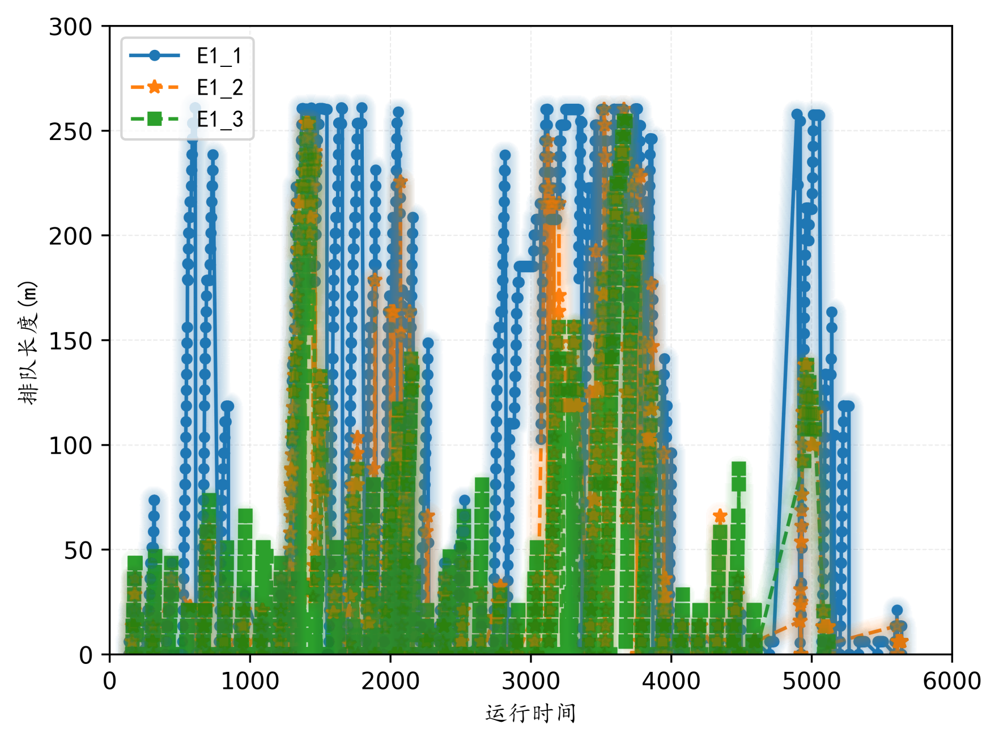

# 路网仿真实例操作说明

## 数据调查

前期的准备包括路网的流量统计，路口的渠化调查。经过前期的调查工作，绘制路网cad,统计流量OD表。以下是路网图片与OD流量表
<br>

<br>
<table>
  <tr>
    <th></th>
    <th>01</th>
    <th>02</th>
    <th>03</th>
    <th>04</th>
    <th>05</th>
    <th>06</th>
    <th>07</th>
    <th>08</th>
    <th>09</th>
    <th>10</th>
    <th>11</th>
    <th>12</th>
  </tr>
  <tr>
    <th>01</th>
    <td>0</td>
    <td>400</td>
    <td>200</td>
    <td>120</td>
    <td>280</td>
    <td>80</td>
    <td>0</td>
    <td>0</td>
    <td>0</td>
    <td>0</td>
    <td>0</td>
    <td>0</td>
  </tr>
  <tr>
    <th>02</th>
    <td>400</td>
    <td>0</td>
    <td>280</td>
    <td>0</td>
    <td>0</td>
    <td>0</td>
    <td>0</td>
    <td>0</td>
    <td>0</td>
    <td>0</td>
    <td>0</td>
    <td>0</td>
  </tr>
  <tr>
    <th>03</th>
    <td>200</td>
    <td>280</td>
    <td>0</td>
    <td>0</td>
    <td>0</td>
    <td>320</td>
    <td>0</td>
    <td>0</td>
    <td>0</td>
    <td>0</td>
    <td>0</td>
    <td>0</td>
  </tr>
  <tr>
    <th>04</th>
    <td>120</td>
    <td>0</td>
    <td>0</td>
    <td>0</td>
    <td>0</td>
    <td>0</td>
    <td>0</td>
    <td>0</td>
    <td>0</td>
    <td>0</td>
    <td>0</td>
    <td>0</td>
  </tr>
  <tr>
    <th>05</th>
    <td>280</td>
    <td>0</td>
    <td>320</td>
    <td>0</td>
    <td>200</td>
    <td>0</td>
    <td>240</td>
    <td>0</td>
    <td>0</td>
    <td>0</td>
    <td>0</td>
    <td>0</td>
  </tr>
  <tr>
    <th>06</th>
    <td>80</td>
    <td>0</td>
    <td>0</td>
    <td>0</td>
    <td>0</td>
    <td>0</td>
    <td>0</td>
    <td>160</td>
    <td>0</td>
    <td>0</td>
    <td>0</td>
    <td>400</td>
  </tr>
  <tr>
    <th>07</th>
    <td>0</td>
    <td>0</td>
    <td>0</td>
    <td>0</td>
    <td>0</td>
    <td>0</td>
    <td>0</td>
    <td>400</td>
    <td>200</td>
    <td>0</td>
    <td>0</td>
    <td>0</td>
  </tr>
  <tr>
    <th>08</th>
    <td>0</td>
    <td>0</td>
    <td>0</td>
    <td>0</td>
    <td>240</td>
    <td>160</td>
    <td>400</td>
    <td>0</td>
    <td>400</td>
    <td>0</td>
    <td>0</td>
    <td>0</td>
  </tr>
  <tr>
    <th>09</th>
    <td>0</td>
    <td>0</td>
    <td>0</td>
    <td>0</td>
    <td>0</td>
    <td>0</td>
    <td>200</td>
    <td>400</td>
    <td>0</td>
    <td>280</td>
    <td>0</td>
    <td>0</td>
  </tr>
  <tr>
    <th>10</th>
    <td>0</td>
    <td>0</td>
    <td>0</td>
    <td>0</td>
    <td>0</td>
    <td>0</td>
    <td>0</td>
    <td>0</td>
    <td>280</td>
    <td>0</td>
    <td>280</td>
    <td>0</td>
  </tr>
  <tr>
    <th>11</th>
    <td>0</td>
    <td>0</td>
    <td>0</td>
    <td>0</td>
    <td>0</td>
    <td>0</td>
    <td>0</td>
    <td>0</td>
    <td>0</td>
    <td>0</td>
    <td>0</td>
    <td>280</td>
  </tr>
  <tr>
    <th>12</th>
    <td>0</td>
    <td>0</td>
    <td>0</td>
    <td>200</td>
    <td>0</td>
    <td>0</td>
    <td>0</td>
    <td>0</td>
    <td>0</td>
    <td>160</td>
    <td>160</td>
    <td>0</td>
  </tr>
</table>

## 仿真建模

cad作为底图进行路网绘制，路网绘制完成如下


## 设置TAZ
- TAZ definitions can be created directly in netedit
- TAZ definitions can be created by drawing polygons in netedit, then using the tool <a href="https://sumo.dlr.de/docs/Demand/Importing_O/D_Matrices.html">edgesInDistricts.py</a> for converting polygons to TAZ.

在netedit中设置TAZ：选择"set TAZ mode", 左侧栏点击"Start drawing"开始绘制，点击"Stop drawing"结束一个TAZ的绘制，逐个完成所有TAZ，如图所示。

并保存为"taz_def.add.xml"文件。内容如下：
```xml
<additional>
    <taz id="taz_01" shape="-335.17,100.08 -287.77,137.33 -289.46,61.71 -334.61,100.65 -335.17,100.08" color="blue">
        <tazSource id="E01" weight="1.00"/>
        <tazSink id="-E01" weight="1.00"/>
    </taz>
    <taz id="taz_02" shape="-338.00,-198.48 -283.82,-159.53 -288.89,-242.50 -338.56,-198.48 -338.00,-198.48" color="blue">
        <tazSource id="E02" weight="1.00"/>
        <tazSink id="-E02" weight="1.00"/>
    </taz>
    <taz id="taz_03" shape="-342.58,-497.62 -282.98,-457.27 -282.98,-542.32 -343.20,-498.25 -342.58,-497.62" color="blue">
        <tazSink id="-E03" weight="1.00"/>
        <tazSource id="E03" weight="1.00"/>
    </taz>
    <taz id="taz_04" shape="-1.29,-823.61 -37.67,-785.36 38.35,-785.36 -1.29,-824.08 -1.29,-823.61" color="blue">
        <tazSink id="-E04" weight="1.00"/>
        <tazSource id="E04" weight="1.00"/>
    </taz>
    <taz id="taz_05" shape="298.63,-822.68 257.58,-781.17 340.60,-781.63 298.63,-822.21 298.63,-822.21 298.63,-822.68" color="blue">
        <tazSink id="-E05" weight="1.00"/>
        <tazSource id="E05" weight="1.00"/>
    </taz>
    <taz id="taz_06" shape="599.48,-822.68 558.43,-783.96 639.12,-783.50 599.01,-822.68 599.01,-822.68 599.48,-822.68" color="blue">
        <tazSink id="-E06" weight="1.00"/>
        <tazSource id="E06" weight="1.00"/>
    </taz>
    <taz id="taz_07" shape="926.92,-499.90 881.20,-465.85 881.20,-538.62 927.38,-501.77 927.38,-501.77 926.92,-499.90" color="blue">
        <tazSink id="-E07" weight="1.00"/>
        <tazSource id="E07" weight="1.00"/>
    </taz>
    <taz id="taz_08" shape="932.05,-200.45 881.67,-164.54 881.67,-242.43 932.05,-201.85 932.05,-201.85 932.05,-200.45" color="blue">
        <tazSink id="-E08" weight="1.00"/>
        <tazSource id="E08" weight="1.00"/>
    </taz>
    <taz id="taz_09" shape="933.45,100.40 878.41,137.25 878.41,64.48 932.51,99.47 932.51,99.47 933.45,100.40" color="blue">
        <tazSink id="-E09" weight="1.00"/>
        <tazSource id="E09" weight="1.00"/>
    </taz>
    <taz id="taz_10" shape="599.09,430.61 568.25,385.12 631.08,385.51 599.09,431.00 598.70,431.00 599.09,430.61" color="blue">
        <tazSink id="-E10" weight="1.00"/>
        <tazSource id="E10" weight="1.00"/>
    </taz>
    <taz id="taz_11" shape="298.79,431.00 271.04,388.21 328.09,388.21 299.18,431.38 299.18,431.38 298.79,431.00" color="blue">
        <tazSink id="-E11" weight="1.00"/>
        <tazSource id="E11" weight="1.00"/>
    </taz>
    <taz id="taz_12" shape="-1.11,428.68 -30.80,386.28 31.27,386.28 -1.50,428.30 -1.11,428.68" color="blue">
        <tazSink id="-E12" weight="1.00"/>
        <tazSource id="E12" weight="1.00"/>
    </taz>
</additional>
```
## 转换Districts

district和taz概念类似，多数情况下可以通用。新建"parseEdgesinDistricts.bat"文件，内容如下：
```command line
python "%SUMO_HOME%tools/edgesInDistricts.py" -n randnet.net.xml -t taz_def.add.xml
pause
```
运行"parseEdgesinDistricts.bat"文件，生成"districts.taz.xml"文件，其内容为：
```xml
<tazs>
    <taz id="taz_01" color="blue" edges="E01"/>
    <taz id="taz_02" color="blue" edges="E02"/>
    <taz id="taz_03" color="blue" edges="E03"/>
    <taz id="taz_04" color="blue" edges="E04"/>
    <taz id="taz_05" color="blue" edges="E05"/>
    <taz id="taz_06" color="blue" edges="E06"/>
    <taz id="taz_07" color="blue" edges="E07"/>
    <taz id="taz_08" color="blue" edges="E08"/>
    <taz id="taz_09" color="blue" edges="E09"/>
    <taz id="taz_10" color="blue" edges="E10"/>
    <taz id="taz_11" color="blue" edges="E11"/>
    <taz id="taz_12" color="blue" edges="E12"/>

    <taz id="taz_001" color="blue" edges="-E01"/>
    <taz id="taz_002" color="blue" edges="-E02"/>
    <taz id="taz_003" color="blue" edges="-E03"/>
    <taz id="taz_004" color="blue" edges="-E04"/>
    <taz id="taz_005" color="blue" edges="-E05"/>
    <taz id="taz_006" color="blue" edges="-E06"/>
    <taz id="taz_007" color="blue" edges="-E07"/>
    <taz id="taz_008" color="blue" edges="-E08"/>
    <taz id="taz_009" color="blue" edges="-E09"/>
    <taz id="taz_010" color="blue" edges="-E10"/>
    <taz id="taz_011" color="blue" edges="-E11"/>
    <taz id="taz_012" color="blue" edges="-E12"/>
</tazs>
```
## 流量输入

由于路网数据过多，流量输入方法采用OD矩阵输入，具体详解见网站

<a href="https://sumo.dlr.de/docs/Demand/Importing_O/D_Matrices.html">https://sumo.dlr.de/docs/Demand/Importing_O/D_Matrices.html</a>

### 方法一:tazRelation格式

新建"od-matrix.xml"文件，并写入：

```xml
<data>
    <interval id="DEFAULT_VEHTYPE" begin="0" end="3600">
        <tazRelation from="taz_01" to="taz_02" count="400"/>
        <tazRelation from="taz_01" to="taz_03" count="300"/>
        <tazRelation from="taz_01" to="taz_04" count="300"/>
        <tazRelation from="taz_01" to="taz_05" count="300"/>
        <tazRelation from="taz_01" to="taz_06" count="300"/>

        <tazRelation from="taz_02" to="taz_01" count="600"/>
        <tazRelation from="taz_02" to="taz_03" count="600"/>

        <tazRelation from="taz_03" to="taz_01" count="400"/>
        <tazRelation from="taz_03" to="taz_02" count="300"/>
        <tazRelation from="taz_03" to="taz_05" count="300"/>
        <tazRelation from="taz_03" to="taz_06" count="200"/>

        <tazRelation from="taz_04" to="taz_01" count="200"/>

        <tazRelation from="taz_05" to="taz_01" count="200"/>
        <tazRelation from="taz_05" to="taz_03" count="400"/>
        <tazRelation from="taz_05" to="taz_06" count="600"/>
        <tazRelation from="taz_05" to="taz_07" count="600"/>

        <tazRelation from="taz_06" to="taz_01" count="200"/>
        <tazRelation from="taz_06" to="taz_03" count="300"/>
        <tazRelation from="taz_06" to="taz_05" count="400"/>
        <tazRelation from="taz_06" to="taz_08" count="300"/>
        <tazRelation from="taz_06" to="taz_12" count="100"/>

        <tazRelation from="taz_07" to="taz_05" count="200"/>
        <tazRelation from="taz_07" to="taz_08" count="200"/>
        <tazRelation from="taz_07" to="taz_09" count="200"/>

        <tazRelation from="taz_08" to="taz_05" count="400"/>
        <tazRelation from="taz_08" to="taz_06" count="500"/>
        <tazRelation from="taz_08" to="taz_07" count="600"/>
        <tazRelation from="taz_08" to="taz_09" count="400"/>

        <tazRelation from="taz_09" to="taz_07" count="400"/>
        <tazRelation from="taz_09" to="taz_08" count="300"/>
        <tazRelation from="taz_09" to="taz_10" count="400"/>

        <tazRelation from="taz_10" to="taz_09" count="400"/>
        <tazRelation from="taz_10" to="taz_11" count="300"/>

        <tazRelation from="taz_11" to="taz_10" count="400"/>
        <tazRelation from="taz_11" to="taz_12" count="400"/>

        <tazRelation from="taz_12" to="taz_04" count="200"/>
        <tazRelation from="taz_12" to="taz_06" count="200"/>
        <tazRelation from="taz_12" to="taz_10" count="400"/>
        <tazRelation from="taz_12" to="taz_11" count="600"/>
    </interval>
</data>
```
### od2trips生成车辆trips

新建"run_od2trips.bat"文件，写入代码：

```command line
call="%SUMO_HOME%bin\od2trips" --taz-files taz_def.add.xml -z od_matrix.xml -o od2trips.rou.xml
pause
```
运行"run_od2trips.bat"文件，生成"od2trips.rou.xml"。

## 方法二:The O-format (VISUM/VISSIM)

新建"ptv-O-format.txt"，并写入：

```txt
$OR;D2
* From-Time  To-Time
0.00 1.00
* Factor
1.00
* some
* additional
* comments
        taz_01	taz_002	400
        taz_01	taz_003	300
        taz_01	taz_004	300
        taz_01	taz_005	300
        taz_01	taz_006	300
        taz_02	taz_001	600
        taz_02	taz_003	600
        taz_03	taz_001	200
        taz_03	taz_002	200
        taz_03	taz_005	200
        taz_03	taz_006	200
        taz_04	taz_001	200
        taz_05	taz_001	200
        taz_05	taz_003	200
        taz_05	taz_006	200
        taz_05	taz_007	200
        taz_06	taz_001	200
        taz_06	taz_003	200
        taz_06	taz_005	200
        taz_06	taz_008	200
        taz_06	taz_012	200
        taz_07	taz_005	200
        taz_07	taz_008	200
        taz_07	taz_009	200
        taz_08	taz_005	200
        taz_08	taz_006	200
        taz_08	taz_007	200
        taz_08	taz_009	200
        taz_09	taz_007	200
        taz_09	taz_008	200
        taz_09	taz_010	200
        taz_10	taz_009	200
        taz_10	taz_011	200
        taz_11	taz_010	200
        taz_11	taz_012	200
        taz_12	taz_004	200
        taz_12	taz_006	200
        taz_12	taz_010	200
        taz_12	taz_011	200
```

### od2trips生成车辆trips

新建"run_od2trips.bat"文件，写入代码：

```command line
call="%SUMO_HOME%bin\od2trips" --taz-files districts.taz.xml -d ptv-O-format.txt -o od2trips.rou.xml
pause
```
运行"run_od2trips.bat"文件，生成"od2trips.rou.xml"。

## od2trips生成车辆trips：方法三
构造车辆构成，新建"typedistributions.def.xml"文件，内容如下：
```xml
<routes>
    <vType id="t01" vClass="passenger"  probability="0.9" accel="2.6" decel="4.5" sigma="0.5" laneChangeModel="LC2013" color="1,1,0" maxSpeed="40" minGap="2.5"/>
    <vType id="t02" vClass="truck"  probability="0.1" accel="2.6" decel="4.5" sigma="0.5" laneChangeModel="LC2013" maxSpeed="40" color="1,1,0" minGap="2.5"/>
    <vTypeDistribution id="typedist1" vTypes="t01 t02"/>
</routes>
```
构造编译配置文件，新建"randnet.od2tripscfg"文件，内容如下：
```xml
<configuration>
    <input>
        <taz-files value="taz_def.add.xml"/>
        <tazrelation-files value="od_matrix.xml"/>
    </input>
	<output>
		<write-license value="false"/>
		<precision value="2"/>
		<output-file value="od2trips.rou.xml"/>
		<flow-output value="od2trips.flows.xml"/>
		<flow-output.probability value="true"/>
	</output>
	<processing>
		<vtype value="typedist1"/>
	</processing>
	<time>
		<begin value="0"/>
		<end value="3600"/>
	</time>
</configuration>
```
进行编译：新建"run_od2trips.bat"文件，写入内容：
```command line
call="%SUMO_HOME%bin\od2trips" -c randnet.od2tripscfg
pause
```
运行"run_od2trips.bat"文件，生成"od2trips.rou.xml"、"od2trips.flows.xml"文件。
## sumocfg配置文件加载
输入以下语句块
```xml
<configuration>
    <input>
        <net-file value="randnet.net.xml"/>
		<route-files value="od2trips.rou.xml"/>
        <additional-files value="taz_def.add.xml"/>
    </input>
</configuration>
```
## 数据绘图

画图数据采用排队长度，选取E1的三条车道数据画图




