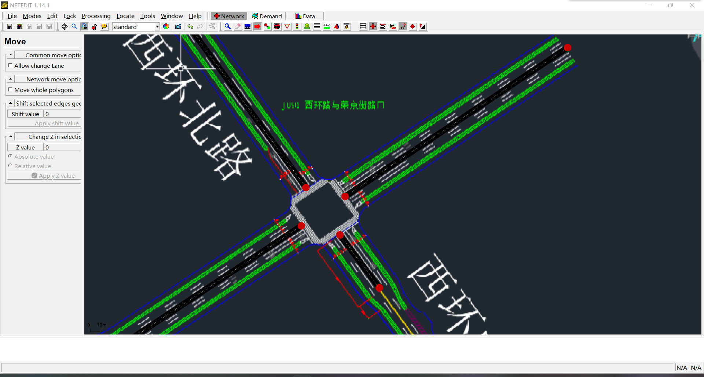

# sumo仿真教程

## 1. 加载背景图

- 构造viewsettings.xml
  
  ```xml
  <viewsettings>
    <scheme name="real world"/>
    <delay value="100"/>
    <decal file="background.png" centerX="0.00" centerY="0.00" centerZ="0.00" width="712.50" height="525.00" altitude="0.00" rotation="0.00" tilt="0.00" roll="0.00" layer="0.00" screenRelative="False"/>
  </viewsettings>
  ```

  其中的width、height等参数需要结合真实情况调整。

- 在NETEDIT中加载背景图
  在netedit界面中，点击，在弹出界面中点击“Load Decals”加载“viewsettings.xml”。

  

- 在“.sumocfg”中加载背景图
  
  ```xml
  <configuration>
    <input>
        <net-file value="example.net.xml"/>
        <route-files value="example.rou.xml"/>
        <gui-settings-file value="viewsettings.xml"/>
    </input>
    <time>
        <begin value="0"/>
        <end value="3600"/>
    </time>
  </configuration>
  ```

## 2. 使用netedit创建/绘制/编辑路网（.net.xml）

### 绘制路段

1、点击上方“Set create edge mode”,在合适位置单击鼠标左键出现第一个红圈，在适当位置再次单击鼠标左键出现第二个红圈，此时一条单向车道绘制完成。


2、鼠标左键单击第一步中所绘制的第二个红圈，再次单击第一个红圈，此时一条双向车道绘制完成。


3、按照上述方法重复操作，将十字路口东西南北四个方向各绘制一条双向车道。



4、点击上方“Set move mode”，再点击四条双向车道上靠近十字路口的红圈拖动进行调整，将这四个红圈重合并且调整至十字路口中央，此时十字路口绘制完成。


### 修改属性

1、点击上方“Set inspect mode”,单击选择其中一条车道，此时屏幕左侧出现所选车道的基本信息


2、选择其中的“numLanes”，将其中的数字1改为数字3，此时所选车道的车道数变为三条。


3、按照上述方法，将每条车道的车道数均改为3条，此时十字路口各条道路绘制完成。


### 调整路段

### 设置连接流向

在界面中点击连接模式，如下图


左键单击想要修改车流路径的车道，蓝色车道为车辆出发车道，即源车道，而绿色车道为源车道的车辆能行驶到达的车道，即目标车道，黄色车道为冲突车道


通过按住control键可以修改冲突车道，使其变为目标车道，如图所示!


同时，虽然绿色车道是可以到达的车道，但是需要点击绿色车道，使得源车道与绿色车道相连的连接由灰色变为蓝色，车辆才能从源车道到达目标车道

### 添加信号灯

 完成上述操作后，点击，接着点击Network和Traffic light即进入信号灯配时设计界面。


点击路口在左边的框中点亮Create，点击Create就可以开始自己的相位配置，其中在下面图片中的dur框是修改各相位时间的，Insert Phase则可以增加相位，delect减少相位。


具体某一时段某一方向相位在该方向上路线右键点击，选择红绿灯，其中绿灯有两种颜色较为深的颜色多用在右转上，直行和左转用浅色绿即可。


具体个时间方向信号配时如下；
**具体信号配时方案根据自己vissim所选图设计的得出下列仅供参考**


## 3. 生成车辆路径（.rou.xml）

### A. jtrrouter方式

利用jtrrouter生成车辆路径有以下两种方法：
1.方法一：

- 手动创建**test.flows.xml**+**test.turns.xml**文件(在net.xml目录下，txt文件改后缀名即成xml文件)

  flows文件内容如下(from中内容为该车道的ID，end表示运行3600s, number为车辆的数量)：

  ```xml
  <routes>
    <flow id="0" from="-E6" begin="0" end="3600" number="100"/>
    <flow id="1" from="-E7" begin="0" end="3600" number="100"/>
    <flow id="2" from="-E8" begin="0" end="3600" number="100"/>
    <flow id="3" from="-E9" begin="0" end="3600" number="100"/>
  </routes>
  ```

  turns文件内容如下:

  ```xml
  <edgeRelations>
    <interval begin="0" end="3600">
      <edgeRelation from="-E6" to="E9" probability="0.1"/>
      <edgeRelation from="-E6" to="E8" probability="0.7"/>
      <edgeRelation from="-E6" to="E7" probability="0.2"/>

      <edgeRelation from="-E7" to="E8" probability="0.3"/>
      <edgeRelation from="-E7" to="E9" probability="0.5"/>
      <edgeRelation from="-E7" to="E6" probability="0.2"/>

      <edgeRelation from="-E8" to="E9" probability="0.2"/>
      <edgeRelation from="-E8" to="E6" probability="0.5"/>
      <edgeRelation from="-E8" to="E7" probability="0.3"/>

      <edgeRelation from="-E9" to="E8" probability="0.1"/>
      <edgeRelation from="-E9" to="E7" probability="0.5"/>
      <edgeRelation from="-E9" to="E6" probability="0.4"/>
    </interval>
  </edgeRelations>
  ```

- 手动创建**jtrrouter.bat**文件(在net文件目录下)，在该文件中写入以下内容
  **这里的%SUMO_HOME%为sumo配置好的环境变量，系统默认到sumo结束，假设我将sumo安装在E盘之下，那么%SUMO_HOME%便是 "E :\sumo\ " .**

  ```xml
  call="%SUMO_HOME%bin\jtrrouter" -n test.net.xml -r test.flows.xml -t test.turns.xml -o test.rou.xml --accept-all-destinations
  pause
  ```

  最后点击bat文件执行，最终成功运行结果如下图
  
  
2.方法二

- 在已经创建好flows文件和turns文件的基础下，手动创建**test.jtrrcfg**文件，在文件中输入以下内容：
**注意input内容中的路网(net.xml)文件，流量文件(flows.xml)和转向比文件(turns.xml)以及output中的路径(rou.xml)文件**

  ```xml
  <configuration>

    <input>
        <net-file value="test.net.xml"/>
        <route-files value="test.flows.xml"/>
        <turn-ratio-files value="test.turns.xml"/>
    </input>

    <output>
        <write-license value="true"/>
        <output-file value="test.rou.xml"/>
    </output>

    <report>
        <ignore-errors value="true"/>
        <no-step-log value="true"/>
    </report>
  </configuration>
  ```

- 在路网文件目录下创建bat文件，文件内容如下：

  ```bash
  call="%SUMO_HOME%bin\jtrrouter" -c test.jtrrcfg --accept-all-destinations
  pause
  ```

  最后点击bat文件执行，最终成功运行结果如下图:
  

### B. 直接构造rou.xml文件

- 直接创建test.rou.xml文件，在里面输入以下内容：
**在这里，vtype设置车辆属性，包括类型，加速度，长度，颜色，最大速度以及出现的可能性；vTypeDistribution汇总了所有车辆的种类；比如：flow id="0"该行数据表示从-E9到-E6车道，所通过的车辆种类有passenger，truck，army，车辆数为100**

  ```xml
  <routes>
    <vType id="t01" vClass="passenger" accel="0.8" length="5" maxSpeed="80" probability="0.8"/>
    <vType id="t02" vClass="truck" accel="1.8" color="0,0.2,1" length="15" maxSpeed="50" probability="0.15"/>
    <vType id="t03" vClass="army" accel="1.8" color="0,1,0.5" length="10" maxSpeed="120" probability="0.05"/>

    <vTypeDistribution id="typedist1" vTypes="t01 t02 t03"/>
    
    <flow id="0" from="-E9" to="E6" type="typedist1" begin="0" end="3600" number="100"/>
    <flow id="1" from="-E9" to="E8" type="typedist1" begin="0" end="3600" number="100"/>
    <flow id="2" from="-E9" to="E7" type="typedist1" begin="0" end="3600" number="100"/>
  </routes>
  ```

### C. duarouter方式

- dua是使用flows文件直接生成rou文件，首先可以使用netedit构建出路网文件，接着使用flows文件中的代码
  
  ```xml
  <routes>
   <interval begin="0" end="1000">
    <flow id="0" from="gneE0" to="gneE12" number="150" />
    <flow id="1" from="gneE3" to="gneE12" number="180" />
    <flow id="2" from="gneE11" to="gneE1" number="100" />
    <flow id="3" from="gneE13" to="gneE2" number="100" />
    <flow id="4" from="gneE9" to="gneE2" number="100" />
    <flow id="5" from="gneE7"  to="gneE10" number="100" />
   </interval>
  </routes>
  ```

  flow意为流量，begin是开始仿真时间,end是仿真结束时间，from意为从哪条边开始发车，to意味目标边,number意为车流量，根据自己建立的路网文件修改其中的代码即可。当构建了路网文件与flows文件，就使用记事本将以下代码输入

  ```bash
  call="%SUMO_HOME%\bin\duarouter" -c  test.duarcfg
  pause
  ```

  即可生成test.duarcfg文件
  再打开记事本将以下代码输入

  ```xml
  <configuration>
    <input>
      <net-file value="test.net.xml"/>
      <route-files value="test.flows.xml"/>
    </input>

    <output>
      <write-license value="true"/>
      <output-file value="test.rou.xml"/>
    </output>

    <report>
      <no-step-log value="true"/>
    </report>
  </configuration>
  ```

  即可得到rou文件
  最后生成配置文件，将以下代码输入，代码中的信号配时文件(signal_config1.xml,signal_config2.xml)没有可以注释掉代码

  ```xml
  <configuration>
    <input>
      <net-file value="test.net.xml"/>
      <route-files value="test.rou.xml"/>
      <additional-files value="signal_config1.xml,signal_config2.xml"/>
    </input>
 
    <output>
      <write-license value="true"/>
      <queue-output value="output_queue.xml"/>
      <emission-output value="output_emission"/>
    <full-output value="output_full-output"/>
    <vtk-output value="output_VTK" />
    </output>

    <time>
      <begin value="0"/>
      <end value="3600"/>
    </time>

    <processing>
      <default.speeddev value="0"/>
    </processing>

    <report>
      <duration-log.disable value="true"/>
      <no-step-log value="true"/>
    </report>
  </configuration>
  ```

  这样就可以生成可运行的配置文件

## 4. 仿真数据采集

### E1检测器
在完成以上操作以后，我们需要放置3个检测器进行数据采集工作，其中第一个检测器为E1检测器，操作方法如下：

1、在当前文件夹下新建一个txt文本文档，复制一下代码到文档里：

```xml
<additional>
  <inductionLoop id="north_0" lane="E0_0" pos="100" freq="300" file="OUTPUT.E1.xml" friendlypos="true"/>
  <inductionLoop id="north_1" lane="E0_1" pos="100" freq="300" file="OUTPUT.E1.xml" friendlypos="true"/>
  <inductionLoop id="north_2" lane="E0_2" pos="100" freq="300" file="OUTPUT.E1.xml" friendlypos="true"/>

  <inductionLoop id="west_0" lane="E1_0" pos="100" freq="300" file="OUTPUT.E1.xml" friendlypos="true"/>
  <inductionLoop id="west_1" lane="E1_1" pos="100" freq="300" file="OUTPUT.E1.xml" friendlypos="true"/>
  <inductionLoop id="west_2" lane="E1_2" pos="100" freq="300" file="OUTPUT.E1.xml" friendlypos="true"/>

  <inductionLoop id="south_0" lane="E2_0" pos="100" freq="300" file="OUTPUT.E1.xml" friendlypos="true"/>
  <inductionLoop id="south_1" lane="E2_1" pos="100" freq="300" file="OUTPUT.E1.xml" friendlypos="true"/>
  <inductionLoop id="south_2" lane="E2_2" pos="100" freq="300" file="OUTPUT.E1.xml" friendlypos="true"/>

  <inductionLoop id="east_0" lane="E3_0" pos="100" freq="300" file="OUTPUT.E1.xml" friendlypos="true"/>
  <inductionLoop id="east_1" lane="E3_1" pos="100" freq="300" file="OUTPUT.E1.xml" friendlypos="true"/>
  <inductionLoop id="east_2" lane="E3_2" pos="100" freq="300" file="OUTPUT.E1.xml" friendlypos="true"/>
</additional>
```

其中“id”指放置的检测器的名称，“lane”指检测器所放置的车道的名称，“pos”是“position”的简写，指检测器所放置的位置，freq是“frequency”的简写，指间隔多长时间采集一次数据，最后的“file”指所采集的数据保存到的文件的名称。这些数值以及名称并不是唯一的，大家可以根据自己所绘制的道路以及需求来输入不同的数值和名称。

2、将txt文本文档的后缀改为“xml”文件。

3、用vscode打开之前创建的“sumocfg”文件（如果没有vscode可以用记事本打开，或者更改文件后缀为txt再打开）在input下添加一段代码：

```xml
<additional-files value="E1.add.xml"/>
```

添加完成后保存，再用sumo打开文件模拟仿真运行。

4、运行完成后在文件夹中会出现一个名称为“OUTPUT.E1.xml”的文件，此时文件中所保存的就是刚才所采集的数据：

```xml
<detector>
    <interval begin="0.00" end="300.00" id="north_0" nVehContrib="13" flow="156.00" occupancy="1.70" speed="12.89" harmonicMeanSpeed="12.75" length="5.00" nVehEntered="13"/>
    <interval begin="0.00" end="300.00" id="north_1" nVehContrib="52" flow="624.00" occupancy="6.54" speed="13.39" harmonicMeanSpeed="13.25" length="5.00" nVehEntered="52"/>
    <interval begin="0.00" end="300.00" id="north_2" nVehContrib="16" flow="192.00" occupancy="2.06" speed="13.18" harmonicMeanSpeed="12.95" length="5.00" nVehEntered="16"/>
    <interval begin="0.00" end="300.00" id="west_0" nVehContrib="27" flow="324.00" occupancy="3.35" speed="13.52" harmonicMeanSpeed="13.42" length="5.00" nVehEntered="27"/>
    <interval begin="0.00" end="300.00" id="west_1" nVehContrib="39" flow="468.00" occupancy="4.94" speed="13.56" harmonicMeanSpeed="13.37" length="5.00" nVehEntered="40"/>
    <interval begin="0.00" end="300.00" id="west_2" nVehContrib="14" flow="168.00" occupancy="1.77" speed="13.32" harmonicMeanSpeed="13.19" length="5.00" nVehEntered="14"/>
    <interval begin="0.00" end="300.00" id="south_0" nVehContrib="18" flow="216.00" occupancy="2.37" speed="13.41" harmonicMeanSpeed="13.34" length="5.00" nVehEntered="19"/>
    <interval begin="0.00" end="300.00" id="south_1" nVehContrib="38" flow="456.00" occupancy="4.74" speed="13.47" harmonicMeanSpeed="13.36" length="5.00" nVehEntered="38"/>
    <interval begin="0.00" end="300.00" id="south_2" nVehContrib="24" flow="288.00" occupancy="3.07" speed="13.17" harmonicMeanSpeed="13.04" length="5.00" nVehEntered="24"/>
    <interval begin="0.00" end="300.00" id="east_0" nVehContrib="11" flow="132.00" occupancy="1.35" speed="13.70" harmonicMeanSpeed="13.60" length="5.00" nVehEntered="11"/>
    <interval begin="0.00" end="300.00" id="east_1" nVehContrib="43" flow="516.00" occupancy="5.40" speed="13.42" harmonicMeanSpeed="13.27" length="5.00" nVehEntered="43"/>
    <interval begin="0.00" end="300.00" id="east_2" nVehContrib="26" flow="312.00" occupancy="3.40" speed="12.87" harmonicMeanSpeed="12.74" length="5.00" nVehEntered="26"/>
</detector>
```

<https://sumo.dlr.de/docs/Simulation/Output/Instantaneous_Induction_Loops_Detectors.html>

Instantaneous Induction Loops Detectors

```xml
<instantInductionLoop id="<ID>" lane="<LANE_ID>" pos="<POSITION_ON_LANE>" file="<OUTPUT_FILE>" [friendlyPos="x"]/>
```

An instantaneous induction loop is writing a value to the output as soon as a vehicle was detected. This detector differs between different states:

    "enter": a vehicle has entered the detector in this simulation step
    "stay": a vehicle which entered the detector in a prior step is still on the detector
    "leave": a vehicle has left the detector in this simulation step

If state is "enter", then the following value is generated additionally:

    gap :The time gap between the vehicle which left the detector before and the one which entered it now; please note that this value is generated only, if another vehicle has already left the detector.

If state is "leave" and the vehicle left the detector via longitudinal movement, then the following value is generated additionally:

    occupancy: The time the vehicle was on the detector.

### E2检测器

1、在当前文件夹下新建一个txt文本文档，复制一下代码到文档里：

```xml
<additional>
 <laneAreaDetector id="north_0" lane="E0_0" pos="100" length="200" freq="300" file="OUTPUT.E2.xml"/>
 <laneAreaDetector id="north_1" lane="E0_1" pos="100" length="200" freq="300" file="OUTPUT.E2.xml"/>
 <laneAreaDetector id="north_2" lane="E0_2" pos="100" length="200" freq="300" file="OUTPUT.E2.xml"/>

 <laneAreaDetector id="westh_0" lane="E1_0" pos="100" length="200" freq="300" file="OUTPUT.E2.xml"/>
 <laneAreaDetector id="westh_1" lane="E1_1" pos="100" length="200" freq="300" file="OUTPUT.E2.xml"/>
 <laneAreaDetector id="westh_2" lane="E1_2" pos="100" length="200" freq="300" file="OUTPUT.E2.xml"/>

 <laneAreaDetector id="south_0" lane="E2_0" pos="100" length="200" freq="300" file="OUTPUT.E2.xml"/>
 <laneAreaDetector id="south_1" lane="E2_1" pos="100" length="200" freq="300" file="OUTPUT.E2.xml"/>
 <laneAreaDetector id="south_2" lane="E2_2" pos="100" length="200" freq="300" file="OUTPUT.E2.xml"/>

 <laneAreaDetector id="east_0" lane="E3_0" pos="100" length="200" freq="300" file="OUTPUT.E2.xml"/>
 <laneAreaDetector id="east_1" lane="E3_1" pos="100" length="200" freq="300" file="OUTPUT.E2.xml"/>
 <laneAreaDetector id="east_2" lane="E3_2" pos="100" length="200" freq="300" file="OUTPUT.E2.xml"/>
 </additional>
 ```

 其中大部分数值和名称和E1一样，“length”指检测范围的长度，pos为设置的位置，该位置不能大于所设车道的长度。

2、将txt文本文档的后缀改为“xml”文件。

3、在sumocfg文件代码里加入E2.xml文件，直接在“E1.xml”后添加“,E2.xml”,添加完成后代码为：

  ```xml
  <additional-files value="E1.add.xml,E2.add.xml"/>
  ```

添加完成后保存文件，再用sumo打开仿真模拟运行。

4、运行完成后在文件夹中会出现一个名称为“OUTPUT.E2.xml”的文件，此时文件中所保存的就是刚才所采集的数据：

  ```xml
  <detector>
    <interval begin="0.00" end="300.00" id="north_0" sampledSeconds="215.45" nVehEntered="13" nVehLeft="11" nVehSeen="13" meanSpeed="11.48" meanTimeLoss="1.95" meanOccupancy="1.74" maxOccupancy="5.00" meanMaxJamLengthInVehicles="0.00" meanMaxJamLengthInMeters="0.00" maxJamLengthInVehicles="0" maxJamLengthInMeters="0.00" jamLengthInVehiclesSum="0" jamLengthInMetersSum="0.00" meanHaltingDuration="0.00" maxHaltingDuration="0.00" haltingDurationSum="0.00" meanIntervalHaltingDuration="0.00" maxIntervalHaltingDuration="0.00" intervalHaltingDurationSum="0.00" startedHalts="0.00" meanVehicleNumber="0.75" maxVehicleNumber="2" />
    <interval begin="0.00" end="300.00" id="north_1" sampledSeconds="2508.22" nVehEntered="52" nVehLeft="49" nVehSeen="52" meanSpeed="4.15" meanTimeLoss="33.94" meanOccupancy="20.73" maxOccupancy="37.50" meanMaxJamLengthInVehicles="4.73" meanMaxJamLengthInMeters="33.84" maxJamLengthInVehicles="12" maxJamLengthInMeters="87.54" jamLengthInVehiclesSum="1419" jamLengthInMetersSum="10152.77" meanHaltingDuration="29.96" maxHaltingDuration="55.00" haltingDurationSum="1468.00" meanIntervalHaltingDuration="29.96" maxIntervalHaltingDuration="55.00" intervalHaltingDurationSum="1468.00" startedHalts="49.00" meanVehicleNumber="8.52" maxVehicleNumber="15" />
  </detector>
  ```

  对上面的属性简单说明一下：

- **nVehContrib**:在这个时间范围内进入检测器范围的车辆
- **nVehLeft**:在一定时间内离开探测器的车的数量
- **meanSpeed**:平均速度
- **meanTimeLoss**:每辆车的平均时间损失, 可以认为是延误
- **jamLengthInVehiclesSum**:所有堵车长度的和
- **jamLengthInVehiclesSum**:最长的堵车的长度

### E3检测器

1、在当前文件夹下新建一个txt文本文档，复制一下代码到文档里：

  ```xml
<additional>
   <entryExitDetector id="区域检测" freq="300" file="OUTPUT.E3.xml">
        <detEntry lane="E0_0" pos="100"/>
        <detEntry lane="E0_1" pos="100"/>
        <detEntry lane="E0_2" pos="100"/>

        <detEntry lane="E1_0" pos="100"/>
        <detEntry lane="E1_1" pos="100"/>
        <detEntry lane="E1_2" pos="100"/>
        <detEntry lane="E2_0" pos="100"/>
        <detEntry lane="E2_1" pos="100"/>
        <detEntry lane="E2_2" pos="100"/>
        <detEntry lane="E3_0" pos="100"/>
        <detEntry lane="E3_1" pos="100"/>
        <detEntry lane="E3_2" pos="100"/>

        <detExit lane="-E0_0" pos="100"/>
        <detExit lane="-E0_1" pos="100"/>
        <detExit lane="-E0_2" pos="100"/>

        <detExit lane="-E1_0" pos="100"/>
        <detExit lane="-E1_1" pos="100"/>
        <detExit lane="-E1_2" pos="100"/>
        <detExit lane="-E2_0" pos="100"/>
        <detExit lane="-E2_1" pos="100"/>
        <detExit lane="-E2_2" pos="100"/>
        <detExit lane="-E3_0" pos="100"/>
        <detExit lane="-E3_1" pos="100"/>
        <detExit lane="-E3_2" pos="100"/>
    </entryExitDetector>
</additional>
  ```

2、将txt文本文档的后缀改为“xml”文件。

3、在sumocfg文件代码里加入E3.xml文件，直接在“E2.xml”后添加“,E3.xml”,添加完成后这一行的完整代码为：

  ```xml
<additional-files value="E1.add.xml,E2.add.xml,E3.add.xml"/>
  ```

添加完成后保存文件，并用sumo打开进行仿真模拟运行。

4、运行完成后在文件夹中会出现一个名称为“OUTPUT.E3.xml”的文件，此时文件中所保存的就是刚才所采集的数据：

  ```xml
<e3Detector >
   <interval begin="0.00" end="300.00" id="区域检测" meanTravelTime="47.87" meanOverlapTravelTime="48.27" meanSpeed="8.07" meanHaltsPerVehicle="0.85" meanTimeLoss="25.54" vehicleSum="256" meanSpeedWithin="6.89" meanHaltsPerVehicleWithin="1.15" meanDurationWithin="42.83" vehicleSumWithin="67" meanIntervalSpeedWithin="6.89" meanIntervalHaltsPerVehicleWithin="1.15" meanIntervalDurationWithin="42.83" meanTimeLossWithin="30.46"/>
   <interval begin="300.00" end="600.00" id="区域检测" meanTravelTime="63.25" meanOverlapTravelTime="63.65" meanSpeed="7.10" meanHaltsPerVehicle="1.25" meanTimeLoss="40.67" vehicleSum="301" meanSpeedWithin="4.36" meanHaltsPerVehicleWithin="2.79" meanDurationWithin="83.79" vehicleSumWithin="98" meanIntervalSpeedWithin="4.36" meanIntervalHaltsPerVehicleWithin="2.79" meanIntervalDurationWithin="83.79" meanTimeLossWithin="72.81"/>
   <interval begin="600.00" end="900.00" id="区域检测" meanTravelTime="79.68" meanOverlapTravelTime="80.08" meanSpeed="6.79" meanHaltsPerVehicle="1.76" meanTimeLoss="57.26" vehicleSum="296" meanSpeedWithin="2.78" meanHaltsPerVehicleWithin="3.55" meanDurationWithin="144.12" vehicleSumWithin="112" meanIntervalSpeedWithin="2.76" meanIntervalHaltsPerVehicleWithin="2.99" meanIntervalDurationWithin="129.17" meanTimeLossWithin="120.23"/>
</detector>
  ```

（这些output的数据只是其中一部分，没有全部展示）
对以上几个属性解释一下：
-**meanTravelTime**：车辆通过该区域所需要的平均时间
-**meanSpeed**：车辆通过该区域时的平均速度
-**meanHaltsPerVehicle**：通过这段区域的时候, 慢速车辆的数量
-**meanTimeLoss**： 通过这片区域的时候的平均时间损失
-**vehicleSum** ：在一段时间内通过区域的车辆总数

### 其他

此时E1、E2、E3检测器全部添加完成。

- edge数据dump（往sumoconfig中加入additional-file定义）
手动构造一个edgedata(name)_dump.add.xml文件：
    **这里id仅区分有多个edgedata定义的输出，可以任意设置不影响运行结果**
    file即文件输出后的保存路径，freq表示聚合周期内检测器所收集的值将相加，如果没有定义从开始到结束所有时间间隔都会相加，withInternal如果设置为True那么连接点内部的边的信息也会被写入文件内，trackVehicles如果True那聚合时间间隔内进入边缘的所有车辆都将进行检测。
  说人话就是id是想要检测的edge编号,具体见netedit中shift键点击车道即可在左边出现，file是保持路径，freq是检测频率。

  

  ```xml
  <additional>
    <edgeData id="edge_dump_300" file="edge_dump_300.xml" freq="300" trackVehicles="true" withInternal="false"/>
  </additional>
  ```

- lane数据dump（基于边缘或车道的存储都以相同方式进行计算）
手动构造一个laneedata(name)_dump.add.xml文件：
  基本内容和上面是一样的，但是excludeEmpty如果为True,则在数据采集期间没有被车辆使用过的车道不会被写入文件中，不设置的话默认值False,如果是default则取决于边缘长度和最大速度的行程时间速度默认值，并打印出来。
 说人话就是id是想要检测的lane编号，file是保持路径，freq是检测频率.
  
```xml
<additional>
  <laneData id="lane_dump_300" file="lane_dump_300.xml" freq="300" excludeEmpty="true"/>
</additional>
  ```

**在写完两个dump后记得在sumocfg中additional-files value中添加文件**


- 整体检测数据summary

将以下代码输入以.sumocfg为后缀的文件中，以duarouoter方式生成路由文件的同学不需要再输入，其他方式生成路由文件的同学需要输入

```xml
<summary-output value="summary2.xml"/>
```

更改绝对路径与文件名即可

- 排放数据

将以下代码输入以.sumocfg为后缀的文件中，以duarouoter方式生成路由文件的同学不需要再输入，其他方式生成路由文件的同学需要输入

  ```xml
<emission-output value="emission.xml"/>
  ```

同样根据自己的路径进行修改
运行配置文件之后即可在emission.xml中看到数据的输出

- 排队数据
   排队数据与排放数据相同，按照duarouter生成的同学将以下代码复制

 ```xml
  <configuration>

    <input>
      <net-file value="sample.net.xml"/>
      <route-files value="sample.rou.xml"/>
      <additional-files value="E1.add.xml,E2.add.xml,E3.add.xml,edge_dump.add.xml,lane_dump.add.xml"/>
    </input>

    <output>
      <output-prefix      value="TIME"/>

      <emission-output.step-scaled   value="true"/>
      <emission-output               value="emissions.xml"/>

      <statistic-output              value="statistic-output.xml"/>

      <summary                       value="summary.xml"/>
      <summary-output.period         value="300"/>

      <netstate-dump                 value="netstate-dump.xml"/>

      <queue-output                  value="queue.xml"/>
      <queue-output.period           value="300"/>

      <edgedata-output               value="edgedata-output.xml"/>
      <lanedata-output               value="lanedata-output.xml"/>
    </output>

    <time>
      <begin   value="0"/>
      <end     value="7200"/>
    </time>

    <report>
      <message-log        value="log-message.xml"/>
      <error-log          value="log-error.xml"/>
      <verbose            value="true"/>
      <no-step-log        value="true"/>
      <step-log.period    value="300"/>
    </report>

    <emissions>
      <device.emissions.period         value="600"/>
    </emissions>

  </configuration>
  ```

并将文件名改为以queue.xml为后缀的文件名,同时修改文件的绝对路径
如果用其他方式生成配置文件的同学将以下代码输入配置文件中

```xml
<queue-output value="queue.xml"/>
```

修改路径即可
运行配置文件之后即可在queue.xml中看到数据的输出

- 其他设置
