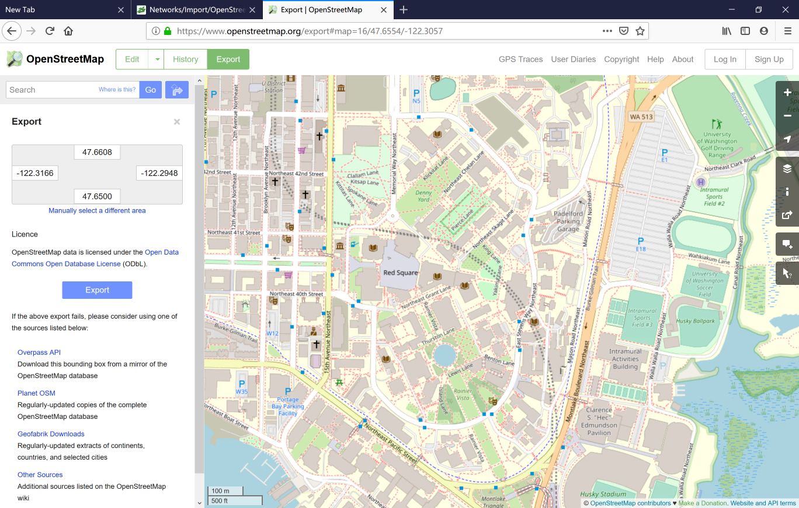
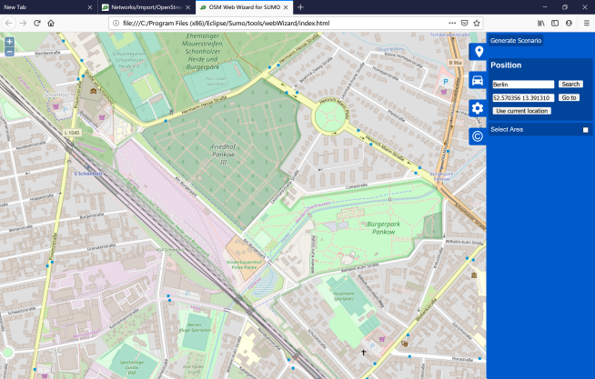
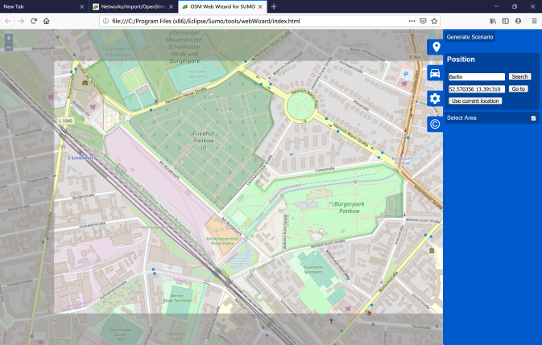
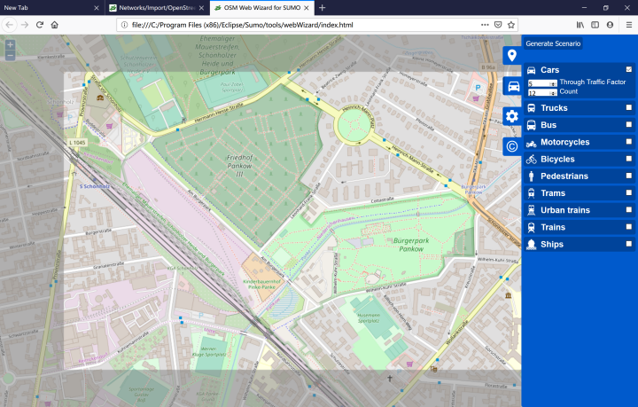
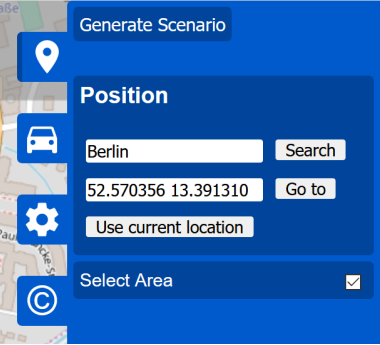

# Importing non-SUMO networks

## 从OpenStreetMap获取路网

The pages [Networks/Import/OpenStreetMap](https://sumo.dlr.de/docs/Networks/Import/OpenStreetMap.html) and [Tutorials/Import from OpenStreetMap](https://sumo.dlr.de/docs/Tutorials/Import_from_OpenStreetMap.html) show how to convert an OpenStreetMap file to a SUMO network file.

### a. 下载OpenStreetMap某个区域数据

- 直接打开浏览器下载：Data can be downloaded comfortably at http://www.openstreetmap.org/export by selecting a rectangular area.
  
  
  
- 选择“Manually Select a different area”进行选区调整
- 完成选区调整，点击“Export”完成文件保存（默认文件名：map.osm）
- 运行命令进行格式转换.新建bat文件并输入：
  
  ```dos
  call="%SUMO_HOME%\bin\netconvert" --osm-files map.osm -o uw.net.xml
  ```

- 用“NETEDIT”打开“uw.net.xml”进行查看

### b. 使用osmWebWizard

- 运行打开
  
  ```dos
  python "%SUMO_HOME%/tools/osmWebWizard.py"
  ```

  

- 勾选“select area”，然后进行选区调整
  
  
- 选择Car等信息
  
  
- 点击“Generate Scenario”进行数据生成，结果将在SUMO中显示
  
  