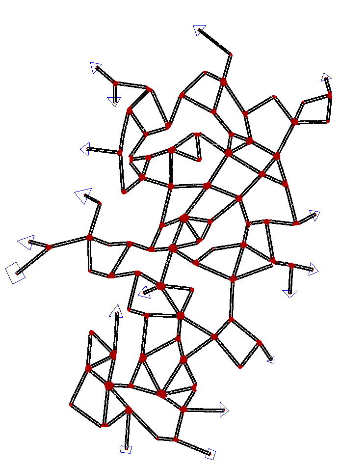

# 从OD建立仿真

对于一个路网，从OD矩阵生成车辆trips，进行仿真。

## 1. 建立路网

绘制路网，命名为"randnet.net.xml"。


## 2. 设置TAZ

- TAZ definitions can be created directly in netedit
- TAZ definitions can be created by drawing polygons in netedit, then using the tool edgesInDistricts.py for converting polygons to TAZ.

在netedit中设置TAZ：选择"set TAZ mode", 左侧栏点击"Start drawing"开始绘制，点击"Stop drawing"结束一个TAZ的绘制，逐个完成所有TAZ，并保存为"taz_def.add.xml"文件。内容如下：
```xml
<additional>
    <!-- TAZs -->
    <taz id="taz_0" shape="0.00,1100.00 52.90,1011.69 -19.84,973.04 -60.76,1061.69 0.35,1099.84 0.35,1099.84 0.00,1100.00" color="blue">
        <tazSource id="-840" weight="1.00"/>
        <tazSink id="-840" weight="1.00"/>
        <tazSource id="840" weight="1.00"/>
        <tazSink id="840" weight="1.00"/>
    </taz>
    <taz id="taz_1" shape="1081.04,-16.16 1100.39,35.44 1139.71,17.32 1125.88,-30.90 1080.73,-16.47 1080.73,-16.47 1081.04,-16.16" color="blue">
        <tazSource id="-1891" weight="1.00"/>
        <tazSink id="-1891" weight="1.00"/>
        <tazSource id="1891" weight="1.00"/>
        <tazSink id="1891" weight="1.00"/>
    </taz>
    <taz id="taz_10" shape="440.58,2173.63 488.78,2227.96 424.80,2241.11 440.58,2174.50 440.58,2173.63" color="blue">
        <tazSource id="-1404" weight="1.00"/>
        <tazSink id="-1404" weight="1.00"/>
        <tazSource id="1404" weight="1.00"/>
        <tazSink id="1404" weight="1.00"/>
    </taz>
    <taz id="taz_11" shape="521.20,2039.54 598.32,2039.54 564.14,1984.33 520.33,2040.42 521.20,2039.54" color="blue">
        <tazSource id="-1396" weight="1.00"/>
        <tazSink id="-1396" weight="1.00"/>
        <tazSource id="1396" weight="1.00"/>
        <tazSink id="1396" weight="1.00"/>
    </taz>
    <taz id="taz_12" shape="421.56,1784.49 411.92,1703.87 365.47,1744.18 419.80,1784.49 421.56,1784.49" color="blue">
        <tazSource id="-1201" weight="1.00"/>
        <tazSink id="-1201" weight="1.00"/>
        <tazSource id="1201" weight="1.00"/>
        <tazSink id="1201" weight="1.00"/>
    </taz>
    <taz id="taz_13" shape="432.52,1522.31 388.90,1428.65 332.44,1497.94 431.24,1521.03 432.52,1522.31" color="blue">
        <tazSource id="-848" weight="1.00"/>
        <tazSink id="-848" weight="1.00"/>
        <tazSource id="848" weight="1.00"/>
        <tazSink id="848" weight="1.00"/>
    </taz>
    <taz id="taz_14" shape="104.05,1254.15 80.96,1166.90 6.54,1219.51 104.05,1254.15" color="blue">
        <tazSource id="-846" weight="1.00"/>
        <tazSink id="-846" weight="1.00"/>
        <tazSource id="846" weight="1.00"/>
        <tazSink id="846" weight="1.00"/>
    </taz>
    <taz id="taz_15" shape="741.75,966.74 767.41,892.32 695.56,910.28 741.75,964.17 741.75,966.74" color="blue">
        <tazSource id="-621" weight="1.00"/>
        <tazSink id="-621" weight="1.00"/>
        <tazSource id="621" weight="1.00"/>
        <tazSink id="621" weight="1.00"/>
    </taz>
    <taz id="taz_16" shape="531.32,788.39 610.87,781.97 581.36,857.67 531.32,789.67 531.32,788.39" color="blue">
        <tazSource id="-1882" weight="1.00"/>
        <tazSink id="-1882" weight="1.00"/>
        <tazSource id="1882" weight="1.00"/>
        <tazSink id="1882" weight="1.00"/>
    </taz>
    <taz id="taz_2" shape="600.69,50.15 661.57,48.48 653.19,6.59 595.94,13.85 600.41,50.15 600.41,50.15 600.69,50.15" color="blue">
        <tazSource id="-1797" weight="1.00"/>
        <tazSink id="-1797" weight="1.00"/>
        <tazSource id="1797" weight="1.00"/>
        <tazSink id="1797" weight="1.00"/>
    </taz>
    <taz id="taz_3" shape="1164.40,211.01 1165.85,299.37 1213.65,248.67 1164.40,212.46 1164.40,212.46 1164.40,211.01" color="blue">
        <tazSource id="-1532" weight="1.00"/>
        <tazSink id="-1532" weight="1.00"/>
        <tazSource id="1532" weight="1.00"/>
        <tazSink id="1532" weight="1.00"/>
    </taz>
    <taz id="taz_4" shape="1432.05,533.75 1474.22,560.39 1472.75,520.53 1431.63,533.96 1432.05,533.75" color="blue">
        <tazSource id="-1483" weight="1.00"/>
        <tazSink id="-1483" weight="1.00"/>
        <tazSource id="1483" weight="1.00"/>
        <tazSink id="1483" weight="1.00"/>
    </taz>
    <taz id="taz_5" shape="1522.71,938.72 1609.23,934.37 1562.43,894.65 1521.62,938.72 1522.71,938.72" color="blue">
        <tazSource id="-686" weight="1.00"/>
        <tazSink id="-686" weight="1.00"/>
        <tazSource id="686" weight="1.00"/>
        <tazSink id="686" weight="1.00"/>
    </taz>
    <taz id="taz_6" shape="1683.23,1097.62 1671.26,1021.98 1727.31,1045.92 1683.78,1097.62 1683.23,1097.62" color="blue">
        <tazSource id="-684" weight="1.00"/>
        <tazSink id="-684" weight="1.00"/>
        <tazSource id="684" weight="1.00"/>
        <tazSink id="684" weight="1.00"/>
    </taz>
    <taz id="taz_7" shape="1673.98,1395.27 1708.26,1331.60 1736.56,1385.48 1673.98,1395.81 1673.98,1395.27" color="blue">
        <tazSource id="-496" weight="1.00"/>
        <tazSink id="-496" weight="1.00"/>
        <tazSource id="496" weight="1.00"/>
        <tazSink id="496" weight="1.00"/>
    </taz>
    <taz id="taz_8" shape="1743.85,2131.71 1801.24,2148.03 1758.20,2180.19 1743.85,2133.69 1743.85,2131.71" color="blue">
        <tazSource id="-1464" weight="1.00"/>
        <tazSink id="-1464" weight="1.00"/>
        <tazSource id="1464" weight="1.00"/>
        <tazSink id="1464" weight="1.00"/>
    </taz>
    <taz id="taz_9" shape="1033.88,2386.59 1083.83,2450.56 1011.09,2452.31 1033.88,2386.59" color="blue">
        <tazSource id="-867" weight="1.00"/>
        <tazSink id="-867" weight="1.00"/>
        <tazSource id="867" weight="1.00"/>
        <tazSink id="867" weight="1.00"/>
    </taz>
</additional>
```

## 3. 转换Districts

district和taz概念类似，多数情况下可以通用。新建"parseEdgesinDistricts.bat"文件，内容如下：
```bash
python "%SUMO_HOME%tools/edgesInDistricts.py" -n randnet.net.xml -t taz_def.add.xml
pause
```
运行"parseEdgesinDistricts.bat"文件，生成"districts.taz.xml"文件，其内容为：
```xml
<tazs>
    <taz id="taz_0" color="blue" edges="-840 840"/>
    <taz id="taz_1" color="blue" edges="-1891 1891"/>
    <taz id="taz_10" color="blue" edges="-1404 1404"/>
    <taz id="taz_11" color="blue" edges="-1396 1396"/>
    <taz id="taz_12" color="blue" edges="-1201 1201"/>
    <taz id="taz_13" color="blue" edges="-848 848"/>
    <taz id="taz_14" color="blue" edges="-846 846"/>
    <taz id="taz_15" color="blue" edges="-621 621"/>
    <taz id="taz_16" color="blue" edges="-1882 1882"/>
    <taz id="taz_2" color="blue" edges="-1797 1797"/>
    <taz id="taz_3" color="blue" edges="-1532 1532"/>
    <taz id="taz_4" color="blue" edges="-1483 1483"/>
    <taz id="taz_5" color="blue" edges="-686 686"/>
    <taz id="taz_6" color="blue" edges="-684 684"/>
    <taz id="taz_7" color="blue" edges="-496 496"/>
    <taz id="taz_8" color="blue" edges="-1464 1464"/>
    <taz id="taz_9" edges="-867 867"/>
</tazs>
```
## 4. 构造OD矩阵

https://github.com/eclipse/sumo/blob/main/docs/web/docs/Demand/Importing_O/D_Matrices.md#describing_the_matrix_cells

### 4.1 tazRelation格式
新建"od-matrix.xml"文件，并写入：
```xml
<data>
	<interval id="DEFAULT_VEHTYPE" begin="0" end="3600">
		<tazRelation from="taz_0" to="taz_8" count="1462"/>
        <tazRelation from="taz_0" to="taz_6" count="800"/>
        <tazRelation from="taz_0" to="taz_10" count="500"/>
	</interval>
</data>
```
### 4.2 The O-format (VISUM/VISSIM)
新建"ptv-O-format.txt"，并写入：
```
$OR;D2
* From-Time  To-Time
0.00 1.00
* Factor
1.00
* some
* additional
* comments
         taz_0          taz_8       1234.00
         taz_0          taz_6       800.00
         taz_0          taz_10      500.00
```

### 4.3 其他格式

- The V format (VISUM/VISSIM)
- The Amitran format

## 5. od2trips生成车辆trips：方式一

新建"run_od2trips.bat"文件，写入一下代码：
```bash
call="%SUMO_HOME%bin\od2trips" --taz-files taz_def.add.xml -z od_matrix.xml -o od2trips.rou.xml
pause
```
运行"run_od2trips.bat"文件，生成"od2trips.rou.xml"。

## 5. od2trips生成车辆trips：方式二

新建"run_od2trips.bat"文件，写入一下代码：
```bash
call="%SUMO_HOME%bin\od2trips" --taz-files districts.taz.xml -d ptv-O-format.txt -o od2trips.rou.xml
pause
```
运行"run_od2trips.bat"文件，生成"od2trips.rou.xml"。

## 6. od2trips生成车辆trips：方式三

构造车辆构成，新建"typedistributions.def.xml"文件，内容如下：
```xml
<routes>
    <vType id="t01" vClass="passenger"  probability="0.9" accel="2.6" decel="4.5" sigma="0.5" laneChangeModel="LC2013" color="1,1,0" maxSpeed="40" minGap="2.5"/>
    <vType id="t02" vClass="truck"  probability="0.1" accel="2.6" decel="4.5" sigma="0.5" laneChangeModel="LC2013" maxSpeed="40" color="1,1,0" minGap="2.5"/>
    <vTypeDistribution id="typedist1" vTypes="t01 t02"/>
</routes>
```

构造编译配置文件，新建"randnet.od2tripscfg"文件，内容如下：
```xml
<configuration>
    <input>
        <taz-files value="taz_def.add.xml"/>
        <tazrelation-files value="od_matrix.xml"/>
    </input>
	<output>
		<write-license value="false"/>
		<precision value="2"/>
		<output-file value="od2trips.rou.xml"/>
		<flow-output value="od2trips.flows.xml"/>
		<flow-output.probability value="true"/>
	</output>
	<processing>
		<vtype value="typedist1"/>
	</processing>
	<time>
		<begin value="0"/>
		<end value="3600"/>
	</time>
</configuration>
```

进行编译：新建"run_od2trips.bat"文件，写入内容：
```bash
call="%SUMO_HOME%bin\od2trips" -c randnet.od2tripscfg
pause
```
运行"run_od2trips.bat"文件，生成"od2trips.rou.xml"、"od2trips.flows.xml"文件。

其中，"od2trips.flows.xml"文件内容如下：
```xml
<routes>
    <flow id="0" begin="0.00" end="3600.00" probability="0.138889" type="typedist1" fromTaz="taz_0" toTaz="taz_10" departLane="free" departSpeed="max"/>
    <flow id="1" begin="0.00" end="3600.00" probability="0.222222" type="typedist1" fromTaz="taz_0" toTaz="taz_6" departLane="free" departSpeed="max"/>
    <flow id="2" begin="0.00" end="3600.00" probability="0.406111" type="typedist1" fromTaz="taz_0" toTaz="taz_8" departLane="free" departSpeed="max"/>
</routes>
```

## 7. 构造sumocfg并进行仿真

```xml
<configuration>
    <input>
        <net-file value="randnet.net.xml"/>
		<route-files value="od2trips.rou.xml"/>
        <additional-files value="taz_def.add.xml"/>
    </input>
</configuration>
```

或者

```xml
<configuration>
    <input>
        <net-file value="randnet.net.xml"/>
		<route-files value="typedistributions.def.xml,od2trips.rou.xml"/>
        <additional-files value="taz_def.add.xml"/>
    </input>
</configuration>
```

## 附录：od2trips相关参数说明

### Configuration

All applications of the **SUMO**-suite handle configuration options the
same way. These options are discussed at [Basics/Using the Command Line
Applications\#Configuration
Files](Basics/Using_the_Command_Line_Applications.md#configuration_files).

| Option | Description |
|--------|-------------|
| **-c** {{DT_FILE}}<br> **--configuration-file** {{DT_FILE}} | Loads the named config on startup |
| **-C** {{DT_FILE}}<br> **--save-configuration** {{DT_FILE}} | Saves current configuration into FILE |
| **--save-configuration.relative** {{DT_BOOL}} | Enforce relative paths when saving the configuration; *default:* **false** |
| **--save-template** {{DT_FILE}} | Saves a configuration template (empty) into FILE |
| **--save-schema** {{DT_FILE}} | Saves the configuration schema into FILE |
| **--save-commented** {{DT_BOOL}} | Adds comments to saved template, configuration, or schema; *default:* **false** |

### Input

| Option | Description |
|--------|-------------|
| **-n** {{DT_FILE}}<br> **--taz-files** {{DT_FILE}} | Loads TAZ (districts; also from networks) from FILE(s) |
| **-d** {{DT_FILE}}<br> **--od-matrix-files** {{DT_FILE}} | Loads O/D-files from FILE(s) |
| **--od-amitran-files** {{DT_FILE}} | Loads O/D-matrix in Amitran format from FILE(s) |
| **-z** {{DT_FILE}}<br> **--tazrelation-files** {{DT_FILE}} | Loads O/D-matrix in tazRelation format from FILE(s) |
| **--tazrelation-attribute** {{DT_STR}} | Define data attribute for loading counts (default 'count'); *default:* **count** |

### Output

| Option | Description |
|--------|-------------|
| **--write-license** {{DT_BOOL}} | Include license info into every output file; *default:* **false** |
| **--output-prefix** {{DT_STR}} | Prefix which is applied to all output files. The special string 'TIME' is replaced by the current time. |
| **--precision** {{DT_INT}} | Defines the number of digits after the comma for floating point output; *default:* **2** |
| **--precision.geo** {{DT_INT}} | Defines the number of digits after the comma for lon,lat output; *default:* **6** |
| **-H** {{DT_BOOL}}<br> **--human-readable-time** {{DT_BOOL}} | Write time values as hour:minute:second or day:hour:minute:second rather than seconds; *default:* **false** |
| **-o** {{DT_FILE}}<br> **--output-file** {{DT_FILE}} | Writes trip definitions into FILE |
| **--flow-output** {{DT_FILE}} | Writes flow definitions into FILE |
| **--flow-output.probability** {{DT_BOOL}} | Writes probabilistic flow instead of evenly spaced flow; *default:* **false** |
| **--pedestrians** {{DT_BOOL}} | Writes pedestrians instead of vehicles; *default:* **false** |
| **--persontrips** {{DT_BOOL}} | Writes persontrips instead of vehicles; *default:* **false** |
| **--persontrips.modes** {{DT_STR[]}} | Add modes attribute to personTrips |
| **--ignore-vehicle-type** {{DT_BOOL}} | Does not save vtype information; *default:* **false** |
| **--junctions** {{DT_BOOL}} | Writes trips between junctions; *default:* **false** |

### Time

| Option | Description |
|--------|-------------|
| **-b** {{DT_TIME}}<br> **--begin** {{DT_TIME}} | Defines the begin time; Previous trips will be discarded; *default:* **0** |
| **-e** {{DT_TIME}}<br> **--end** {{DT_TIME}} | Defines the end time; Later trips will be discarded; Defaults to the maximum time that SUMO can represent; *default:* **-1** |

### Processing

| Option | Description |
|--------|-------------|
| **-s** {{DT_FLOAT}}<br> **--scale** {{DT_FLOAT}} | Scales the loaded flows by FLOAT; *default:* **1** |
| **--spread.uniform** {{DT_BOOL}} | Spreads trips uniformly over each time period; *default:* **false** |
| **--different-source-sink** {{DT_BOOL}} | Always choose source and sink edge which are not identical; *default:* **false** |
| **--vtype** {{DT_STR}} | Defines the name of the vehicle type to use |
| **--prefix** {{DT_STR}} | Defines the prefix for vehicle names |
| **--timeline** {{DT_STR[]}} | Uses STR[] as a timeline definition |
| **--timeline.day-in-hours** {{DT_BOOL}} | Uses STR as a 24h-timeline definition; *default:* **false** |
| **--no-step-log** {{DT_BOOL}} | Disable console output of current time step; *default:* **false** |

### Defaults

| Option | Description |
|--------|-------------|
| **--departlane** {{DT_STR}} | Assigns a default depart lane; *default:* **free** |
| **--departpos** {{DT_STR}} | Assigns a default depart position |
| **--departspeed** {{DT_STR}} | Assigns a default depart speed; *default:* **max** |
| **--arrivallane** {{DT_STR}} | Assigns a default arrival lane |
| **--arrivalpos** {{DT_STR}} | Assigns a default arrival position |
| **--arrivalspeed** {{DT_STR}} | Assigns a default arrival speed |

### Report

All applications of the **SUMO**-suite handle most of the reporting
options the same way. These options are discussed at [Basics/Using the
Command Line Applications\#Reporting
Options](Basics/Using_the_Command_Line_Applications.md#reporting_options).

| Option | Description |
|--------|-------------|
| **-v** {{DT_BOOL}}<br> **--verbose** {{DT_BOOL}} | Switches to verbose output; *default:* **false** |
| **--print-options** {{DT_BOOL}} | Prints option values before processing; *default:* **false** |
| **-?** {{DT_BOOL}}<br> **--help** {{DT_BOOL}} | Prints this screen or selected topics; *default:* **false** |
| **-V** {{DT_BOOL}}<br> **--version** {{DT_BOOL}} | Prints the current version; *default:* **false** |
| **-X** {{DT_STR}}<br> **--xml-validation** {{DT_STR}} | Set schema validation scheme of XML inputs ("never", "local", "auto" or "always"); *default:* **local** |
| **-W** {{DT_BOOL}}<br> **--no-warnings** {{DT_BOOL}} | Disables output of warnings; *default:* **false** |
| **--aggregate-warnings** {{DT_INT}} | Aggregate warnings of the same type whenever more than INT occur; *default:* **-1** |
| **-l** {{DT_FILE}}<br> **--log** {{DT_FILE}} | Writes all messages to FILE (implies verbose) |
| **--message-log** {{DT_FILE}} | Writes all non-error messages to FILE (implies verbose) |
| **--error-log** {{DT_FILE}} | Writes all warnings and errors to FILE |
| **--language** {{DT_STR}} | Language to use in messages; *default:* **C** |
| **--ignore-errors** {{DT_BOOL}} | Continue on broken input; *default:* **false** |

### Random Number

All applications of the **SUMO**-suite handle randomisation options the
same way. These options are discussed at [Basics/Using the Command Line
Applications\#Random Number
Options](Basics/Using_the_Command_Line_Applications.md#random_number_options).

| Option | Description |
|--------|-------------|
| **--random** {{DT_BOOL}} | Initialises the random number generator with the current system time; *default:* **false** |
| **--seed** {{DT_INT}} | Initialises the random number generator with the given value; *default:* **23423** |

# Notes

* The option --vtype only works when "--od-matrix-files" is used. For "Amitran" format, this is given by the "id" property of "actorConfig".
* With use of netedit it is possible to observe the demand amount distribution of edge-based or TAZ-based relations [network/TAZ related data](Netedit/editModesData.md).