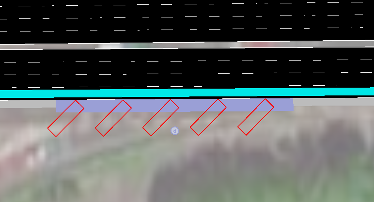
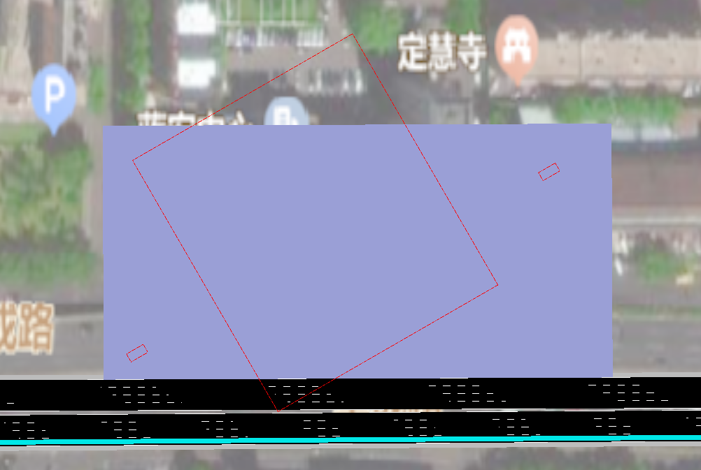
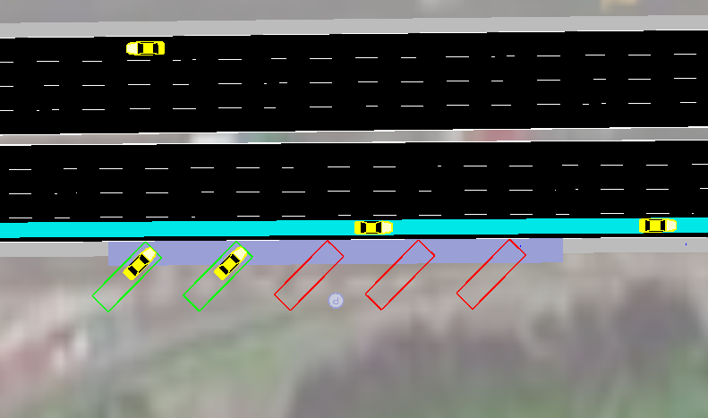

## 停车场设置

新建一个.add.xml文件，停车场设置的代码如下

```xml
<additional>
  <!-- StoppingPlaces -->
  <parkingArea id="ParkAreaA" lane="E2_1" startPos="250" endPos="300" roadsideCapacity="5" angle="45" length="30"/>
  <parkingArea id="ParkAreaB" lane="-E3_1" startPos="240" endPos="460" roadsideCapacity="0" width="105" length="120" angle="30">
    <space x="-450" y="20" width="4" length="8" angle="120"/>
    <space x="-450" y="30" width="4" length="8" angle="120"/>
    <space x="-250" y="20"/>
  </parkingArea>
</additional>
```

参数说明：
- id为停车场代号，不做限制。
- lane为停车场所在的道路
- startPos与endPos为停车场所在道路的开始位置与结束位置。
- roadsideCapacity为路边停车停车场的数量。
- width与length为停车场的长与宽，自行设置合适的数值。
- angle为停车场斜角，多取30，45，60。

如果是多个停车场按照id为ParkAreaA的参数设置即可，设置完成如下图




如果设置一个大型停车场，需要按照id为ParkAreaB的设置方法

```python
<parkingArea id="ParkAreaB" lane="-E3_1" startPos="240" endPos="460" roadsideCapacity="0" width="105" length="120" angle="30">
```

这里的定义是停车范围的划定，所建立的大小停车场都应该在此范围内,而且大停车场也只能停一辆车
而如果需要建立小的停车场，则按照如下写法

```python
<space x="-450" y="30" width="4" length="8" angle="120"/>
```

大停车场的建立按照如下写法

```python
<space x="-250" y="20"/>
```

完成如下图



## 进入停车场的车流量设置

在停车场已经建立好的基础之后，需要加载进入停车场的车流

新建.flow.xml文件,代码如下

```xml
<routes>
	<vehicle id="p0" depart="0">
    <route edges="E2 -E1"/>
    <stop parkingArea="ParkAreaA" duration="120"/>
	</vehicle>
	<vehicle id="p1" depart="0">
    <route edges="E2 -E3"/>
    <stop parkingArea="ParkAreaB" duration="120"/>
	</vehicle>
	<flow id="pp0" from="E2" begin="0" end="7200" period="100">
		<stop parkingArea="ParkAreaA" duration="120"/>
	</flow>
	<flow id="pp1" from="E2" begin="0" end="7200" period="100">
		<stop parkingArea="ParkAreaB" duration="120"/>
	</flow>
</routes>
```

vehicle定义参数解释：
- route egdes为出发边到目标边
- stop parkingArea为停车的停车场id
- duration为停车时长

flow定义参数解释：
- from为出发边
- begin与end为仿真时长
- period为多长时间发一次要停车的车

完成之后可以看到汽车停在停车场内，如下图


