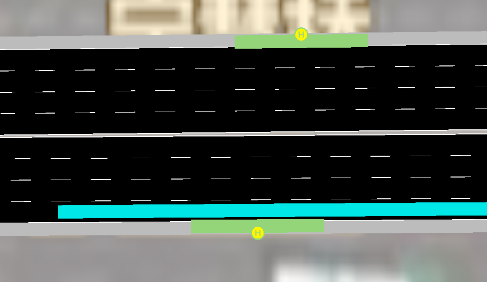

# 公交车仿真操作

## 公交车站设置

在设置公交车流量之前需要先建立公交车站，新建一个.add.xml文件,代码如下所示

```xml
<additional>
    <!-- StoppingPlaces -->
    <busStop id="station1" lane="-E5_1" startPos="120.00" endPos="140.00">
        <access lane="-E5_1" pos="130.00"/>
    </busStop>
    <busStop id="station2" lane="E3_1" startPos="120.00" endPos="140.00">
        <access lane="E3_1" pos="130.00"/>
    </busStop>
    <busStop id="station3" lane="E4_1" startPos="120.00" endPos="140.00">
        <access lane="E4_1" pos="130.00"/>
    </busStop>
    <busStop id="station4" lane="E5_1" startPos="904.00" endPos="924.00">
        <access lane="E5_1" pos="914.00"/>
    </busStop>
    <busStop id="station5" lane="-E3_1" startPos="173.00" endPos="193.00">
        <access lane="-E3_1" pos="183.00"/>
    </busStop>
    <busStop id="station6" lane="-E4_1" startPos="730.00" endPos="750.00">
        <access lane="-E4_1" pos="740.00"/>
    </busStop>
</additional>
```

参数解释：
- id为代号，不做限制。
- lane为公交车站放置的车道位置。
- startPos为公交车站起始位置，endPos为公交车站结束位置。
- access lane为公交车到达的车道，pos为公交车停靠的位置。
根据自己需求进行设置即可。

设置完成后如图所示



## 公交车流量添加

设置好公交车站之后，下面进行公交车流量添加
新建一个.flow.xml文件，代码如下

```xml

<routes>
	<!--公交相关，公交车站在.net.xml中定义-->
	<vType id="BUS_A" personCapacity="40" personNumber="3" accel="2.6" decel="4.5" sigma="0" vClass="bus" length="12" minGap="3" maxSpeed="19" color="1,1,1" guiShape="bus"/>
	<vType id="BUS_B" personCapacity="40" personNumber="4" maxSpeed="8" vClass="bus" Length="14.63" guiShape="bus" />


    <flow id="brt1" color="1,1,1"  begin="0" end= "3600" period="300" line="bus_brt1" type="BUS_B" from="-E5" to="E4"> 
      <stop busStop="station1" duration="30"/>
    </flow>


    <flow id="brt2" color="1,1,0"  begin="0" end= "3600" period="300" line="bus_brt2" type="BUS_A" from="-E4" to="E5"> 
      <stop busStop="station2" duration="30"/>
    </flow>    

</routes>
```

公交车类型定义参数解释：
- id为代号，不作限制。
- personCapacity为公交车最高人数上限。
- personNumber为已经占据的位置，当公交车创建就已经设定，取值范围为[0,personCapacity]。
- maxSpeed为公交车最大速度
- color为RGB颜色选择。
- Length为公交车长度设置。
- accel与decel为加速度与减速度。
- minGap为最小跟车距离。
- 其他参数不作解释，有兴趣可自行了解。

公交车流量生成参数解释：
- begin与end为仿真时长。
- period为多长时间发一次车。
- line为公交车道id，不作限制。
- color为RGB颜色选择。
- type为选择的公交车类型，使用之前所定义的公交车类型。
- from to 为出发的边到结束的边。
- busStop为公交车站id，不做限制。
- duration为停靠时间。


以上为生成公交车流量全部步骤,正确设置图示如下

