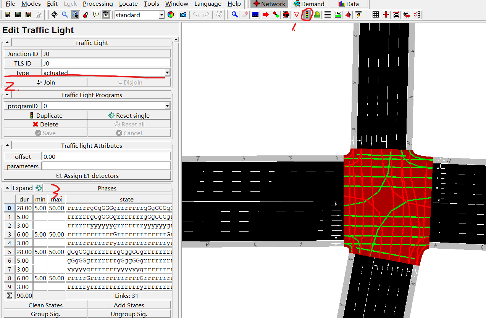

# 感应控制仿真操作

新建.add.xml文件，代码如下

```xml
<additional>
    <tlLogic id="J7" type="actuated" programID="pid010" offset="0">
        <param key="max-gap" value="50.0"/>
        <param key="detector-gap" value="15.0"/>
        <param key="passing-time" value="2.0"/>
        <param key="vTypes" value=""/>
        <param key="show-detectors" value="true"/>
        <param key="file" value="tsl-actuated-output.xml"/>
        <param key="freq" value="300"/>
        <param key="jam-threshold" value="100"/>
        <param key="detector-length" value="350"/>

        <phase duration="50" name="南北直行"         state="gGrgrrgGrgrr"   minDur="15" maxDur="90"/>
        <phase duration="3"  name="黄灯（南北直行）"  state="gyrgrrgyrgrr"   />
        <phase duration="1"  name="全红（南北直行）"  state="rrrrrrrrrrrr"   />
        <phase duration="20" name="南北左转"         state="grGgrrgrGgrr"   minDur="10" maxDur="50"/>
        <phase duration="3"  name="黄灯（南北左转）"  state="grygrrgrygrr"   />
        <phase duration="1"  name="全红（南北左转）"  state="rrrrrrrrrrrr"   />
        <phase duration="50" name="东西直行"         state="grrgGrgrrgGr"   minDur="15" maxDur="90"/>
        <phase duration="3"  name="黄灯（东西直行）"  state="grrgyrgrrgyr"   />
        <phase duration="1"  name="全红（东西直行）"  state="rrrrrrrrrrrr"   />
        <phase duration="20" name="东西左转"         state="grrgrGgrrgrG"   minDur="10" maxDur="50"/>
        <phase duration="3"  name="黄灯（东西左转）"  state="grrgrygrrgry"   />
        <phase duration="1"  name="全红（东西左转）"  state="rrrrrrrrrrrr"   />
    </tlLogic>
</additional>

```

参数解释：

- tlLogic id与programID为代号，不做限制

- type为交通信号灯控制类型，有：static(固定配时),actuated(感应控制),delay_based(基于时间损失控制)

- offset为相位差

- max-gap为导致当前阶段延长的连续车辆之间的最大时间间隔(最大车头时距)
- detector-gap为导致当前相位延长的连续车辆之间的最大时间间隔决定了(自动生成的)检测器与停车线之间的时间距离(以秒为单位)
- passing-time为绿延时，如果绿延时时间不足，将会产生warning
- 由于感应控制是基于E1检测器进行控制，vTypes，file,freq可不做定义，参数在E1检测器的定义中定义即可
- show-detectors为是否在sumo-gui中可看到检测器
- jam-threshold为如果车辆位于检测器上，通过路口比给定的时间更长，可忽略这些车辆
- detector-length为将检测器长度设置为给定的值，以确保在不同间隙和车辆位置下进行稳健的请求检测

相位设置：
相位可在netedit中设置，如图所示：



先点击红绿灯创建模式，然后选择类型为actuated，然后在下方设置最大绿最小绿时长

也可以如上代码所示，在.add.xml中设置
