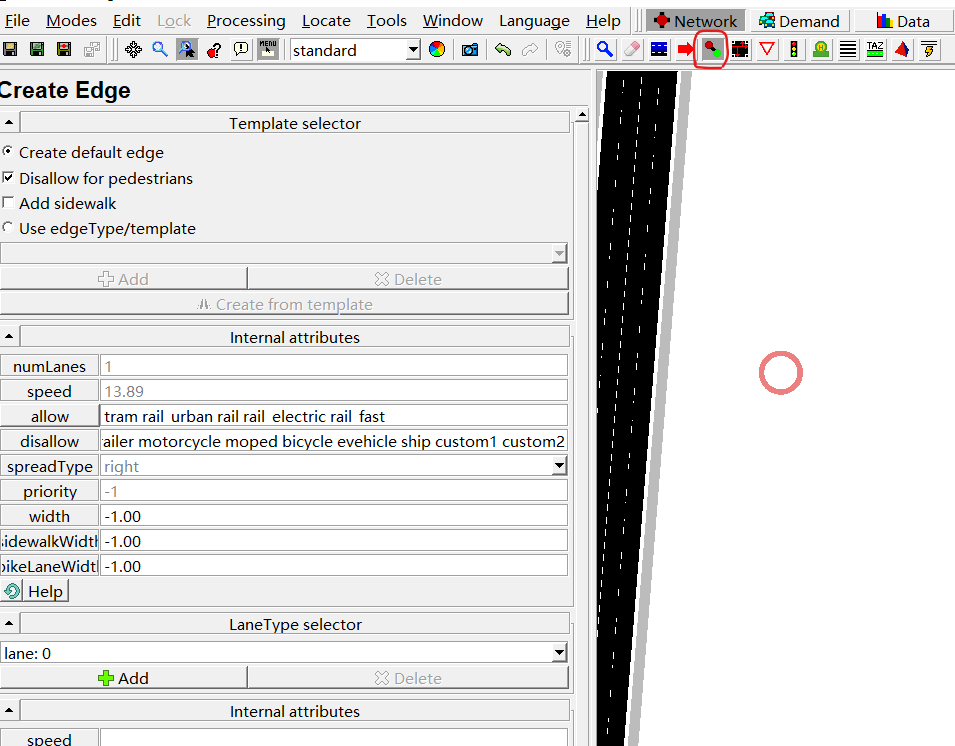
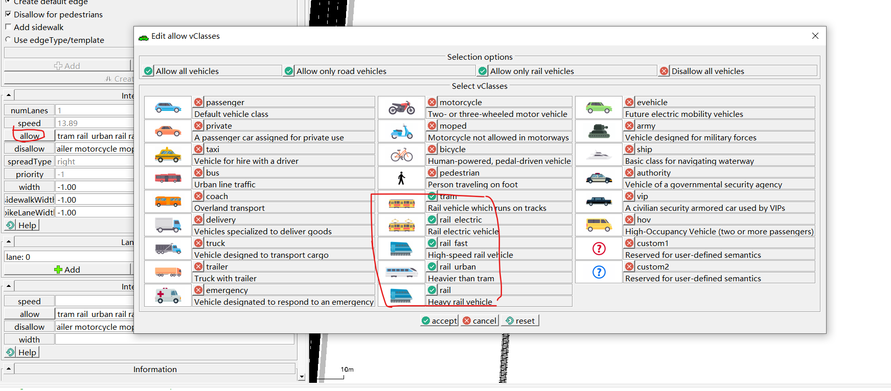
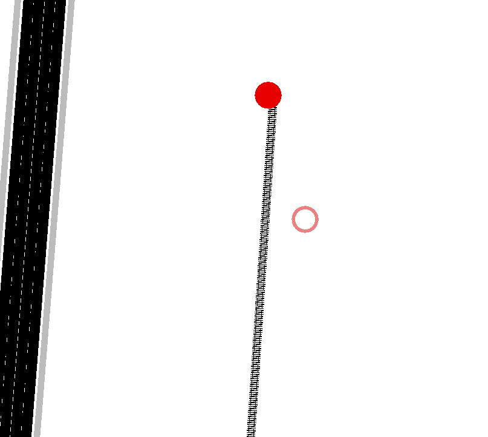
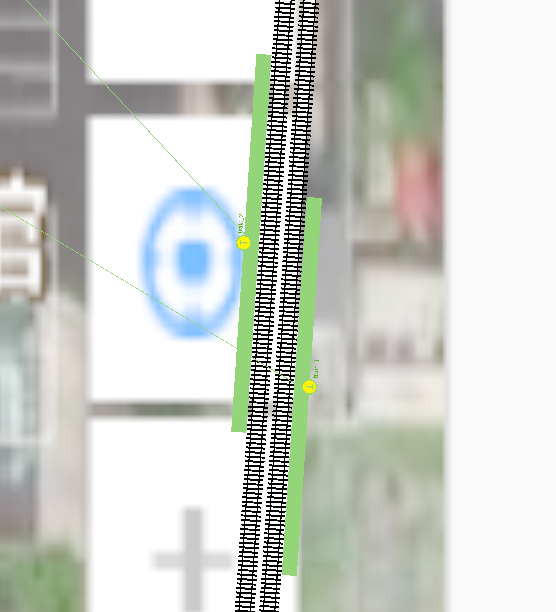
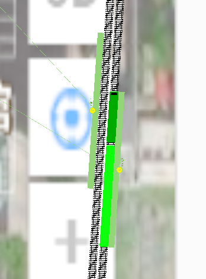

# 火车仿真操作


## 火车线路创建

进入.net文件，选择创建道路模式，如下图红线



然后点击选择许可进入道路的车辆，按照下图红线中的内容进行选择



根据路网要求画出火车轨道，如下图即为完成



## 火车站创建

新建一个.add.xml文件,火车站创建代码如下

```xml
<additional>
    <!-- StoppingPlaces -->
    <trainStop id="ts_4" name="西黄村站" lane="E-R210_0" startPos="200.80" endPos="250.80" lines="K405">
        <access lane="E2_0" pos="100.00"/>
    </trainStop>
    <!-- Wires -->
    <tractionSubstation id="tr_0" pos="606.62,-85.88" voltage="600.00" currentLimit="400.00"/>
</additional>
```

火车站参数解释：
- id与name都是代号，根据情况设置，不做限制。
- lane为火车道名称
- startPos与endPos为火车站起始与结束位置
- lines为火车站名称
- access lane 为连接行人与火车站的道路，为人行道的道路id
- pos为连接行人与火车站的位置，根据实际情况决定让行人从哪去往火车站

牵引变电所参数解释：
- id为代号，不做限制
- pos为变电所位置
- voltage为所提供电压大小
- currentLimit为所提供电流大小

在文件编译过程中可能会出现如下错误
==Error: invalid byte '?' at position 2 of a 2-byte sequence==

可通过在文件头添加如下代码解决
```python
<?xml version="1.0" encoding="gbk"?>
```
火车站成功创建如下图：


## 火车流量配置

新建一个.flow.xml文件，代码如下

```xml
<routes>
	<vType id="train_A" vClass="rail" carFollowModel="Rail"/>
	<vType id="train_B"  length="50" vClass="rail" />

  <flow id="trtype3" line="train_test" color="1,1,1"  begin="0" end= "7200" period="900" type="train_B" from="E-R111" to="E-R211"> 
      <stop trainStop="ts_1" duration="300"/>
      <stop trainStop="ts_3" duration="300"/>
  </flow>

</routes>
```
车辆类型参数解释:
- id为代号，不做限制。
- vclass为sumo中车辆类型的类。
- carFollowModel为跟驰模型，选择Rail即可。
- length为车辆长度，不做设置即为默认值。

车辆流量参数解释：
- id为代号，不做限制。
- line为名称
- color为RGB颜色，自行设置
- begin与end为仿真时长，period为多长时间发一次车
- type选择一个之前所定义的火车类型即可
- from to为发车的边到目标边
- stop trainStop为火车停靠站,==顺序有先后，先经过的站在前，后停靠的站在后==
- duration为停靠时间


完成后可看到火车停靠，如下图


