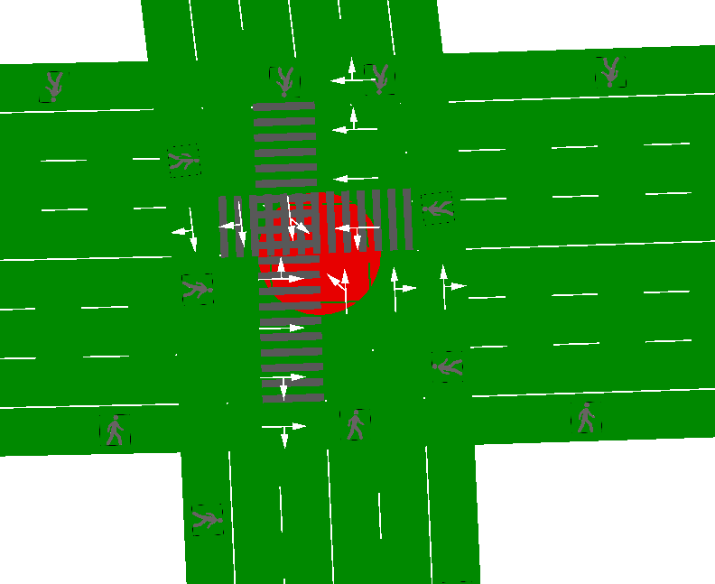

# 行人仿真说明

## 人行道设置


选择最外侧车道，左侧车道设置中点击allow


进入界面之后，将所有车辆禁止通行，只留下行人

## 斑马线设置


设置完毕之后，选择设置斑马线模式，点击交汇点，可以看到所有车道线变成暗绿色，如图所示


点击发车道，可以看到变成亮绿色，再点击同一方向的紧邻车道，按下回车键，就能生成灰色斑马线，如图所示



按照以上步骤逐步生成四个方向的斑马线，如果有同学出现斑马线生成变成红色，并且出现如下报错，按照以下方式解决，生成斑马线没有问题的同学可以进行行人流量步骤


报以上错误的同学需要把机动车道的允许车辆全部改为行人除外，每一条机动车道都需要修改，如图所示


修改之后再次生成斑马线即可顺利生成

## 行人流量设置

行人流量需单独新建.add.xml文件

按照以下格式书写：
```xml
<routes>
<!-- 行人 -->
    <!-- 南进口 -->
	<personFlow id="p1" begin="0" end="3600" period="18">
       <walk from="S1" to="W1"/>
	   <walk from="S1" to="-N1"/>
	   <walk from="S1" to="-E1"/>
    </personFlow>
	<!-- 北进口 -->
	<personFlow id="p2" begin="0" end="3600" period="18">
       <walk from="N1" to="E1"/>
	   <walk from="N1" to="-S1"/>
	   <walk from="N1" to="-W1"/>
    </personFlow>
	<!-- 西进口 -->
	<personFlow id="p3" begin="0" end="3600" period="18">
       <walk from="W1" to="N1"/>
	   <walk from="W1" to="-E1"/>
	   <walk from="W1" to="-S1"/>
    </personFlow>
	<!-- 东进口 -->
	<personFlow id="p4" begin="0" end="3600" period="18">
       <walk from="E1" to="S1"/>
	   <walk from="E1" to="-W1"/>
	   <walk from="E1" to="-N1"/>
    </personFlow>
</routes>
```


参数说明：
- id为编号，不做限制。
- begin与end为仿真开始与结束时间，需与配置文件中一致。
- period为时间间隔，即多长时间生成一个人。
- walk from to 意为出发的边与目标边。
按照实际路口的情况填写即可


全部完成以后，在.sumocfg配置文件中添加fl_person.add.xml,如以下代码
```python
<additional-files value="fl_person.add.xml"/>
```
