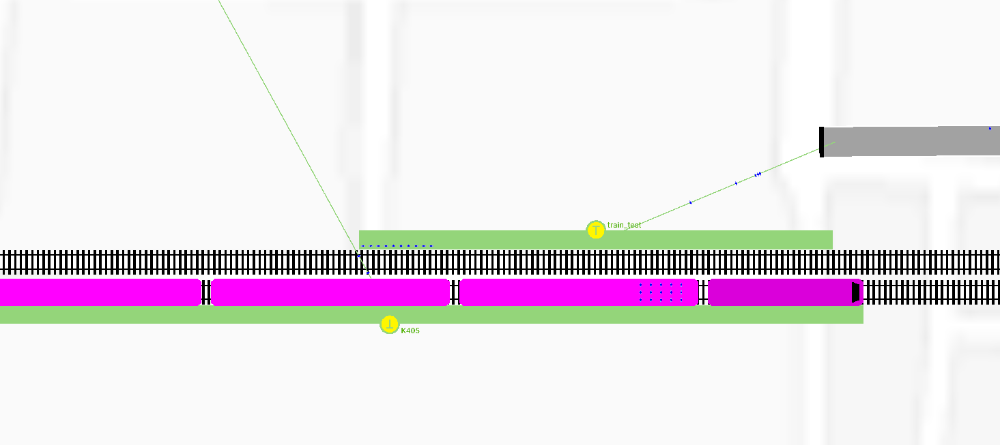
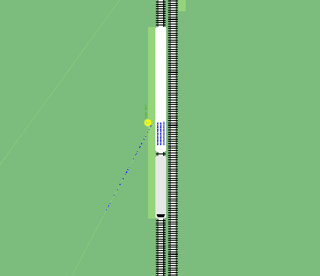

# 行人换乘

新建一个.flow.xml文件，代码如下

```xml
<routes>
  <personFlow id="person0" depart="0" number="400">
    <walk from="E2" busStop="station5" arrivalPos="random"/>
    <ride busStop="station2" lines="bus_test"/>
    <walk to="-E0" arrivalPos="random"/>
    <walk from="-E0" trainStop="ts_2" arrivalPos="random"/>
    <ride trainStop="ts_2" lines="K405"/>
  </personFlow>
  <personFlow id="person1" depart="1" number="1000">
    <walk from="Eperson"  trainStop="ts_1" arrivalPos="random"/>
    <ride trainStop="ts_3" lines="train_test"/>
    <walk to="E2" busStop="station4" arrivalPos="random"/>
    <ride busStop="station4" lines="bus_test"/>
    <walk to="-E0" arrivalPos="random"/>
  </personFlow>
</routes>
```

参数解释：

id为代号，不做限制
depart为人流量进入路网的时间步长
number为人流量的数量
arrivalPos为到达方式，可选random,best,free等

```python
walk from="E2" busStop="station5
```

为人流量在E2生成，从E2出发，到达id为station5的公交车站

```python
ride busStop="station2" lines="bus_test"
```

为行人搭乘公交车，沿着id为bus_test的lines的道路，最后到达id为station2的公交车站。

```python
walk to="-E0" arrivalPos="random"
```

行人在id为station2的公交车站下车，station2在-E0上，最后到达的边为-E0，到达方式随机

```python
walk from="-E0" trainStop="ts_2" arrivalPos="random"
```

行人从-E0出发，到达id为ts_2的火车站(trainStop),到达方式随机

```python
ride trainStop="ts_2" lines="K405"
```

行人在ts_2火车站搭乘火车沿着id为K405的lines(路线)前进

效果完成图如下:



---


