# 环境配置说明

## 1. 安装Python最新版本

- 进入Python官网<https://www.python.org/downloads/>

  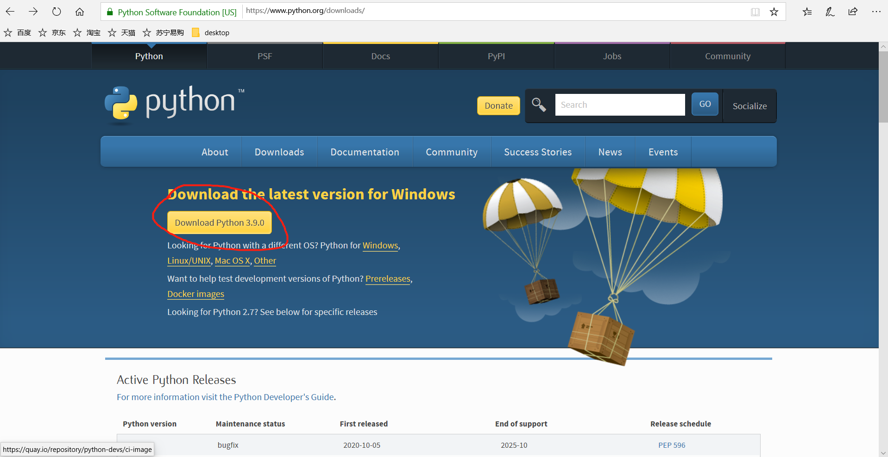

- 点击进去后选择安装。尽量不要选择zip压缩包。64位系统就选择Windows x86-64 executable installer。
  
  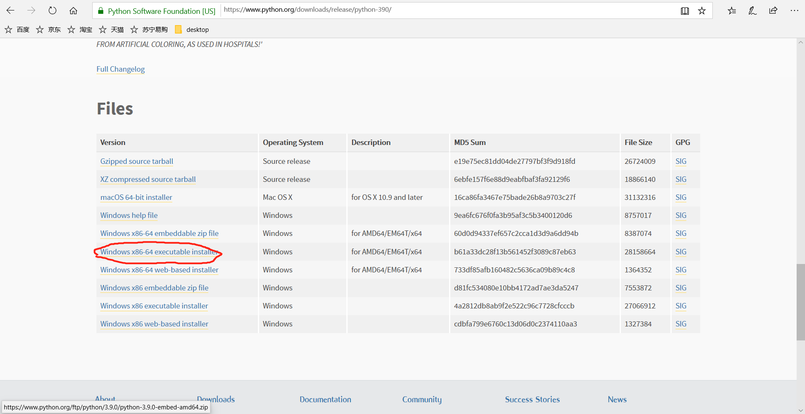

- 下载完成后点开安装（注意勾选“add Python to Path”）

  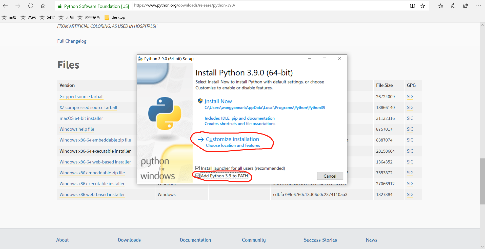

- 开始自定义安装

  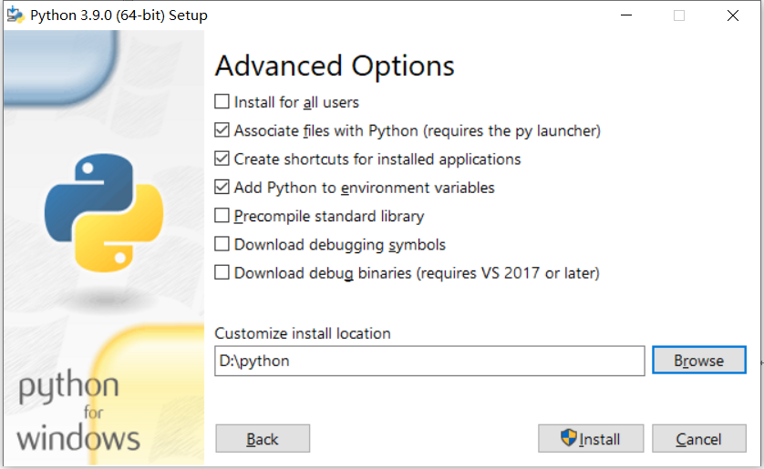

- 完成后，Win+R，键入cmd。在cmd窗口中输入python并回车，若显示当前版本表示安装成功。
  
  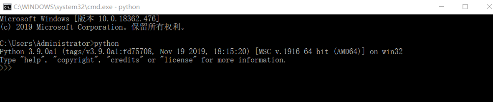

## 2. 安装pycharm（community版）最新版

- 打开官网下载community版本<https://www.jetbrains.com/pycharm/download/#section=windows>
  
  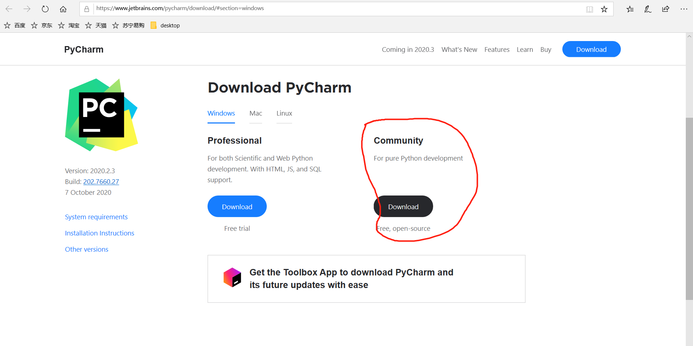

- 下载完成后打开安装，自定义安装目录后一路next
  
  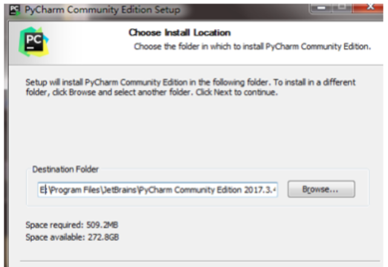

- 打开pycharm，选择主题后创建新项目，改写项目名称，第一次下载一般不用修改其他选项，点击create就可以了.
  
  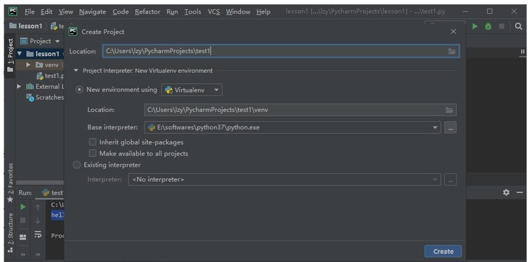

- 创建后的界面可以开始进行操作
  
  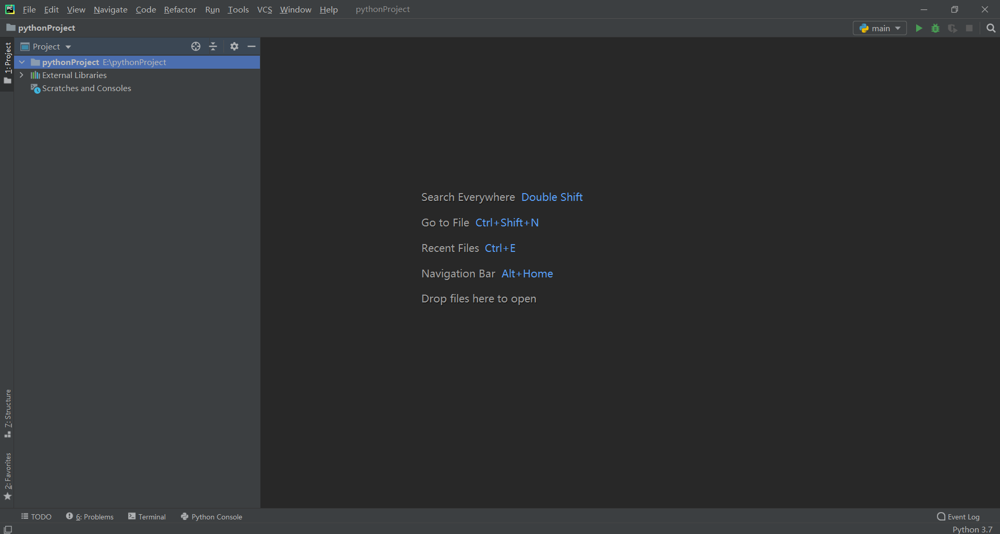

- 右键文件夹，点击新建python.file，自命名
  
  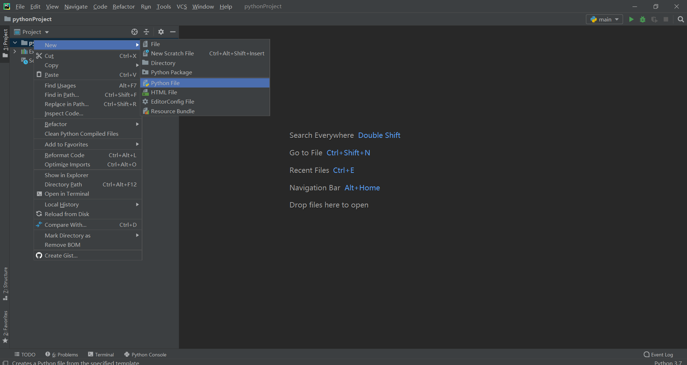
- 输入“hello world”,并点击运行
  
  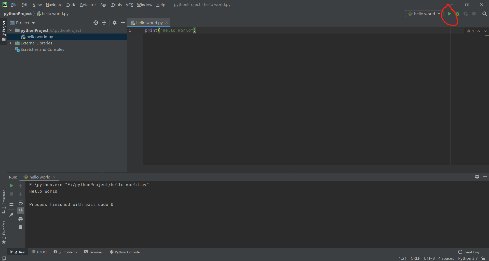

## 3. 安装SUMO最新版
进入官网下载即可<https://www.eclipse.org/sumo/>

  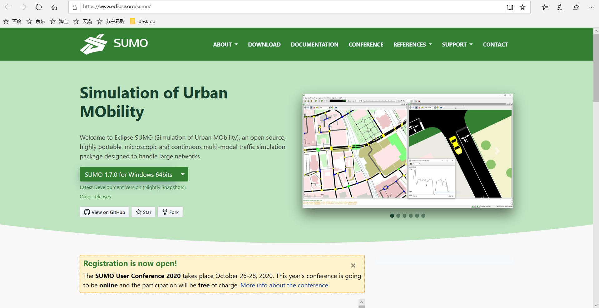

## 4. 安装VSCODE、VSCodium

VSCODE下载地址：<https://code.visualstudio.com/Download>

VSCODIUM下载地址：<https://vscodium.com>