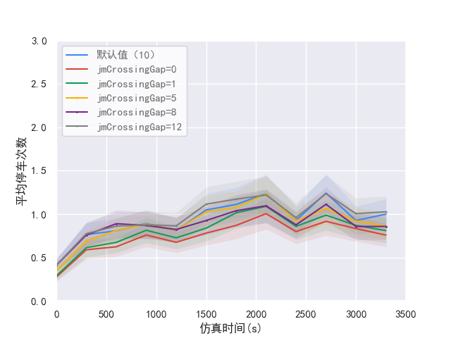

# SUMO仿真输出结果绘图

## 1. 准备数据

仿真输出数据包括各类检测器数据、仿真统计数据等，检测对象涵盖机动车、公交车、行人等，数据种类有流量相关数据、速度相关数据、延误、旅行时间、碰撞冲突等，存储形式为.xml。

常见的SUMO输出数据文件有：
- collision.xml
- e1.xml/e1_instant.xml
- e2.xml
- e3.xml
- edges.xml/lanes.xml
- emission.xml
- person_summary.xml
- Queue.xml
- statistic.xml
- summary.xml

## 2. 构造YAML信息文件

以E3检测器中的“平均停车次数”对比图为例，构造各次仿真对比分析yaml数据文件：
```YAML
basic_info:
  pic_name: '3.4晚高峰_jmCrossingGap_首体路与增光路_E3_平均停车次数'
  save_path_png: 'picture/E3/3.4晚高峰_jmCrossingGap_首体路与增光路_E3_平均停车次数.png'
  save_path_pdf: 'picture/E3/3.4晚高峰_jmCrossingGap_首体路与增光路_E3_平均停车次数.pdf'
  xlabel: '仿真时间(s)'
  ylabel: '平均停车次数'
  xlim: [0, 3500]
  xticks: [0, 500, 1000, 1500, 2000, 2500, 3000, 3500]
  xticklabels: ['0', '500', '1000', '1500', '2000', '2500', '3000', '3500']
  ylim: [0, 3]
  palette: ["#4285F4", "#DB4437", "#0F9D58", "#F4B400","#7A288A","#808080", ]
  markers: ["o", 'd', "^", 'x', 'o', 'v', 'p', 'd']
  marker_size: [0, 0, 0, 1, 1, 1]
  line_styles: ['-', '-', '-', '-', '-', '-']
data_from_files:
  data1:
    name: '默认值（10）'
    path: '../现状仿真/3.4晚高峰/output/OUTPUT-data_e3.xml'
    type: 'e3'
    tag_name: 'interval'
    locating_cols: {
      'id': '首体路与增光路',
    }
    time_col: 'begin'
    attr_col: 'meanHaltsPerVehicle'

  data2:
    name: 'jmCrossingGap=0'
    path: '../交叉口模型参数分析/jmCrossingGap/3.4晚高峰（jmCrossingGap=0）/output/OUTPUT-data_e3.xml'
    type: 'e3'
    tag_name: 'interval'
    locating_cols: {
      'id': '首体路与增光路',
    }
    time_col: 'begin'
    attr_col: 'meanHaltsPerVehicle'

  data3:
    name: 'jmCrossingGap=1'
    path: '../交叉口模型参数分析/jmCrossingGap/3.4晚高峰（jmCrossingGap=1）/output/OUTPUT-data_e3.xml'
    type: 'e3'
    tag_name: 'interval'
    locating_cols: {
      'id': '首体路与增光路',
    }
    time_col: 'begin'
    attr_col: 'meanHaltsPerVehicle'

  data4:
    name: 'jmCrossingGap=5'
    path: '../交叉口模型参数分析/jmCrossingGap/3.4晚高峰（jmCrossingGap=5）/output/OUTPUT-data_e3.xml'
    type: 'e3'
    tag_name: 'interval'
    locating_cols: {
      'id': '首体路与增光路',
    }
    time_col: 'begin'
    attr_col: 'meanHaltsPerVehicle'

  data5:
    name: 'jmCrossingGap=8'
    path: '../交叉口模型参数分析/jmCrossingGap/3.4晚高峰（jmCrossingGap=8）/output/OUTPUT-data_e3.xml'
    type: 'e3'
    tag_name: 'interval'
    locating_cols: {
      'id': '首体路与增光路',
    }
    time_col: 'begin'
    attr_col: 'meanHaltsPerVehicle'

  data6:
    name: 'jmCrossingGap=12'
    path: '../交叉口模型参数分析/jmCrossingGap/3.4晚高峰（jmCrossingGap=12）/output/OUTPUT-data_e3.xml'
    type: 'e3'
    tag_name: 'interval'
    locating_cols: {
      'id': '首体路与增光路',
    }
    time_col: 'begin'
    attr_col: 'meanHaltsPerVehicle'
```

## 3. 绘制对比图（Python实现）

```python
def plot_sumo_output_data_by2(yamlfile):
    """
    该函数根据给定的 yaml 文件中的配置信息，绘制 SUMO 输出数据的图表。

    :param yamlfile: .yaml 格式的配置文件路径
    :return: None
    """

    # 读取 yaml 文件。yaml 文件中包含图表的配置信息和数据源信息
    with open(yamlfile, 'r', encoding='utf-8') as f:
        data_all = yaml.load(f.read(), Loader=yaml.FullLoader)

    # 提取基本信息和数据源信息
    basic_info = data_all['basic_info']
    data_info = data_all['data_from_files']

    # 从基本信息中提取图表参数
    x_label = basic_info['xlabel']
    y_label = basic_info['ylabel']
    x_lim = basic_info['xlim']
    y_lim = basic_info['ylim']
    x_ticks = basic_info['xticks']
    x_show_ticks = basic_info['xticklabels']
    palette = basic_info['palette']
    markers = basic_info['markers']
    marker_size = basic_info['marker_size']
    line_styles = basic_info['line_styles']
    save_path_png = basic_info['save_path_png']
    save_path_pdf = basic_info['save_path_pdf']
    legend_name = []

    # 初始化 plot 的绘图环境
    fig = plt.figure()
    sns.set_style(style='darkgrid')
    plt.rcParams['font.sans-serif'] = ['Simhei']

    # 初始化用于保存绘图数据的 DataFrame
    df = DataFrame()

    # 根据配置文件中指定的数据源信息进行数据读取和绘图
    for d in data_info.values():
        # 提取数据源的基本信息
        data_name = d['name']
        legend_name.append(data_name)
        file_path = d['path']
        data_type = d['type']
        tag_name = d['tag_name']
        locating_col = d['locating_cols']
        time_col = d['time_col']
        attr_col = d['attr_col']

        # 初始化用于保存数据源的数据列表
        data_time = []
        data_attr = []

        # 打开 xml 文件并解析数据
        dom = minidom.parse(file_path)
        root = dom.documentElement
        data = dom.getElementsByTagName(tag_name)

        # 从解析的数据中定位需要的数据
        for dt in data:
            if_is = True
            for key, val in locating_col.items():
                if dt.getAttribute(key) != val:
                    if_is = False
                    break
            if if_is:
                data_time.append(dt.getAttribute(time_col))
                data_attr.append(dt.getAttribute(attr_col))

        # 转换数据格式
        data_time = [int(float(i)) for i in data_time]
        data_attr = [float(i) for i in data_attr]

        # 平滑处理数据
        smoothed = []
        last1 = 0
        last2 = data_attr[0]
        smoothed_weight = 0.48
        for p in data_attr:
            smoothed_val = 0.5 * (last1 + last2) * \
                smoothed_weight + (1 - smoothed_weight) * p
            smoothed.append(smoothed_val)
            last1 = last2
            last2 = smoothed_val

        # 使用二次多项式近似拟合中心线
        coefficients = np.polyfit(data_time, data_attr, 2)
        data_attr_fit = np.polyval(coefficients, data_time)

        # 构造 DataFrame 保存数据
        df1 = DataFrame(smoothed)
        results = Holt(endog=df1, initialization_method='estimated').fit()
        df_smoothed = results.fittedvalues
        df[data_name] = df1
        df['Simulation Time'] = DataFrame(data_time)

    # 设置 plot 的色彩配置
    sns.set_palette(palette)

    # 对每一组数据进行绘图
    for i, column in enumerate(df.drop('Simulation Time', axis=1).columns):
        error = df[column].values.astype(float) * 0.175
        line_color = palette[i % len(palette)]
        plt.plot(df['Simulation Time'], df[column], color=line_color, linestyle=line_styles[i],
                 marker=markers[i], markersize=marker_size[i], label=legend_name[i])
        plt.fill_between(df['Simulation Time'], df[column] - error, df[column] + error, alpha=0.1,
                         edgecolor=line_color, facecolor=line_color, linewidth=.1, linestyle=line_styles[i], antialiased=True)

    # 完善文章其它元素，例如添加 x，y 轴标签，设置图例，设置刻度等
    plt.xlabel(x_label)
    plt.ylabel(y_label)

    sns.set_theme(style="ticks")
    plt.rcParams['font.sans-serif'] = ['Simhei']
    plt.gca().set_xlim(x_lim)
    plt.gca().set_ylim(y_lim)
    plt.legend(loc='upper left', labelcolor='dimgrey')

    plt.xticks(x_ticks, x_show_ticks)
    fig = plt.gcf()

    # 保存图表至指定路径
    fig.savefig(save_path_png)
    fig.savefig(save_path_pdf)

```

## 4. 调用函数完成绘制
```python
if __name__ == '__main__':
    plot_sumo_output_data_by2(
        yamlfile="yaml_config/E3/3.4晚高峰_jmCrossingGap_首体路整体_E3_平均停车次数.yaml")
```


## 完整工程文件
[查看](./)
[下载](./SUMO仿真结果绘图.zip)