主干路仿真教程
===
# 1 数据采集
## 1.1 交叉路口相关信息
我们选取的主干路包含三个路口，分别为园林路与兴民路交叉路口、园林路与富康路交叉路口以及园林路与飞天路交叉路口。
## 1.2 车道相关信息
经过观察可知，东西向的园林路以及南北向的富康路为四车道，分别为左转车道、直行车道、右转车道以及非机动车道，南北向的兴民路以及飞天路为三车道，分别为直左车道、右转车道以及非机动车道。

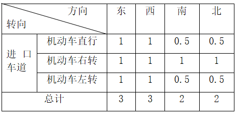

表1-1 园林路与兴民路交叉路口各方向车道数

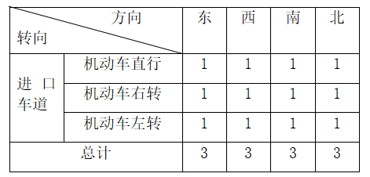

表1-2 园林路与富康路交叉路口各方向车道数

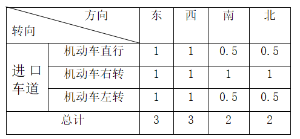

表1-3 园林路与飞天路交叉路口各方向车道数

## 1.3 车辆信息
我们统计了一小时内各车道的车辆信息，每15分钟各进口车道小型车以及大型车的转向车辆数。

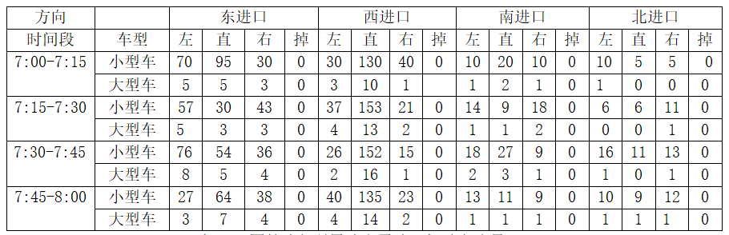

表1-4 园林路与兴民路交叉路口机动车流量

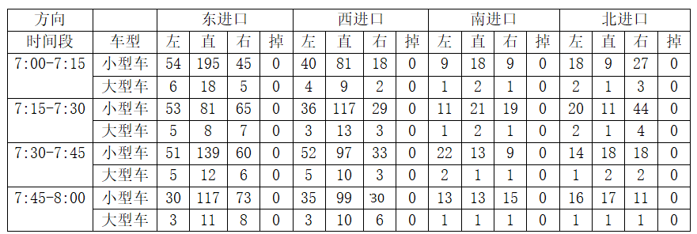

表1-5 园林路与富康路交叉路口机动车流量

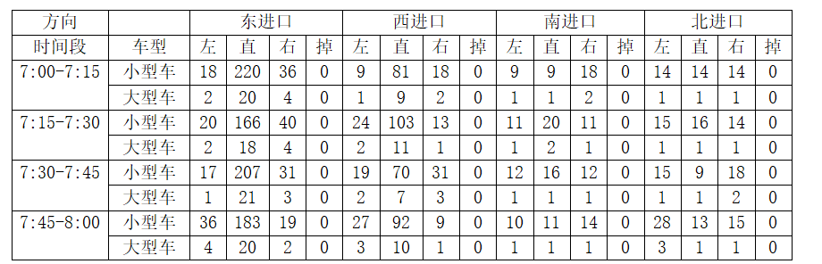

表1-6 园林路与飞天路交叉路口机动车流量

## 1.4 相位信息
园林路与兴民路交叉路口以及园林路与飞天路交叉路口为三相位，第一相位为东西向直行，第二相位为东西向左转，第三相位为南北向直左；园林路与富康路交叉路口为四相位，第一相位为东西向直行，第二相位为东西向左转，第三相位为南北向直行，第四相位为南北向左转。

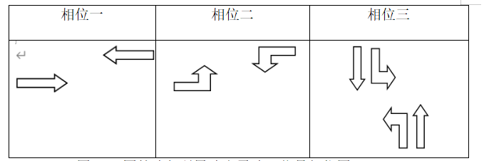

表1-7 园林路与兴民路交叉路口信号相位图

第一相位绿灯27s，黄灯3s，全红3s；第二相位绿灯17s，黄灯3s，全红3s；第三相位绿灯27s，黄灯3s，全红3s。

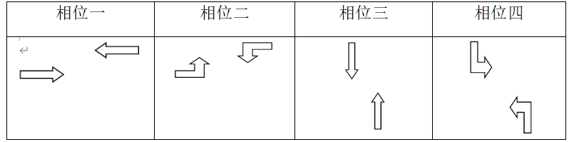

表1-8 园林路与富康路交叉路口信号相位图

第一相位绿灯27s，黄灯3s，全红3s；第二相位绿灯17s，黄灯3s，全红3s；第三相位绿灯27s，黄灯3s，全红3s；第四相位绿灯17s，黄灯3s，全红3s。

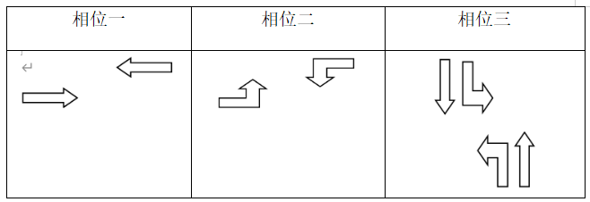

表1-9 园林路与飞天路交叉路口信号相位图

第一相位绿灯27s，黄灯3s，全红3s；第二相位绿灯17s，黄灯3s，全红3s；第三相位绿灯27s，黄灯3s，全红3s。
## 1.5 公交车信息

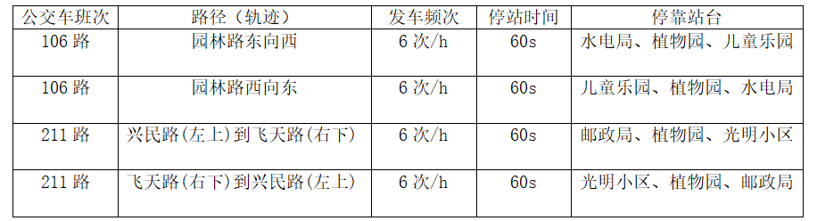

表1-10 主干路公交车相关信息

# 2 绘制路口
## 2.1 绘制背景图
首先在CAD中对主干路进行绘制，包括道路信息、周边环境等内容。

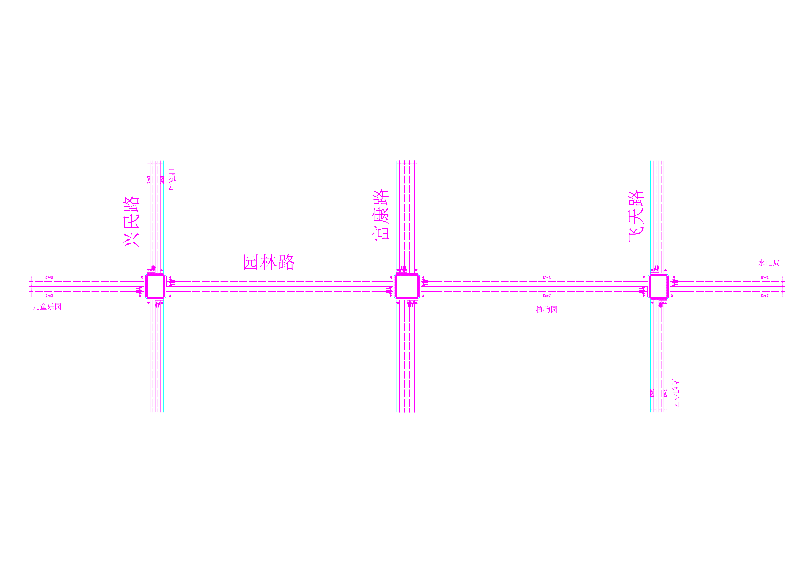

图2-1 主干路背景图（注：机动车道宽度4m，非机动车道宽度5m。））
