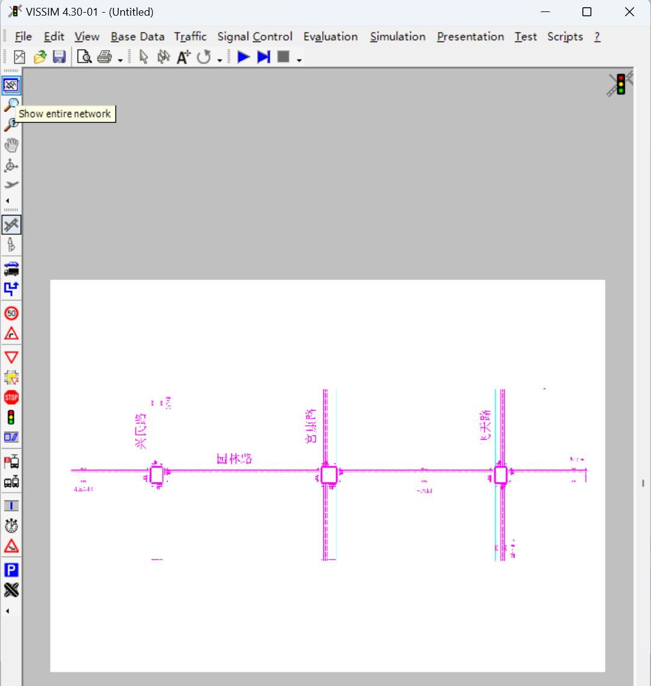
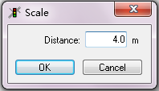
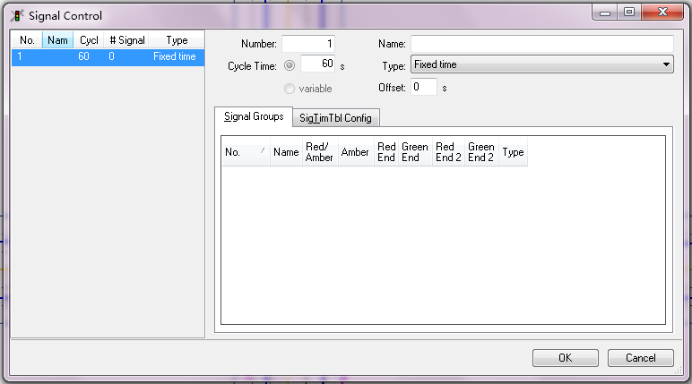
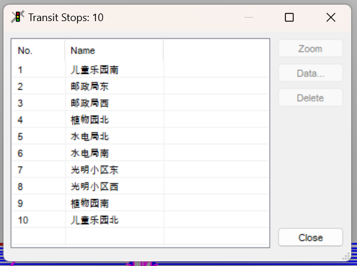
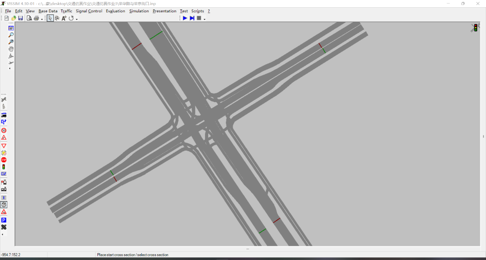

# Vissim教程

## Vissim 4.3 破解安装过程
详情请见VISSIM4.3+破解版.zip

## 主界面

### 点开VISSIM软件

###  加载背景图&调整比例尺

加载完背景图后不要点击close，先点击‘scale’，会出现背景图(若未出现，说明背景图在其他位置，可以点击最左侧的 show entire network)。

注意：道路方向

放大背景图后，使用鼠标左键选点按住拖动至合适位置后松开，填写实际距离。

### 绘制路网

点击左边工具栏Links&Connectors后使用鼠标右键点击选点后按住并移动至合适位置绘出线路，再次点击右键确定终点。

注意：在绘制路网时，线路是具有方向性的，进口道是指向交叉口进入的方向，出口道是指从交叉口出来的方向，切勿画反！

非机动车道如图所示：

机动车道可以一次画完三个机动车道,机动车道如图所示：

依次画完三个路口，按下Ctrl+A 可以得到更为直观地路网图，便于大家观察

当需要绘制转向车道时，先鼠标左键选择车道，再点右键选定入口车道并按住拖动指向出口车道如图：

from link列对应着两条直行车道，to link列对应着两条直行车道。车道自外向内编号分别为Lane 1 Lane 2 Lane 3...

注意：points数量越多，代表该条Link直线系数越低（即概直线越弯，常用在转弯的地方）

最后为下图：

### 定义交通构成
主界面上方菜单栏Traffic——Compositions

+
点击New添加

添加好后点击Edit根据实际情况定义各路段车辆构成，
特别注意，car为小车，HGV为大车，bike为非机动车。例如园林路与兴民路交叉口的西进口，根据表格数据计算求得一小时内小车共802辆、大车共72辆，则小车所占比例为802/(802+72)=0.92,大车为1-0.92=0.08：

注意：在车辆构成中Rel.Flow的值必须相加为1；速度也应选择一个合适的区间，不宜过快或过慢。
### 车辆输入

定义好个路段车辆构成后点击左边工具栏Vehicle Inputs 左键双击某路段即可输入（输入实际情况），右键可以点击new新建。

特别注意：最右侧那一栏，应根据表格中划分的时间来划分，若表格中数据是15min一组，则用15*60=900s，每一组为900s，共四组。

注意：根据表格中数据如实输入
最后输入完成后，可以右键随机点击浅灰色背景，出现汇总：

## 设置路径选择

点击左边工具栏Routes，在已绘制线路上的合适位置   注意:分流决策点的设定尽可能离交叉口较远

右键单击鼠标出现下图

将决策点起好名字后点击ok关掉弹窗，左键点击决策点后车辆将驶入的路段，在合适的位置点击右键出现黄色路段

转向比例设定：
设置好各路段后，空白处点击右键出现弹窗

根据实际情况设置每条路段的车辆比例（左右转 直行 掉头等）

## 信号配时
### (1)点击上方菜单栏：Signal Control——Edit Controllers

右键点击左边空白处新建

右键点击Signal Groups下方的空白处新建红绿灯配时

完善Signal Groups中的name,例如:东西直行，东西左转，左转待转等

根据实际情况设置周期时长 (cycle time) 黄灯时间 (ember) 红灯结束 (red end) 绿灯结束 (green end) 和全红时间

(red ember：红灯黄灯间隔启亮，实际情况下是green amber red 无red ember的情景，故将其设为0s)

设置各个路段信号灯配时，

路口1、3:

（行人信号灯配置（行人清尾问题）了解即可
假设机动车道宽度为3.5m，非机动车道宽度为4m，行人速度为6km/h，以路口1南北方向人行横道长约29m，按最低速度计算，南北方向行人通过时间为18s，则行人南北green end为65s(83-18)，保证下一个相位开始时，路口内没有上一个相位没有行走完的行人）

路口2：

### (2)灯头的放置
点击左边工具栏红绿灯图标Signal Heads，左键选定路段，右键设置信号灯，左键拖拽到合适的位置：

每条线路需要分开设置信号灯，Signal group需要与之前设置的红绿灯配时编号对应

左转待转信号灯放置在进口停止线上，左转信号灯放置在待转区的停止线上
## 冲突区与减速区设置

减速区设置：
点击左边工具栏Reduced speed areas，左键选定路段后在需要减速的路段位置按住鼠标右键绘制：

冲突区的设置：
点击左边工具栏Conflict areas
在有冲突的位置点击鼠标左键：

点击右键即可设置优先权（绿色为优先）

## 公交车相关设置

### （1）点击左边工具栏Transit stops
左键选定路段， 按住鼠标右键并拖动绘制出公交站台(依据所需选择type)

street:直线路上设置公交车站

lay-by:港湾式停靠站

在弹框中点击Passengers设置乘客

点击new新建 设置乘客每小时数量 起始和结束时间

### （2）设置公交线路
点击左边工具栏Bus/Tram lines
左键单击公交车其实路段右键单击出现红色横线

左键点击公交车将驶入的路段，在合适位置点击右键完成路线设定

注:通过拖拽右侧蓝色竖线至公交车行驶整个路线，完成公交路线绘制

设定公交车相关数据

点击Start Times

点击右上角Serv.Rate… 设置时间
    

设置完成后点击ok

## 数据采集

### （1）数据采集点
在左侧工具栏选择“Data collection points” ，首先用鼠标左键选择一条路段，然后在适当位置点击鼠标右键放置数据采集点，然后重复上述操作，将每条车道适当位置均放置数据采集点：

放置完成时，或者鼠标右键点击其他位置弹出属性窗口可调节采集器位置等信息：

### （2）旅行时间检测器
在工具栏左侧选择“Travel time selections”，在图中用鼠标左键点击选择路段，再点击鼠标右键选择检测器起点以及终点：

设置完成后弹出窗口：

### （3）排队长度计时器
在左侧工具栏选择“Queue counters”，在图中用鼠标左键选择车道，再用鼠标右键在适当位置放置排队长度计时器：

弹出窗口：

### (4) 节点数据采集
在左侧工具栏选择“Nodes”（左侧工具栏最下方的图标），然后框选所绘制的十字路口中央（点击鼠标左键固定各个点位，最后点击第一个点位实现闭合）：

### 配属输出

- 点击上方菜单栏Evaluation——Files 
弹出窗口并勾选下图中的所示选项

点击Node右边的Configuration,如图设置：

Node：节点  Data collection：数据收集  Network performance：网络性能  Travel time：行程时间  Lane change：车道变化  Queue length：排队长度  Link evaluation：路段评价  Delay：延误

点击Node右边的Filter,如图设置：

图上“<<”是将右边的向左边放入，“>>"是将左边的向右边放入

- 点击Data collection右边的Configuration

设置from起始时间 until终止时间和interval间隔时间
点击new新建,将已经设置的测量点加进去   Interval为每多少秒测量一次数据

点击Configuration进行新建设置

- 点击Network performance右边的Configuration
如图设置：

- 点击Travel time右边的configuration

如图设置：

- 点击Queue length右边的configuration
如图设置：

- 点击Link evalution右边的configuration
如图设置：

- 点击Delay右边的configuration
如图设置：

点击new进行新建

- 设置完数据采集后保存并运行交通仿真，待运行完成
- 后数据信息会自动保存在仿真目录里：

    - .kna (Node evaluation(节点评估))
       - Node(节点)；
       - tStart（起始时间）; 
       - tEnd（结束时间）;
       - FromLink（进入节点的路段）; 
       - ToLink（离开节点的路段）; 
       - Movement（移动方向）;
       - Delay (All)（所有车辆的延误）; 
       - Veh (All)（所有车辆数量）; 
       - Stops (All)（所有车辆的停车次数）; 
       - aveQueue（平均排队长度）;
    - .mes (Data Collection (Compiled Data)(数据收集(已编译数据)))
       - Measur(测量编号);from(起始);to(结束);Number Veh(车辆数量);Occup. Rate(占有率);all veh. types(所有车辆类型);all veh. types(所有车辆类型)
    - .npe (Network Performance(网络性能))
       - Average delay time per vehicle [s], All Vehicle Types(每辆车的平均延误时间 [秒]，所有车辆类型);
       - Average number of stops per vehicles(每辆车的平均停车次数);Average speed [km/h](平均速度 [千米 / 小时]);Average stopped delay per vehicle [s](每辆车的平均停车延误时间 [秒]);
       - Total delay time [h](总延误时间 [小时]);Total Path Distance [km](总路径距离 [千米]);
       - Number of Stops(停车次数);Number of vehicles in the network(网络中的车辆数量);Number of vehicles that have left the network(已离开网络的车辆数量);Total stopped delay [h](总停车延误时间 [小时]);Total travel time [h](总行程时间 [小时]);
    - .rsz (Table of Travel Times(行程时间表))
       - Time; Trav;#Veh(时间；行程；# 车辆)
    - .stz (Queue Length Record(排队长度记录))
       - Time; Avg.; max;Stop;(时间；平均值；最大值；停车)
    - .vlz (Table of Delay(延误表))
       - 编号. 1：行程时间路段（s）1:
       - 时间；延误；停车时间；停车次数；车辆数；人数；人数；车辆类别；所有；

[def]: 背景图比例尺4.png