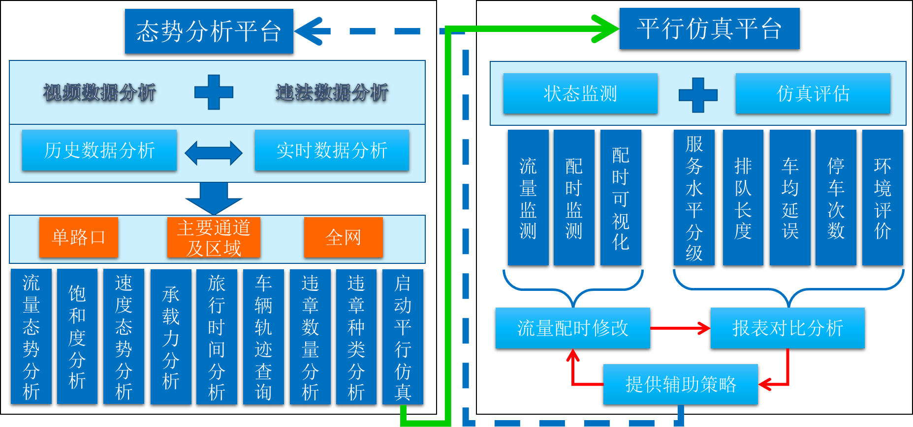
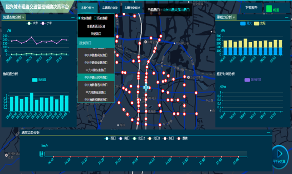
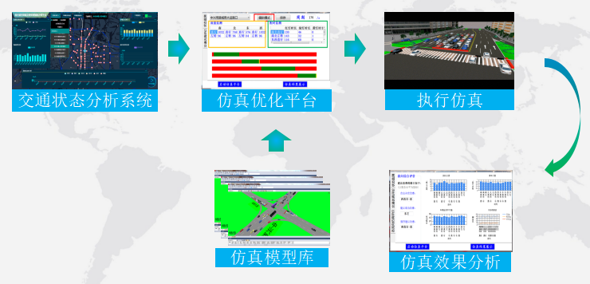
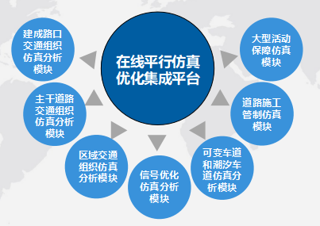
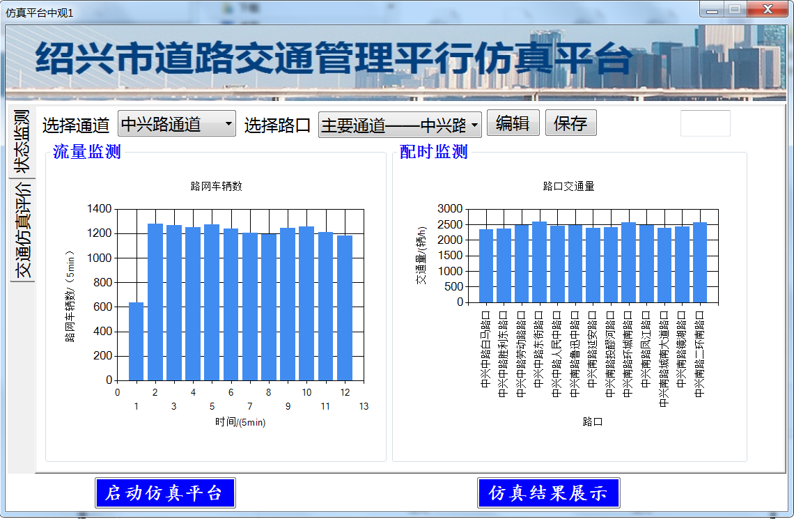
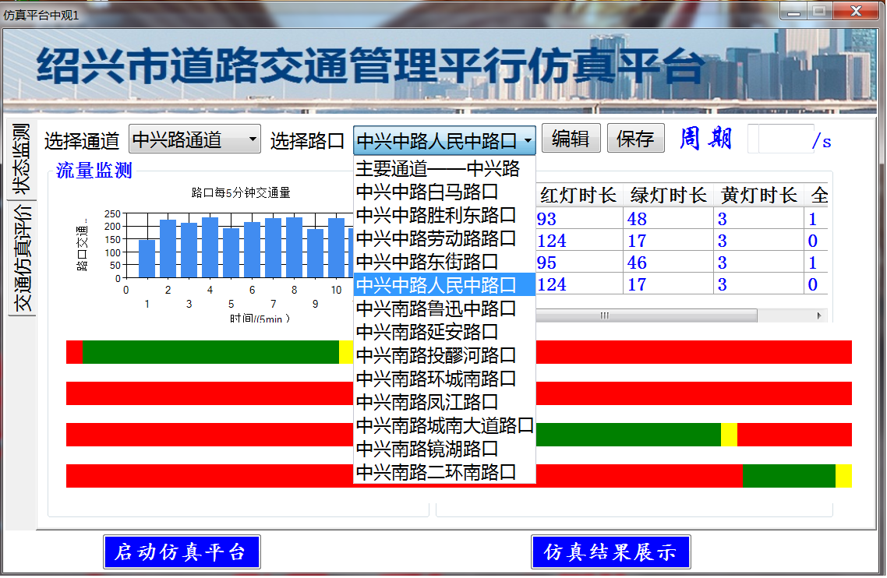
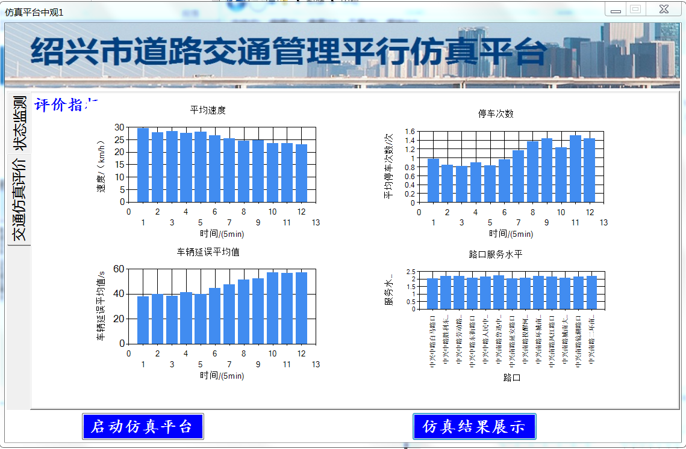
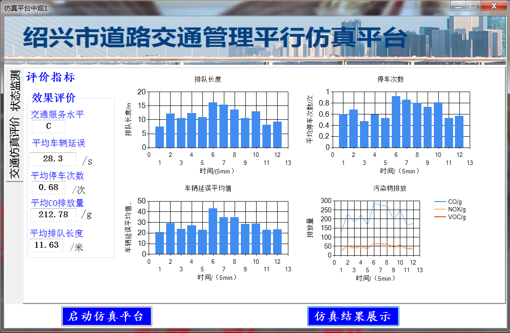

# 绍兴市交通平行仿真辅助决策系统

绍兴市公安局交通管理局

绍兴市交通平行仿真辅助决策系统在国内属于首次应用平行仿真的概念，成功解决了城市交通管理中的重要难题。通过建立虚拟的交通网络，系统能够准确模拟城市交通流量、交通信号控制和道路布局等因素的综合影响，为交通规划、交通优化和交通安全提供科学依据。系统的应用填补了国内在城市交通管理领域平行仿真的空白，实现了对交通系统的全面分析和综合优化，为构建智慧城市和提升城市交通运行水平提供了新思路和工具。

绍兴市交通平行仿真辅助决策系统在城市交通管理中具有重要性和应用意义。以下是相关方面的介绍：
- (1)交通规划与设计：平行仿真辅助决策系统可以帮助交通规划者和设计师模拟和评估各种交通规划方案的效果。通过建立虚拟交通网络，系统可以模拟不同道路布局、信号控制策略和交通流量分配方案的效果，从而为城市交通规划和设计提供科学依据。
- (2)交通优化与管理：系统可以通过模拟和优化交通信号控制、路口配时、道路巡航等交通管理策略，提高交通系统的运行效率和道路通行能力。交通管理者可以根据仿真结果，调整交通信号配时方案，减少交通拥堵和交叉口冲突，提高交通系统的整体性能。
- (3)交通安全评估：平行仿真辅助决策系统可以用于模拟和评估不同交通安全措施的效果，如交通信号灯、交通标志、限速措施等。通过模拟交通事故发生的概率和严重程度，可以提供交通安全改进的建议，并帮助决策者制定交通安全政策。
- (4)突发事件响应与应急管理：系统可以模拟和评估城市交通系统在突发事件（如交通事故、天气灾害等）发生时的应急响应能力。通过模拟交通流量调整、道路封闭、交通引导等策略的效果，可以提供应急管理决策的参考，帮助减少交通事故和降低应急事件对交通系统的影响。

总的来说，绍兴市交通平行仿真辅助决策系统在交通规划、交通优化、交通安全和应急管理等方面具有重要性和应用意义。它可以为决策者提供科学的数据支持和决策建议，提高城市交通系统的效率、安全性和韧性，为城市发展和居民出行提供更便利、安全的交通环境。

该系统的解决方案主要包括以下几个方面：
- (1)平行仿真模型建立：系统通过收集和整合大量的实时交通数据，建立了真实城市交通网络的虚拟模型。这包括道路网络、交通信号灯、车辆流量等要素的建模和参数设定。
- (2)交通行为模拟：系统基于交通流理论和行为模型，模拟不同类型车辆的行驶行为，如加速、减速、换道等。通过模拟车辆的行为，系统能够准确反映交通拥堵、交叉口冲突等交通问题。
- (3)交通信号控制优化：系统利用智能算法和优化技术，对交通信号控制进行仿真和优化。通过模拟不同信号配时方案的效果，系统能够找到最优的信号控制策略，减少交通拥堵和交叉口冲突，提高交通系统的效率。
- (4)交通安全评估：系统通过模拟交通事故发生的概率和严重程度，评估交通安全措施的效果。通过分析不同安全措施的影响，系统能够提供针对性的安全改进建议，提升城市交通的安全性。
- (5)应急响应与管理：系统模拟城市交通系统在突发事件发生时的应急响应能力。通过模拟交通流量调整、道路封闭、交通引导等策略的效果，系统能够提供应急管理决策的参考，减少交通事故和降低应急事件对交通系统的影响。
该系统的解决方案包括建立平行仿真模型、交通行为模拟、交通信号控制优化、交通安全评估和应急响应与管理等方面，通过模拟和优化交通系统的各个方面，提供科学依据和决策支持，解决城市交通管理中的重要难题。

图1 系统框架

图2 系统主界面

图3 系统功能流程图

图4 系统主要模块

 
图5 系统运行结果展示

该系统具有以下主要亮点和取得的成果，包括技术指标、效率提升以及经济和社会效益的改善。
- (1)技术指标和效率提升：
    - 基于虚拟模型的平行仿真：系统通过建立虚拟的交通网络模型，能够准确模拟和预测交通流量、交通信号控制策略和道路布局的效果。这为交通管理者提供了科学的数据支持和决策参考。
    - 交通优化和拥堵减少：通过仿真和优化交通信号控制策略，系统能够找到最优的信号配时方案，有效减少交通拥堵，提高道路通行能力和交通系统的效率。
    - 交通安全评估和改进：系统模拟交通事故发生的概率和严重程度，评估不同交通安全措施的效果。通过分析和优化安全措施，系统能够提供具体的改进建议，提升城市交通的安全性。
- (2)经济和社会效益的改善：
    - 减少交通拥堵：通过优化交通信号控制和交通流量分配，系统能够有效减少交通拥堵，提高通行效率，缩短行车时间，降低燃料消耗和车辆排放，为居民提供更加便捷的出行环境。
    - 提高交通安全性：通过模拟和评估交通安全措施的效果，系统能够提供有针对性的安全改进建议，降低交通事故发生的概率和严重程度，提升城市交通的安全性，保障居民的生命财产安全。
    - 提升交通管理效能：系统的应用能够提高交通管理者的决策水平和决策效率，提供科学的数据支持和决策参考，优化交通信号控制和交通系统运行，最大程度地提高道路通行能力和交通效率，为城市的经济发展和社会进步提供有力支撑。
该系统通过平行仿真技术和优化策略的应用，取得了较大的技术指标和效率改善，包括减少交通拥堵、提高交通安全性和提升交通管理效能等方面。同时，经济和社会效益也得到了明显的改善，为居民提供了更加便捷、安全和高效的交通环境，促进了城市的可持续发展和社会的进步。

该系统采取的措施和方案在合理性上进行分析如下：
- (1)基于虚拟模型的平行仿真：该系统建立了虚拟的交通网络模型，这种基于模型的仿真方法具有合理性。通过虚拟模型，系统可以准确地模拟和预测不同交通方案的效果，为决策者提供科学的数据支持。与实地试验相比，虚拟模型具有成本低、操作灵活等优势，能够更好地满足实际需求。
- (2)交通优化和拥堵减少：系统通过仿真和优化交通信号控制策略，采取的优化方案具有合理性。通过模拟不同信号配时方案的效果，系统能够找到最优的控制策略，提高道路通行能力，减少交通拥堵。这种基于仿真和优化的方法，能够综合考虑各种交通要素和变量，找到全局最优解，具有明显的合理性和有效性。
- (3)交通安全评估和改进：系统通过模拟交通事故发生的概率和严重程度，评估不同交通安全措施的效果，这种方法具有合理性。通过分析和优化安全措施，系统能够提供具体的改进建议，降低交通事故风险。这种基于模拟的安全评估方法，可以更全面地考虑各种交通情况和变量，为决策者提供科学的安全决策支持。
- (4)经济和社会效益的改善：该系统的应用能够提高交通管理的效能，具备合理性。通过优化交通信号控制和流量分配，系统能够减少交通拥堵，提高道路通行能力，从而提高经济和社会效益。此外，该系统的安全评估和改进措施能够降低交通事故风险，保障居民的生命财产安全，进一步提高社会效益。

该系统所采取的措施和方案在合理性上进行了充分分析。基于虚拟模型的平行仿真、交通优化和拥堵减少、交通安全评估和改进等措施都具备合理性，并能够有效提高交通管理的效能和经济社会效益，为城市交通领域的决策者提供科学依据和决策支持。

绍兴市交通平行仿真辅助决策系统涉及的技术问题和科学问题包括：
- (1)技术问题：
    - 建模与仿真技术：包括交通网络的建模方法、仿真模型的构建和验证技术，以及仿真结果的准确性和可信度评估等。
    - 优化算法和策略：涉及交通信号控制优化算法、交通流量分配策略的优化方法，以及优化算法的效率和可行性等。
    - 数据采集和处理：包括实时交通数据的采集技术、数据预处理和清洗方法，以及大规模数据处理和分析的技术手段等。
    - 平行计算与性能优化：涉及大规模平行仿真的计算效率、并行计算的算法设计和优化等技术问题。
- (2)科学问题：
    - 交通流理论：包括交通流量模型、交通流稳定性理论和拥堵形成机制等。
    - 交通控制理论：包括交通信号控制原理、交叉口优化控制策略等。
    - 交通安全理论：涉及交通事故发生机理、安全评估方法和交通安全措施的效果评估等。
相关理论课程应用说明：
- (1)课程名称：交通仿真技术
- (2)教学目的与用途：
    - 本课程旨在培养学生对交通仿真和优化技术的理解和应用能力。通过学习该课程，学生将了解交通仿真和优化的基本原理和方法，并能够应用相关技术解决实际的交通管理和规划问题。
- (3)思考题：
    - 请简述交通仿真技术在城市交通规划和设计中的作用和意义。
    - 基于仿真的交通优化方法有哪些，各自的优缺点是什么？
    - 如何利用交通仿真技术评估不同交通安全措施的效果？
- (4)分析思路：
    - 通过教师讲解、案例分析和实践操作，引导学生理解交通仿真和优化技术的原理和应用场景。结合实际问题，学生需要运用所学知识和技能，进行数据采集、建模仿真、结果分析和优化策略设计等环节。
- (5)关键要点：
    - 关键知识点：交通流理论、交通控制理论、建模与仿真技术、优化算法和策略。
    - 分析的关键路径：数据采集与处理、建模与验证、仿真模拟、结果分析与优化。
    - 能力提升点：问题分析与解决能力、数据处理与建模能力、仿真与优化能力。
- (6)建议课堂计划：
    - 第一次课：介绍交通仿真与优化的基本概念，讲解交通流理论和交通控制理论的基础知识。
    - 第二次课：讲解交通仿真建模方法和仿真模型的构建，引导学生进行简单的建模实践。
    - 第三次课：介绍交通优化算法和策略，讲解交通信号控制优化的原理和方法。
    - 第四次课：进行案例分析，学生根据实际问题进行数据采集、建模仿真和优化策略设计。
    - 第五次课：学生展示并讨论案例分析结果，教师进行评价和指导，总结课程要点和应用技巧。
通过该课程的学习和实践，学生将掌握交通仿真和优化的基本理论和技术，提高解决实际交通问题的能力，并为将来的科研和实践工作奠定坚实基础。
